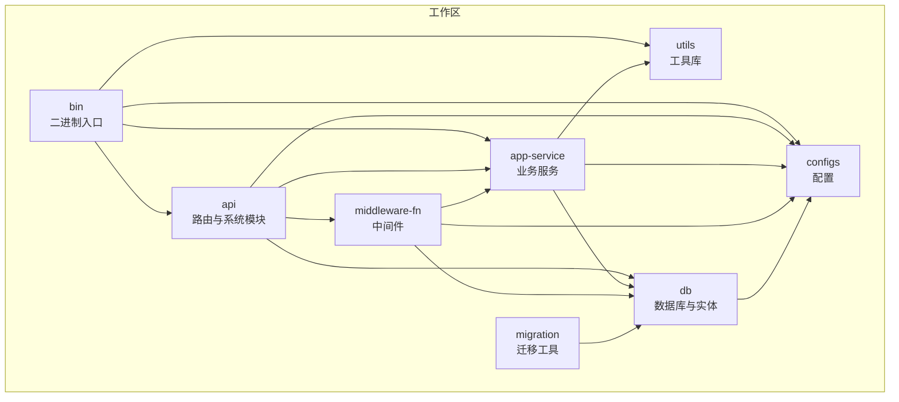
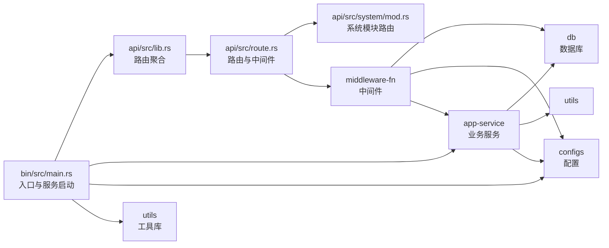
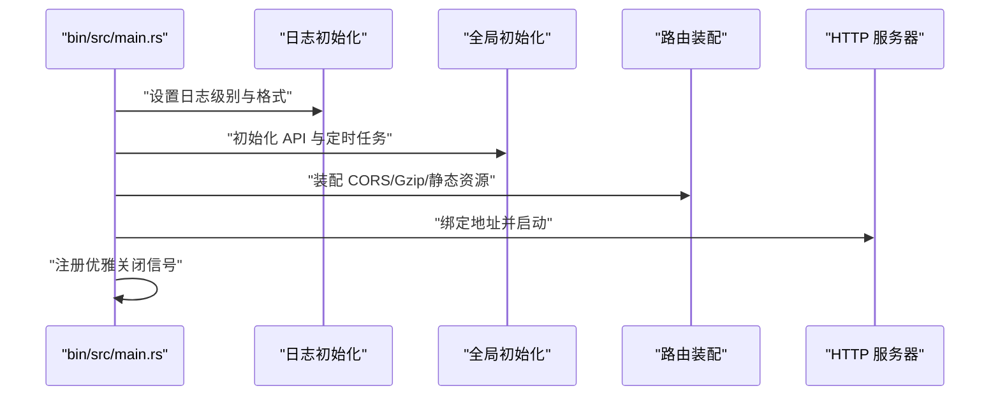
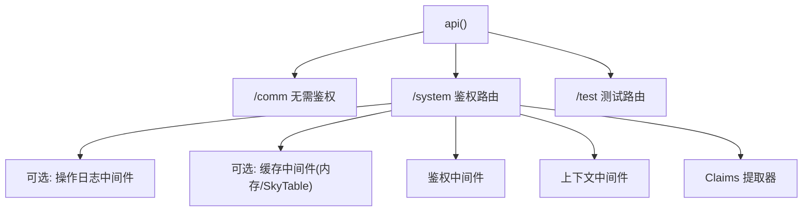
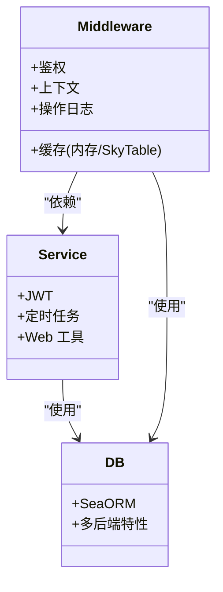
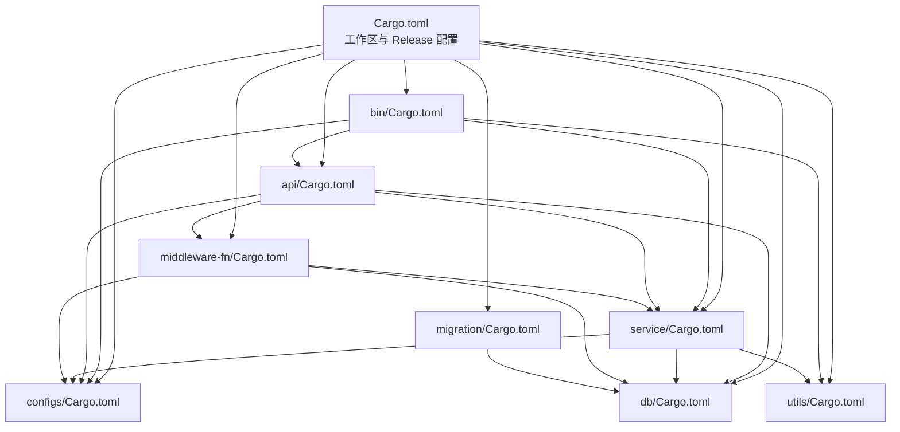

# 应用编译部署

<cite>
**本文引用的文件**
- [Cargo.toml](file://Cargo.toml)
- [.cargo/config.toml](file://.cargo/config.toml)
- [.github/workflows/rust.yml](file://.github/workflows/rust.yml)
- [bin/Cargo.toml](file://bin/Cargo.toml)
- [api/Cargo.toml](file://api/Cargo.toml)
- [service/Cargo.toml](file://service/Cargo.toml)
- [middleware-fn/Cargo.toml](file://middleware-fn/Cargo.toml)
- [utils/Cargo.toml](file://utils/Cargo.toml)
- [configs/Cargo.toml](file://configs/Cargo.toml)
- [db/Cargo.toml](file://db/Cargo.toml)
- [migration/Cargo.toml](file://migration/Cargo.toml)
- [bin/src/main.rs](file://bin/src/main.rs)
- [api/src/lib.rs](file://api/src/lib.rs)
- [api/src/route.rs](file://api/src/route.rs)
- [api/src/system/mod.rs](file://api/src/system/mod.rs)
</cite>

## 目录
1. [简介](#简介)
2. [项目结构](#项目结构)
3. [核心组件](#核心组件)
4. [架构总览](#架构总览)
5. [详细组件分析](#详细组件分析)
6. [依赖关系分析](#依赖关系分析)
7. [性能与编译优化](#性能与编译优化)
8. [跨平台与交叉编译](#跨平台与交叉编译)
9. [故障排查指南](#故障排查指南)
10. [结论](#结论)
11. [附录](#附录)

## 简介
本指南面向 Axum Admin 应用的编译与部署，覆盖 Cargo 工作区配置、Release 模式编译参数、交叉编译设置、二进制优化选项，并提供针对不同目标平台的编译策略、常见编译问题排查与解决方案。内容基于仓库现有配置与源码进行总结，帮助读者在本地与 CI 环境中稳定产出高性能、体积可控的可执行文件。

## 项目结构
Axum Admin 采用多包工作区组织，包含二进制入口、API 路由、业务服务、中间件、工具库、配置与数据库等模块。工作区统一定义了依赖版本与发布配置，主工程的 Release 配置集中于根 Cargo.toml 的 profile.release。

图表来源
- [Cargo.toml](file://Cargo.toml#L1-L12)
- [bin/Cargo.toml](file://bin/Cargo.toml#L10-L26)
- [api/Cargo.toml](file://api/Cargo.toml#L8-L22)
- [service/Cargo.toml](file://service/Cargo.toml#L9-L33)
- [middleware-fn/Cargo.toml](file://middleware-fn/Cargo.toml#L9-L25)
- [utils/Cargo.toml](file://utils/Cargo.toml#L9-L22)
- [configs/Cargo.toml](file://configs/Cargo.toml#L9-L14)
- [db/Cargo.toml](file://db/Cargo.toml#L9-L20)
- [migration/Cargo.toml](file://migration/Cargo.toml#L11-L16)

章节来源
- [Cargo.toml](file://Cargo.toml#L1-L12)
- [bin/Cargo.toml](file://bin/Cargo.toml#L1-L26)
- [api/Cargo.toml](file://api/Cargo.toml#L1-L22)
- [service/Cargo.toml](file://service/Cargo.toml#L1-L39)
- [middleware-fn/Cargo.toml](file://middleware-fn/Cargo.toml#L1-L39)
- [utils/Cargo.toml](file://utils/Cargo.toml#L1-L22)
- [configs/Cargo.toml](file://configs/Cargo.toml#L1-L14)
- [db/Cargo.toml](file://db/Cargo.toml#L1-L25)
- [migration/Cargo.toml](file://migration/Cargo.toml#L1-L16)

## 核心组件
- 二进制入口：负责启动服务、加载配置、初始化日志、挂载路由与中间件、处理优雅关闭信号。
- API 模块：按功能拆分子模块，统一通过路由层聚合；支持无鉴权与鉴权路由、操作日志中间件、缓存中间件等。
- 业务服务：封装 JWT、定时任务、Web 工具、数据范围等通用能力。
- 中间件：提供鉴权、上下文注入、操作日志、缓存（内存/SkyTable）等。
- 工具库：提供环境变量、随机数、时间、加密等基础能力。
- 配置：集中读取与解析 TOML 配置，支持运行时动态调整。
- 数据库：基于 SeaORM，支持多后端特性开关（PostgreSQL/MySQL/SQLite）。
- 迁移：独立迁移工具，依赖数据库模块。

章节来源
- [bin/src/main.rs](file://bin/src/main.rs#L25-L96)
- [api/src/lib.rs](file://api/src/lib.rs#L1-L10)
- [api/src/route.rs](file://api/src/route.rs#L12-L22)
- [api/src/system/mod.rs](file://api/src/system/mod.rs#L26-L44)
- [service/Cargo.toml](file://service/Cargo.toml#L34-L39)
- [middleware-fn/Cargo.toml](file://middleware-fn/Cargo.toml#L27-L39)
- [utils/Cargo.toml](file://utils/Cargo.toml#L9-L22)
- [configs/Cargo.toml](file://configs/Cargo.toml#L9-L14)
- [db/Cargo.toml](file://db/Cargo.toml#L21-L25)
- [migration/Cargo.toml](file://migration/Cargo.toml#L11-L16)

## 架构总览
下图展示从二进制入口到各子模块的调用关系与数据流，体现工作区内的依赖方向与职责边界。

图表来源
- [bin/src/main.rs](file://bin/src/main.rs#L25-L96)
- [api/src/lib.rs](file://api/src/lib.rs#L1-L10)
- [api/src/route.rs](file://api/src/route.rs#L12-L22)
- [api/src/system/mod.rs](file://api/src/system/mod.rs#L26-L44)
- [service/Cargo.toml](file://service/Cargo.toml#L9-L33)
- [middleware-fn/Cargo.toml](file://middleware-fn/Cargo.toml#L9-L25)
- [db/Cargo.toml](file://db/Cargo.toml#L9-L20)
- [utils/Cargo.toml](file://utils/Cargo.toml#L9-L22)
- [configs/Cargo.toml](file://configs/Cargo.toml#L9-L14)

## 详细组件分析

### 二进制入口与启动流程
- 初始化默认密码学提供者、日志级别与格式、滚动日志文件与标准输出。
- 全局初始化 API 与定时任务。
- 配置 CORS、静态资源服务、Gzip 压缩（排除 SSE）。
- 绑定地址，支持 TLS 或明文启动。
- 注册优雅关闭信号，等待终止信号后执行平滑关闭。

图表来源
- [bin/src/main.rs](file://bin/src/main.rs#L25-L96)

章节来源
- [bin/src/main.rs](file://bin/src/main.rs#L25-L96)

### 路由与中间件
- 路由聚合：公共接口、系统模块、测试模块分别挂载。
- 中间件链：按配置启用操作日志、缓存（内存或 SkyTable）、鉴权、上下文注入、Claims 提取。
- 系统模块：用户、字典、岗位、部门、角色、菜单、日志、监控、更新日志等子路由。

图表来源
- [api/src/route.rs](file://api/src/route.rs#L12-L22)
- [api/src/route.rs](file://api/src/route.rs#L33-L54)
- [api/src/system/mod.rs](file://api/src/system/mod.rs#L26-L44)

章节来源
- [api/src/route.rs](file://api/src/route.rs#L12-L69)
- [api/src/system/mod.rs](file://api/src/system/mod.rs#L26-L199)

### 业务服务与数据库
- 业务服务提供 JWT、定时任务、Web 工具、数据范围等能力。
- 数据库模块支持多后端特性开关，配合迁移工具使用。
- 中间件模块可选择启用 SkyTable 缓存。

图表来源
- [service/Cargo.toml](file://service/Cargo.toml#L9-L33)
- [db/Cargo.toml](file://db/Cargo.toml#L9-L20)
- [middleware-fn/Cargo.toml](file://middleware-fn/Cargo.toml#L9-L25)

章节来源
- [service/Cargo.toml](file://service/Cargo.toml#L9-L39)
- [middleware-fn/Cargo.toml](file://middleware-fn/Cargo.toml#L9-L39)
- [db/Cargo.toml](file://db/Cargo.toml#L9-L25)

## 依赖关系分析
- 工作区统一版本与特性：所有包共享 workspace 依赖版本与特性，避免版本漂移。
- 二进制包依赖 API、服务、配置与工具模块；API 包依赖服务、数据库、中间件与配置。
- 业务服务依赖数据库、工具与配置；中间件依赖服务、数据库与配置。
- 迁移工具仅依赖数据库模块与迁移框架。

图表来源
- [Cargo.toml](file://Cargo.toml#L1-L12)
- [bin/Cargo.toml](file://bin/Cargo.toml#L10-L26)
- [api/Cargo.toml](file://api/Cargo.toml#L8-L22)
- [service/Cargo.toml](file://service/Cargo.toml#L9-L33)
- [middleware-fn/Cargo.toml](file://middleware-fn/Cargo.toml#L9-L25)
- [utils/Cargo.toml](file://utils/Cargo.toml#L9-L22)
- [configs/Cargo.toml](file://configs/Cargo.toml#L9-L14)
- [db/Cargo.toml](file://db/Cargo.toml#L9-L20)
- [migration/Cargo.toml](file://migration/Cargo.toml#L11-L16)

章节来源
- [Cargo.toml](file://Cargo.toml#L1-L12)
- [bin/Cargo.toml](file://bin/Cargo.toml#L10-L26)
- [api/Cargo.toml](file://api/Cargo.toml#L8-L22)
- [service/Cargo.toml](file://service/Cargo.toml#L9-L33)
- [middleware-fn/Cargo.toml](file://middleware-fn/Cargo.toml#L9-L25)
- [utils/Cargo.toml](file://utils/Cargo.toml#L9-L22)
- [configs/Cargo.toml](file://configs/Cargo.toml#L9-L14)
- [db/Cargo.toml](file://db/Cargo.toml#L9-L20)
- [migration/Cargo.toml](file://migration/Cargo.toml#L11-L16)

## 性能与编译优化
- 工作区统一的 Release 配置已开启：
  - 单代码生成单元（提升 LTO 效果）
  - 关闭调试符号（减小体积）
  - 启用链接时优化（LTO）
  - 以体积优先的优化等级
  - 异常模式为 abort（更小体积与更快启动）
- 可选的符号剥离（注释掉）可在最终发布前进一步减小二进制体积。
- 以上配置位于根 Cargo.toml 的 release profile，适用于所有成员包。

章节来源
- [Cargo.toml](file://Cargo.toml#L83-L90)

## 跨平台与交叉编译
- Windows（MSVC）目标：.cargo/config.toml 中预留了 x86_64-pc-windows-msvc 的配置段，可用于添加链接器参数或编译标志（如静态 CRT、移除调试信息等）。当前仓库未启用具体参数，可根据需要在注释示例基础上启用。
- Linux（GNU）目标：.cargo/config.toml 中预留了 x86_64-unknown-linux-gnu 的配置段，可用于指定链接器或启用 mold 等现代链接器（当前未启用）。
- 交叉编译建议：
  - 使用 rustup 安装目标工具链（如 x86_64-pc-windows-msvc、aarch64-unknown-linux-gnu 等）。
  - 在 .cargo/config.toml 中为目标添加必要的 rustflags/linker。
  - 使用 cargo build --release --target <target-triple> 进行交叉编译。
- 注意事项：
  - 若使用 OpenSSL 或其他外部库，需确保目标平台可用且链接正确。
  - TLS 与网络栈依赖（如 rustls）通常无需额外处理，但静态链接 CRT（Windows）可能影响兼容性与体积。

章节来源
- [.cargo/config.toml](file://.cargo/config.toml#L1-L10)

## 故障排查指南
- 依赖冲突与版本不一致
  - 现象：cargo build 报告版本冲突或循环依赖。
  - 处理：检查各包的 workspace 依赖是否一致；确保 members 明确列出并在根 Cargo.toml 中统一版本。
  - 参考：工作区 members 与 workspace 依赖声明。
- 特性开关导致的功能缺失
  - 现象：启用特定数据库后功能异常。
  - 处理：确认 features 开关与后端匹配（PostgreSQL/MySQL/SQLite），必要时显式启用所需特性。
  - 参考：service、middleware-fn、db 的特性定义。
- TLS/证书问题
  - 现象：HTTPS 启动失败或证书加载错误。
  - 处理：确认证书路径与权限、PEM 文件格式正确；检查运行时环境变量与配置项。
  - 参考：入口对 TLS 的加载与绑定。
- 日志与运行时行为异常
  - 现象：日志级别不符合预期或输出格式异常。
  - 处理：检查环境变量 RUST_LOG 与配置项；确认日志初始化顺序与格式化器配置。
  - 参考：入口的日志初始化逻辑。
- CI 构建失败
  - 现象：GitHub Actions 构建失败或超时。
  - 处理：确认工具链版本、缓存命中情况；在本地复现相同命令；检查依赖下载与网络代理。
  - 参考：CI 工作流的构建步骤。

章节来源
- [Cargo.toml](file://Cargo.toml#L1-L12)
- [service/Cargo.toml](file://service/Cargo.toml#L34-L39)
- [middleware-fn/Cargo.toml](file://middleware-fn/Cargo.toml#L27-L39)
- [db/Cargo.toml](file://db/Cargo.toml#L21-L25)
- [bin/src/main.rs](file://bin/src/main.rs#L25-L96)
- [.github/workflows/rust.yml](file://.github/workflows/rust.yml#L17-L25)

## 结论
本指南基于仓库现有配置与源码，给出了 Axum Admin 的编译与部署要点：工作区统一版本、Release 优化参数、跨平台配置预留、以及常见问题的排查思路。建议在本地与 CI 中均使用统一的 Release 参数，结合目标平台的 .cargo/config.toml 进行微调，以获得稳定、高效、体积可控的产物。

## 附录
- 本地编译
  - Debug：cargo build
  - Release：cargo build --release
- CI 编译
  - 使用仓库提供的 GitHub Actions 工作流，或自定义流水线复用相同命令。
- 发布建议
  - 在 Release 构建后，根据需要启用符号剥离（注释掉的 strip 选项）以进一步减小体积。
  - 对 Windows 目标可考虑静态链接 CRT 以提升分发便利性，但需评估兼容性与体积。

章节来源
- [.github/workflows/rust.yml](file://.github/workflows/rust.yml#L17-L25)
- [Cargo.toml](file://Cargo.toml#L83-L90)
- [.cargo/config.toml](file://.cargo/config.toml#L1-L10)