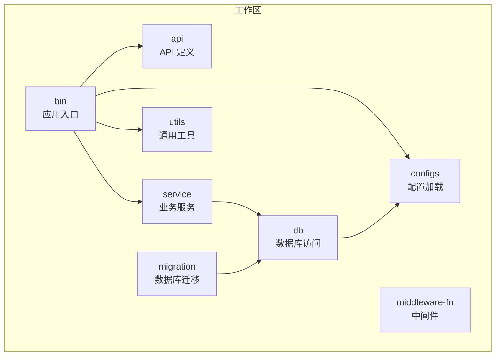
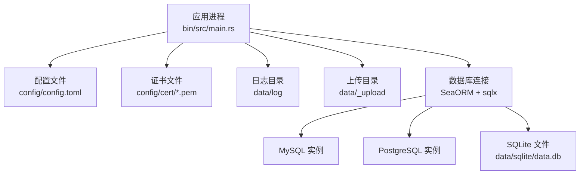
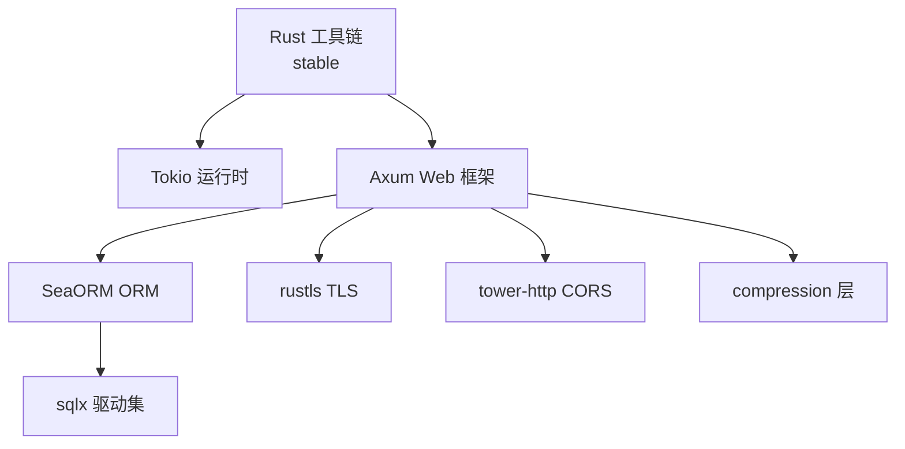

# 服务器环境准备

<cite>
**本文引用的文件**
- [Cargo.toml](file://Cargo.toml)
- [bin/Cargo.toml](file://bin/Cargo.toml)
- [db/Cargo.toml](file://db/Cargo.toml)
- [config/config.toml.sample](file://config/config.toml.sample)
- [.env.sample](file://.env.sample)
- [bin/src/main.rs](file://bin/src/main.rs)
- [configs/src/get_config.rs](file://configs/src/get_config.rs)
- [db/src/db.rs](file://db/src/db.rs)
- [migration/README.md](file://migration/README.md)
- [.github/workflows/rust.yml](file://.github/workflows/rust.yml)
- [README.md](file://README.md)
- [utils/src/my_env.rs](file://utils/src/my_env.rs)
- [service/src/system/server_info.rs](file://service/src/system/server_info.rs)
- [db/src/system/models/server_info.rs](file://db/src/system/models/server_info.rs)
</cite>

## 目录
1. [简介](#简介)
2. [项目结构](#项目结构)
3. [核心组件](#核心组件)
4. [架构总览](#架构总览)
5. [详细组件分析](#详细组件分析)
6. [依赖关系分析](#依赖关系分析)
7. [性能考虑](#性能考虑)
8. [故障排查指南](#故障排查指南)
9. [结论](#结论)
10. [附录](#附录)

## 简介
本指南面向在服务器上部署 Axum Admin 的运维与开发人员，提供从操作系统选择、系统依赖安装、资源与网络配置，到用户权限、时间同步、SSH 密钥等基础环境准备的完整流程。文档结合项目实际配置与运行参数，给出可落地的步骤与示例，覆盖 Linux 主流发行版的安装命令与配置要点。

## 项目结构
Axum Admin 采用多 crate 工作区组织，核心运行入口位于 bin crate，数据库访问通过 db crate，配置加载来自 configs crate，业务服务集中在 service crate，工具模块位于 utils crate。整体运行时依赖 Tokio 异步运行时、Axum Web 框架、SeaORM ORM 以及 TLS 支持。

图表来源
- [Cargo.toml](file://Cargo.toml#L1-L12)
- [bin/Cargo.toml](file://bin/Cargo.toml#L10-L25)
- [db/Cargo.toml](file://db/Cargo.toml#L9-L19)

章节来源
- [Cargo.toml](file://Cargo.toml#L1-L12)
- [bin/Cargo.toml](file://bin/Cargo.toml#L10-L25)
- [db/Cargo.toml](file://db/Cargo.toml#L9-L19)

## 核心组件
- 应用入口与运行时
  - 运行入口位于 bin/src/main.rs，使用 Tokio 运行时启动 HTTP/HTTPS 服务，支持 CORS、静态文件服务与压缩层。
  - 默认监听地址与端口由配置文件决定，支持启用 TLS。
- 配置加载
  - 通过 configs crate 从 config/config.toml 加载配置，并以惰性单例形式缓存，避免重复 IO。
- 数据库连接
  - db crate 使用 SeaORM 连接数据库，支持 MySQL、PostgreSQL、SQLite，默认启用多连接池参数。
- 日志与环境
  - 日志级别与格式由配置与环境变量共同决定，支持滚动文件与标准输出双通道。

章节来源
- [bin/src/main.rs](file://bin/src/main.rs#L24-L96)
- [configs/src/get_config.rs](file://configs/src/get_config.rs#L12-L25)
- [db/src/db.rs](file://db/src/db.rs#L9-L19)
- [config/config.toml.sample](file://config/config.toml.sample#L2-L16)
- [utils/src/my_env.rs](file://utils/src/my_env.rs#L38-L71)

## 架构总览
下图展示服务器侧关键组件与外部依赖的关系：应用进程、配置文件、数据库与证书文件之间的交互。

图表来源
- [bin/src/main.rs](file://bin/src/main.rs#L84-L94)
- [config/config.toml.sample](file://config/config.toml.sample#L17-L49)
- [db/src/db.rs](file://db/src/db.rs#L9-L19)

## 详细组件分析

### 服务器基础环境配置
- 操作系统选择
  - 推荐使用稳定版本的 Linux 发行版，如 Ubuntu 22.04/24.04、CentOS Stream/RHEL 9、Debian 12 等，确保内核与包管理器长期支持。
- 用户与权限
  - 建议创建专用服务用户运行应用，限制权限并隔离日志、上传与数据库文件目录。
  - 将需要的系统用户加入相应组（如 docker、ssh 等），便于后续部署与运维。
- 时间同步
  - 启用 NTP（如 chronyd 或 systemd-timesyncd）保持时间准确，避免 JWT 与证书校验问题。
- SSH 密钥配置
  - 为运维账户配置无密码公钥登录，禁用密码认证，限制 root 登录，仅允许必要端口访问。

章节来源
- [bin/src/main.rs](file://bin/src/main.rs#L102-L128)
- [config/config.toml.sample](file://config/config.toml.sample#L31-L37)

### 系统依赖安装
- Rust 工具链
  - 使用 rustup 安装稳定版工具链，确保 Cargo、Rustc 版本满足项目要求。
  - 参考工作流配置，使用稳定工具链进行构建。
- 数据库客户端
  - 若使用 MySQL/PostgreSQL，需安装对应开发头文件与链接库，以便编译 sqlx 驱动。
  - SQLite 无需额外客户端，但需确保运行时可访问数据文件。
- 其他系统依赖
  - 安装 build-essential、libssl-dev、pkg-config 等常用编译依赖。
  - 如需 HTTPS，确保系统信任根证书可用。

章节来源
- [.github/workflows/rust.yml](file://.github/workflows/rust.yml#L18-L21)
- [db/Cargo.toml](file://db/Cargo.toml#L22-L24)

### 系统资源要求
- CPU
  - 生产建议至少 2 核，开发/测试可 1 核起步；高并发场景建议 4 核以上。
- 内存
  - 最小 2GB RAM，推荐 4GB；数据库连接池与日志缓冲会占用额外内存。
- 磁盘空间
  - 至少 5GB 可用空间，包含应用二进制、日志、上传目录与数据库文件。
- 网络
  - 预留对外端口（默认 3000），若启用 HTTPS 则需 443 端口。
  - 防火墙放行应用端口与必要的管理端口（如 22）。

章节来源
- [config/config.toml.sample](file://config/config.toml.sample#L6)
- [db/src/db.rs](file://db/src/db.rs#L11-L14)

### 网络配置要求
- 端口开放
  - HTTP 默认 3000；HTTPS 需 443（如启用 SSL）。
- 防火墙设置
  - 使用 UFW 或 firewalld 放行应用端口，限制不必要的入站连接。
- 反向代理
  - 建议通过 Nginx/Traefik 提供反向代理与 TLS 终止，减少直接暴露应用端口的风险。

章节来源
- [config/config.toml.sample](file://config/config.toml.sample#L6)
- [bin/src/main.rs](file://bin/src/main.rs#L85-L94)

### 配置文件准备
- 复制样例配置
  - 将 config/config.toml.sample 复制为 config/config.toml 并按需修改。
- 关键配置项
  - 服务器地址与端口、SSL 开关、压缩开关、API 前缀、缓存方式与 SkyTable 地址、Web 静态目录与上传目录、证书路径、日志目录与级别、JWT 过期时间与密钥、数据库连接串。
- 环境变量
  - 可通过 .env 设置 DATABASE_URL，或直接在 config.toml 中配置 database.link。

章节来源
- [config/config.toml.sample](file://config/config.toml.sample#L2-L49)
- [.env.sample](file://.env.sample#L1-L3)

### 数据库准备与迁移
- 数据库类型
  - 支持 MySQL、PostgreSQL、SQLite；默认示例使用 SQLite 文件。
- 迁移工具
  - 安装 sea-orm-cli 后，通过迁移命令初始化数据库结构。
- 连接池与超时
  - 应用侧配置最大连接数、最小连接数、连接与空闲超时，确保高并发稳定性。

章节来源
- [README.md](file://README.md#L65-L71)
- [migration/README.md](file://migration/README.md#L1-L38)
- [db/src/db.rs](file://db/src/db.rs#L11-L14)

### 日志与监控
- 日志目录
  - 默认日志目录为 data/log，需确保应用用户具有写权限。
- 日志级别
  - 可通过配置 log_level 控制日志详细程度，生产建议 INFO 或 WARN。
- 系统监控
  - 项目内置系统信息采集模型，可用于系统监控页面展示。

章节来源
- [config/config.toml.sample](file://config/config.toml.sample#L31-L37)
- [service/src/system/server_info.rs](file://service/src/system/server_info.rs#L4-L72)
- [db/src/system/models/server_info.rs](file://db/src/system/models/server_info.rs#L3-L69)

### 部署与启动流程
- 构建
  - 使用 Cargo 在服务器上构建项目，确保依赖已安装。
- 迁移
  - 执行数据库迁移，初始化表结构。
- 启动
  - 以服务用户运行应用，检查日志目录权限与配置文件正确性。
- 健康检查
  - 通过本地回环或容器健康探针验证服务可用性。

章节来源
- [.github/workflows/rust.yml](file://.github/workflows/rust.yml#L24-L25)
- [README.md](file://README.md#L65-L71)
- [bin/src/main.rs](file://bin/src/main.rs#L24-L96)

## 依赖关系分析
下图展示应用运行所需的关键依赖与版本特征，帮助在服务器侧准备兼容的系统环境。

图表来源
- [Cargo.toml](file://Cargo.toml#L46-L51)
- [Cargo.toml](file://Cargo.toml#L24-L34)
- [Cargo.toml](file://Cargo.toml#L74-L80)

章节来源
- [Cargo.toml](file://Cargo.toml#L24-L80)

## 性能考虑
- 连接池参数
  - 根据并发与数据库能力调整 max_connections 与 idle_timeout，避免连接耗尽或资源浪费。
- 压缩策略
  - 启用响应压缩可降低带宽，但需注意 SSE 流式数据的特殊处理。
- 日志级别
  - 生产环境建议降低日志量，避免 I/O 成为瓶颈。
- 静态资源
  - 将静态资源交由反向代理缓存，减轻应用压力。

章节来源
- [db/src/db.rs](file://db/src/db.rs#L11-L14)
- [bin/src/main.rs](file://bin/src/main.rs#L75-L82)
- [config/config.toml.sample](file://config/config.toml.sample#L10)

## 故障排查指南
- 配置文件缺失
  - 若缺少 config/config.toml，应用会在启动时抛出错误；请复制样例并修正。
- 数据库连接失败
  - 检查 DATABASE_URL 或 config.toml 中 database.link 是否正确，确认数据库实例可达且凭据有效。
- 端口占用
  - 确认 3000（或 443）未被其他进程占用，必要时修改配置中的 address。
- 权限问题
  - 确保应用用户对 data/log、data/_upload、证书文件具有读写权限。
- 日志定位
  - 查看 data/log 下的滚动日志文件，结合日志级别快速定位问题。

章节来源
- [configs/src/get_config.rs](file://configs/src/get_config.rs#L14-L23)
- [db/src/db.rs](file://db/src/db.rs#L16)
- [bin/src/main.rs](file://bin/src/main.rs#L84-L94)
- [config/config.toml.sample](file://config/config.toml.sample#L31-L37)

## 结论
按照本指南完成服务器基础环境准备与配置，可确保 Axum Admin 在生产环境中稳定运行。建议在上线前完成数据库迁移、证书配置与反向代理部署，并制定完善的日志与监控策略，以提升系统的可观测性与可维护性。

## 附录

### 不同 Linux 发行版安装命令示例
- Ubuntu/Debian
  - 安装 Rust 工具链与编译依赖：使用 rustup 安装稳定版工具链，安装 build-essential、libssl-dev、pkg-config。
  - 安装数据库开发包（如使用 MySQL/PostgreSQL）：apt install libmysqlclient-dev 或 libpq-dev。
- CentOS/RHEL
  - 安装 Rust 工具链与编译依赖：使用 rustup 安装稳定版工具链，安装 gcc、gcc-c++、openssl-devel、pkg-config。
  - 安装数据库开发包：yum install mysql-devel 或 postgresql-devel。
- Alpine Linux
  - 安装 Rust 工具链与编译依赖：apk add rust cargo gcc g++ openssl-dev pkgconfig。
  - 安装数据库开发包：apk add mariadb-dev 或 postgresql-dev。

章节来源
- [.github/workflows/rust.yml](file://.github/workflows/rust.yml#L18-L21)
- [db/Cargo.toml](file://db/Cargo.toml#L22-L24)