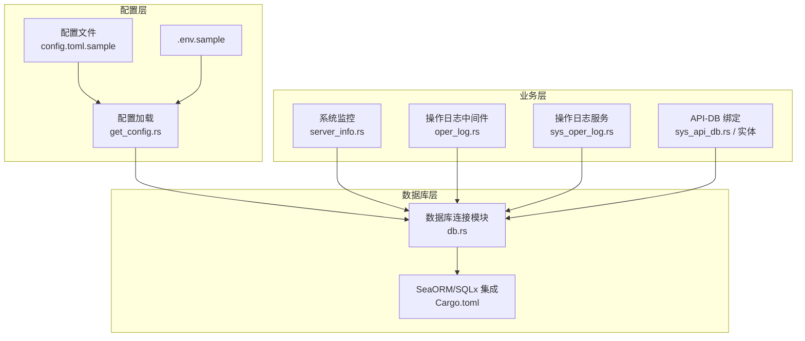
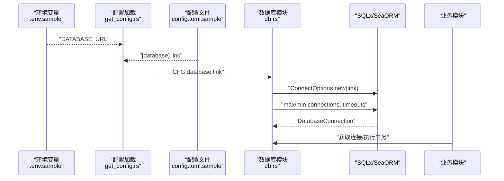
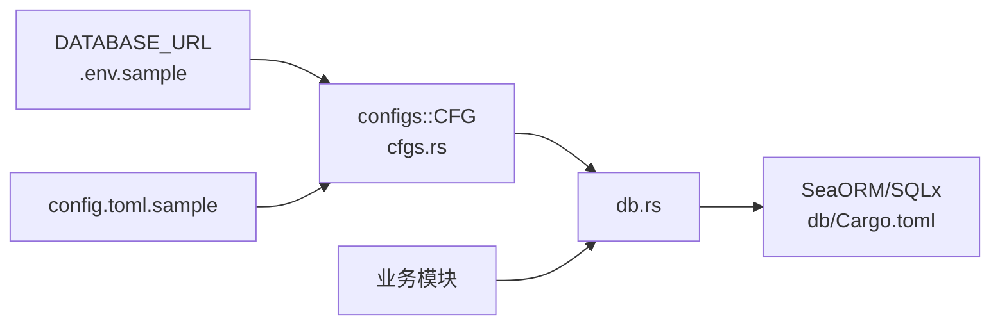
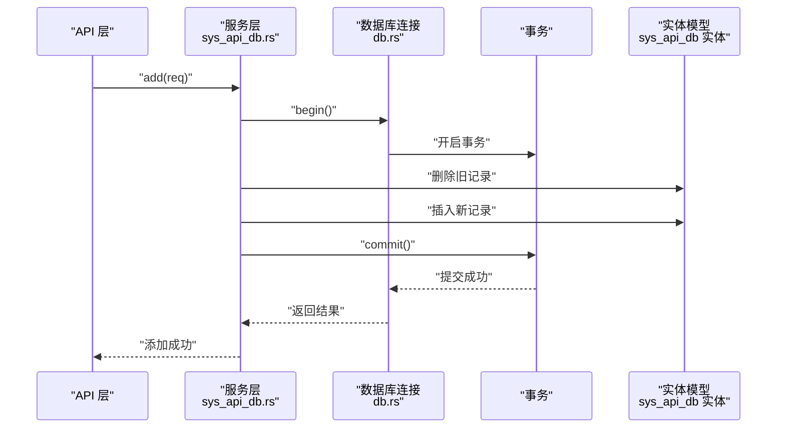

# MySQL 生产配置

<cite>
**本文引用的文件**
- [config.toml.sample](file://config/config.toml.sample)
- [.env.sample](file://.env.sample)
- [cfgs.rs](file://configs/src/cfgs.rs)
- [get_config.rs](file://configs/src/get_config.rs)
- [db.rs](file://db/src/db.rs)
- [lib.rs](file://db/src/lib.rs)
- [Cargo.toml](file://db/Cargo.toml)
- [Cargo.toml](file://Cargo.toml)
- [server_info.rs](file://service/src/system/server_info.rs)
- [oper_log.rs](file://middleware-fn/src/oper_log.rs)
- [sys_oper_log.rs](file://service/src/system/sys_oper_log.rs)
- [sys_api_db.rs](file://service/src/system/sys_api_db.rs)
- [sys_api_db 实体](file://db/src/system/entities/sys_api_db.rs)
</cite>

## 目录
1. [简介](#简介)
2. [项目结构](#项目结构)
3. [核心组件](#核心组件)
4. [架构总览](#架构总览)
5. [详细组件分析](#详细组件分析)
6. [依赖关系分析](#依赖关系分析)
7. [性能考虑](#性能考虑)
8. [故障排查指南](#故障排查指南)
9. [结论](#结论)
10. [附录](#附录)

## 简介
本指南面向在生产环境中部署基于 Rust 与 SeaORM 的应用，并使用 MySQL 作为数据库时的完整配置与优化建议。内容涵盖：
- 连接字符串格式与环境变量注入
- 连接池参数优化（最大连接数、最小连接数、空闲超时、连接超时）
- 事务隔离级别与字符集/排序规则配置建议
- MySQL 8.0+ 性能调优参数（缓冲池、日志文件大小、查询缓存等）
- SSL 连接配置要点
- 用户权限与备份策略
- 监控指标与日志采集

说明：本仓库默认示例使用 SQLite，但通过配置即可切换至 MySQL；本文以 MySQL 为生产目标进行配置说明。

## 项目结构
本项目采用多工作区组织，数据库相关模块集中在 db 工作区，配置由 configs 提供，运行时通过环境变量注入数据库连接串。

图表来源
- [get_config.rs](file://configs/src/get_config.rs#L1-L26)
- [config.toml.sample](file://config/config.toml.sample#L45-L50)
- [.env.sample](file://.env.sample#L1-L3)
- [db.rs](file://db/src/db.rs#L1-L19)
- [Cargo.toml](file://db/Cargo.toml#L21-L25)
- [server_info.rs](file://service/src/system/server_info.rs#L1-L74)
- [oper_log.rs](file://middleware-fn/src/oper_log.rs#L105-L157)
- [sys_oper_log.rs](file://service/src/system/sys_oper_log.rs#L1-L79)
- [sys_api_db.rs](file://service/src/system/sys_api_db.rs#L1-L38)
- [sys_api_db 实体](file://db/src/system/entities/sys_api_db.rs#L1-L59)

章节来源
- [config.toml.sample](file://config/config.toml.sample#L45-L50)
- [.env.sample](file://.env.sample#L1-L3)
- [get_config.rs](file://configs/src/get_config.rs#L1-L26)
- [db.rs](file://db/src/db.rs#L1-L19)
- [Cargo.toml](file://db/Cargo.toml#L21-L25)

## 核心组件
- 配置加载与结构
  - 配置文件位于 config/config.toml.sample，其中包含 [database] 段落用于定义连接串。
  - 配置加载器 get_config.rs 将配置文件读入内存并反序列化为 Configs 结构体，供全局访问。
  - 配置结构体 cfgs.rs 中定义了 Database 结构，包含 link 字段，即数据库连接串。
- 运行时注入
  - .env.sample 提供 DATABASE_URL 环境变量样例，可直接注入到运行时。
- 数据库连接
  - db.rs 通过 SeaORM/SQLx 初始化连接，设置连接池参数（最大连接数、最小连接数、连接/空闲超时）。
  - db 模块导出静态 OnceCell 容器 DB 与 db_conn 函数，供业务模块使用。

章节来源
- [config.toml.sample](file://config/config.toml.sample#L45-L50)
- [cfgs.rs](file://configs/src/cfgs.rs#L96-L110)
- [get_config.rs](file://configs/src/get_config.rs#L1-L26)
- [.env.sample](file://.env.sample#L1-L3)
- [db.rs](file://db/src/db.rs#L1-L19)
- [lib.rs](file://db/src/lib.rs#L1-L8)

## 架构总览
下图展示从配置到数据库连接再到业务使用的整体流程。

图表来源
- [.env.sample](file://.env.sample#L1-L3)
- [get_config.rs](file://configs/src/get_config.rs#L1-L26)
- [config.toml.sample](file://config/config.toml.sample#L45-L50)
- [db.rs](file://db/src/db.rs#L9-L19)

## 详细组件分析

### 连接字符串格式与注入
- 连接字符串位置
  - 在 config/config.toml.sample 的 [database] 段中提供 link 字段示例，支持 mysql://、postgres://、sqlite:// 等多种协议。
  - .env.sample 提供 DATABASE_URL 示例，可在容器或 systemd 环境中注入。
- 注入方式
  - 应用启动时，配置加载器读取配置文件与环境变量，最终将连接串传递给数据库连接模块。
- 生产建议
  - 使用环境变量优先注入，避免将敏感信息硬编码在版本控制中。
  - 对于 MySQL，推荐使用 mysql:// 协议，并在连接串中显式指定字符集与时区参数。

章节来源
- [config.toml.sample](file://config/config.toml.sample#L45-L50)
- [.env.sample](file://.env.sample#L1-L3)
- [get_config.rs](file://configs/src/get_config.rs#L1-L26)

### 连接池参数优化
- 当前实现
  - db.rs 中设置了 max_connections、min_connections、connect_timeout、idle_timeout 等参数。
- 参数建议（生产）
  - 最大连接数：根据并发请求数与数据库最大连接限制综合评估，避免超过数据库 max_connections。
  - 最小连接数：保持较低值（如 5），以减少常驻连接占用。
  - 连接超时：根据网络状况设置（如 5–10 秒）。
  - 空闲超时：建议与数据库 wait_timeout 保持一致或略低，防止连接被回收。
  - SQLx 日志：生产关闭 sqlx_logging，避免日志风暴。

章节来源
- [db.rs](file://db/src/db.rs#L9-L19)

### 事务隔离级别与字符集/排序规则
- 事务隔离级别
  - 通过数据库驱动或连接选项设置（例如在连接串中追加参数），常见级别为 READ-COMMITTED 或 REPEATABLE-READ，按业务需求选择。
- 字符集与排序规则
  - 建议统一使用 utf8mb4 与合适的排序规则（如 utf8mb4_unicode_ci），确保表情符号与多语言支持。
  - 在连接串中显式声明字符集与排序规则，避免默认值差异导致的数据问题。

章节来源
- [db.rs](file://db/src/db.rs#L10-L15)

### MySQL 8.0+ 性能调优参数
以下参数需在 MySQL 服务端 my.cnf 中配置，并结合实例规格与负载进行调整：
- innodb_buffer_pool_size
  - 建议占物理内存 50%–70%，确保热点数据常驻。
- innodb_log_file_size
  - 建议 512M–1G，兼顾恢复速度与日志文件体积。
- innodb_flush_log_at_trx_commit
  - 生产常用 1（强一致）或 2（折中），依据数据安全与吞吐权衡。
- query_cache_size
  - MySQL 8.0 已移除查询缓存，建议改用应用侧缓存或查询结果缓存。
- max_connections
  - 与应用连接池上限匹配，避免资源耗尽。
- innodb_thread_concurrency
  - 默认即可，若 CPU 核心较多可适度放宽。
- sort_buffer_size / read_buffer_size
  - 根据排序/扫描场景适当增大，注意与并发连接数的乘积不超过可用内存。
- tmp_table_size / max_heap_table_size
  - 保持一致，避免磁盘临时表影响性能。
- thread_cache_size
  - 与连接池最小连接数相协调，减少线程创建开销。

章节来源
- [db.rs](file://db/src/db.rs#L10-L15)

### SSL 连接配置
- 连接串参数
  - 在连接串中启用 SSL（如 ssl_mode=REQUIRED），并可指定 CA/证书路径参数。
- 证书与密钥
  - 若应用需要 TLS 终止，可参考项目中的证书加载模块（用于 Web 层 TLS），数据库层 SSL 由连接串参数控制。
- 注意事项
  - 确保数据库服务器启用了 SSL 并配置了有效证书。
  - 客户端与服务器证书链一致，避免握手失败。

章节来源
- [cert.rs](file://utils/src/cert.rs#L1-L26)
- [config.toml.sample](file://config/config.toml.sample#L25-L27)

### 用户权限管理
- 最小权限原则
  - 为不同环境（开发/测试/生产）创建独立账号，仅授予必要权限。
- 权限分离
  - 读写分离：主库写入、只读库查询；或使用只读副本。
- 定期审计
  - 定期审查账号权限与访问日志，及时回收不再使用的账号。

章节来源
- [sys_oper_log.rs](file://service/src/system/sys_oper_log.rs#L1-L79)

### 备份策略
- 全量备份
  - 周期性执行全量备份，建议使用逻辑备份（如 mysqldump）与物理备份（如 Percona XtraBackup）结合。
- 增量备份
  - 结合二进制日志（binlog）进行增量备份，缩短 RPO。
- 恢复演练
  - 定期进行恢复演练，验证备份数据的完整性与可恢复性。
- 存储与传输
  - 备份数据加密存储，跨机房异地容灾。

章节来源
- [sys_oper_log.rs](file://service/src/system/sys_oper_log.rs#L1-L79)

### 监控指标与日志
- 系统监控
  - 使用系统信息采集模块收集 CPU、内存、磁盘、网络等指标，辅助容量规划与异常告警。
- 数据库监控
  - 关注慢查询、连接数、缓冲池命中率、锁等待、binlog 延迟等关键指标。
- 日志与审计
  - 启用慢查询日志与错误日志，结合操作日志中间件记录 API 访问与业务操作，便于问题定位与合规审计。

章节来源
- [server_info.rs](file://service/src/system/server_info.rs#L1-L74)
- [oper_log.rs](file://middleware-fn/src/oper_log.rs#L105-L157)
- [sys_oper_log.rs](file://service/src/system/sys_oper_log.rs#L1-L79)

## 依赖关系分析
- 配置依赖
  - db.rs 依赖 configs::CFG 提供的数据库连接串。
  - 配置加载器 get_config.rs 依赖 toml 解析与文件读取。
- 运行时依赖
  - db 模块依赖 SeaORM/SQLx，启用 mysql 特性。
  - 业务模块通过 db 模块提供的连接执行查询与事务。

图表来源
- [cfgs.rs](file://configs/src/cfgs.rs#L96-L110)
- [get_config.rs](file://configs/src/get_config.rs#L1-L26)
- [db.rs](file://db/src/db.rs#L1-L19)
- [Cargo.toml](file://db/Cargo.toml#L21-L25)

章节来源
- [cfgs.rs](file://configs/src/cfgs.rs#L96-L110)
- [get_config.rs](file://configs/src/get_config.rs#L1-L26)
- [db.rs](file://db/src/db.rs#L1-L19)
- [Cargo.toml](file://db/Cargo.toml#L21-L25)

## 性能考虑
- 连接池
  - 合理设置最大/最小连接数，避免频繁创建销毁连接。
  - 控制连接超时与空闲超时，减少僵尸连接。
- 查询优化
  - 使用索引覆盖、避免 N+1 查询、分页查询使用游标或基于索引的键集分页。
- 缓冲池与 IO
  - 根据数据量与访问模式调整 innodb_buffer_pool_size，确保热数据命中。
  - 使用 SSD 或 NVMe，优化 IO 延迟。
- 事务与锁
  - 缩短事务时长，避免长事务持有锁；合理设置隔离级别。
- 监控与压测
  - 持续监控关键指标，定期进行压力测试与容量规划。

## 故障排查指南
- 连接失败
  - 检查连接串格式、主机可达性、端口开放、SSL 参数与证书链。
  - 查看连接池是否达到上限，适当提高 max_connections 或降低空闲超时。
- 性能问题
  - 关注慢查询日志与执行计划，优化索引与 SQL。
  - 检查缓冲池命中率、锁等待与 binlog 延迟。
- 日志与审计
  - 启用并检查操作日志中间件与数据库日志，定位异常请求与错误堆栈。
  - 对于超长日志字段，注意截断策略，避免存储膨胀。

章节来源
- [oper_log.rs](file://middleware-fn/src/oper_log.rs#L105-L157)
- [sys_oper_log.rs](file://service/src/system/sys_oper_log.rs#L1-L79)

## 结论
在生产环境中，MySQL 的配置与优化需要从连接串、连接池、事务与字符集、服务端参数、SSL、权限与备份、监控等多个维度协同考虑。本项目通过配置注入与连接池参数设置提供了良好的基础，建议结合业务负载与硬件资源进一步细化参数，并建立完善的监控与备份体系。

## 附录

### API-DB 绑定与事务处理流程
该流程展示了 API 与数据库绑定以及事务提交的关键步骤。

图表来源
- [sys_api_db.rs](file://service/src/system/sys_api_db.rs#L11-L31)
- [sys_api_db 实体](file://db/src/system/entities/sys_api_db.rs#L15-L38)
- [db.rs](file://db/src/db.rs#L11-L15)