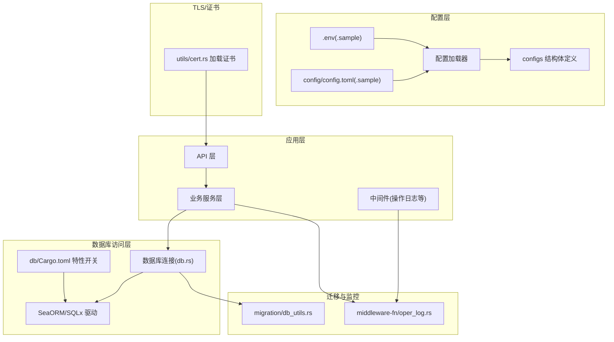
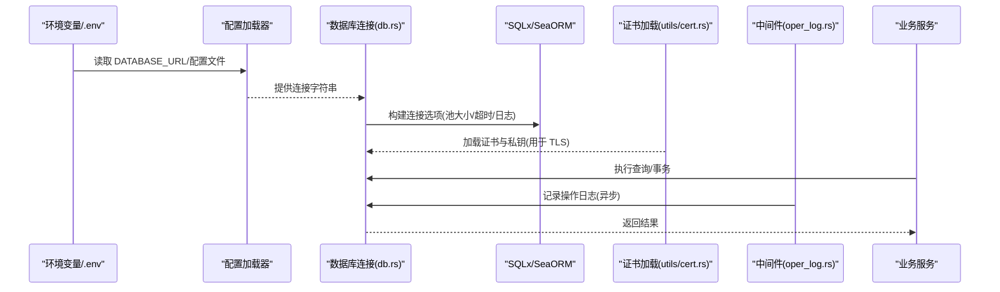
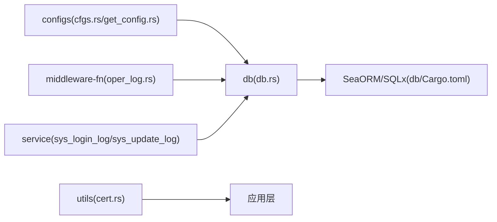

# PostgreSQL 生产配置

<cite>
**本文引用的文件**
- [config/config.toml.sample](file://config/config.toml.sample)
- [config/config.toml](file://config/config.toml)
- [.env.sample](file://.env.sample)
- [configs/src/cfgs.rs](file://configs/src/cfgs.rs)
- [configs/src/get_config.rs](file://configs/src/get_config.rs)
- [db/src/db.rs](file://db/src/db.rs)
- [db/Cargo.toml](file://db/Cargo.toml)
- [Cargo.toml](file://Cargo.toml)
- [utils/src/cert.rs](file://utils/src/cert.rs)
- [migration/src/db_utils.rs](file://migration/src/db_utils.rs)
- [middleware-fn/src/oper_log.rs](file://middleware-fn/src/oper_log.rs)
- [service/src/system/sys_login_log.rs](file://service/src/system/sys_login_log.rs)
- [service/src/system/sys_update_log.rs](file://service/src/system/sys_update_log.rs)
</cite>

## 目录
1. [简介](#简介)
2. [项目结构](#项目结构)
3. [核心组件](#核心组件)
4. [架构总览](#架构总览)
5. [详细组件分析](#详细组件分析)
6. [依赖关系分析](#依赖关系分析)
7. [性能考虑](#性能考虑)
8. [故障排查指南](#故障排查指南)
9. [结论](#结论)
10. [附录](#附录)

## 简介
本文件面向在生产环境中部署与运维 PostgreSQL 的工程实践，结合仓库中现有的配置与连接实现，给出可落地的连接字符串配置、连接池参数、共享缓冲区与缓存估算、WAL 与统计分析、查询计划器优化、autovacuum、work_mem、maintenance_work_mem 等参数建议，并补充 SSL 连接、用户认证、备份恢复策略与监控配置要点。为避免直接暴露敏感信息，本文所有参数均以“建议值”或“配置项说明”的形式呈现。

## 项目结构
该仓库采用多工作区组织，数据库相关能力集中在 db 工作区，配置由 configs 提供，运行时通过环境变量与 TOML 配置文件加载。PostgreSQL 的连接字符串与连接池参数在 db 层实现，证书与 TLS 在 utils 中加载，日志与监控通过中间件与服务层协同。

图表来源
- [db/src/db.rs](file://db/src/db.rs#L1-L19)
- [db/Cargo.toml](file://db/Cargo.toml#L21-L25)
- [configs/src/cfgs.rs](file://configs/src/cfgs.rs#L96-L101)
- [configs/src/get_config.rs](file://configs/src/get_config.rs#L1-L26)
- [utils/src/cert.rs](file://utils/src/cert.rs#L1-L27)
- [middleware-fn/src/oper_log.rs](file://middleware-fn/src/oper_log.rs#L87-L157)
- [migration/src/db_utils.rs](file://migration/src/db_utils.rs#L1-L158)

章节来源
- [db/src/db.rs](file://db/src/db.rs#L1-L19)
- [configs/src/cfgs.rs](file://configs/src/cfgs.rs#L96-L101)
- [configs/src/get_config.rs](file://configs/src/get_config.rs#L1-L26)
- [db/Cargo.toml](file://db/Cargo.toml#L21-L25)
- [utils/src/cert.rs](file://utils/src/cert.rs#L1-L27)
- [middleware-fn/src/oper_log.rs](file://middleware-fn/src/oper_log.rs#L87-L157)
- [migration/src/db_utils.rs](file://migration/src/db_utils.rs#L1-L158)

## 核心组件
- 配置加载与结构
  - 通过配置文件与环境变量加载数据库连接字符串，支持 PostgreSQL/MySQL/SQLite 多后端。
  - 配置项位于 [config/config.toml.sample](file://config/config.toml.sample#L45-L49) 与 [configs/src/cfgs.rs](file://configs/src/cfgs.rs#L96-L101)，实际生效配置需放置于 [config/config.toml](file://config/config.toml)。
- 数据库连接与连接池
  - 应用侧在 [db/src/db.rs](file://db/src/db.rs#L9-L19) 中构建连接选项，设置最大/最小连接数、超时与日志开关；PostgreSQL 特性在 [db/Cargo.toml](file://db/Cargo.toml#L22-L24) 中启用。
- TLS/SSL 与证书
  - 证书与私钥路径来自配置 [config/config.toml.sample](file://config/config.toml.sample#L25-L27)，加载逻辑见 [utils/src/cert.rs](file://utils/src/cert.rs#L18-L26)。
- 日志与监控
  - 中间件记录操作日志并落库，见 [middleware-fn/src/oper_log.rs](file://middleware-fn/src/oper_log.rs#L87-L157)；登录日志与更新日志写入数据库，见 [service/src/system/sys_login_log.rs](file://service/src/system/sys_login_log.rs#L106-L128)、[service/src/system/sys_update_log.rs](file://service/src/system/sys_update_log.rs#L1-L76)。

章节来源
- [config/config.toml.sample](file://config/config.toml.sample#L45-L49)
- [configs/src/cfgs.rs](file://configs/src/cfgs.rs#L96-L101)
- [configs/src/get_config.rs](file://configs/src/get_config.rs#L1-L26)
- [db/src/db.rs](file://db/src/db.rs#L9-L19)
- [db/Cargo.toml](file://db/Cargo.toml#L21-L25)
- [utils/src/cert.rs](file://utils/src/cert.rs#L18-L26)
- [middleware-fn/src/oper_log.rs](file://middleware-fn/src/oper_log.rs#L87-L157)
- [service/src/system/sys_login_log.rs](file://service/src/system/sys_login_log.rs#L106-L128)
- [service/src/system/sys_update_log.rs](file://service/src/system/sys_update_log.rs#L1-L76)

## 架构总览
下图展示从配置到数据库连接、TLS 加载与日志落库的整体流程。

图表来源
- [.env.sample](file://.env.sample#L1-L3)
- [configs/src/get_config.rs](file://configs/src/get_config.rs#L1-L26)
- [db/src/db.rs](file://db/src/db.rs#L9-L19)
- [utils/src/cert.rs](file://utils/src/cert.rs#L18-L26)
- [middleware-fn/src/oper_log.rs](file://middleware-fn/src/oper_log.rs#L87-L157)

## 详细组件分析

### 连接字符串配置
- 配置位置
  - 示例与默认值位于 [config/config.toml.sample](file://config/config.toml.sample#L45-L49)；实际生效配置需放置于 [config/config.toml](file://config/config.toml)。
  - 环境变量示例见 [.env.sample](file://.env.sample#L1-L3)。
- 生产建议
  - 使用专用只读副本与主库分离，分别配置连接字符串，避免写操作影响读性能。
  - 在连接字符串中显式设置连接超时、空闲超时、最大尝试次数等，确保稳定性。
  - 对高并发场景，建议开启连接池复用与健康检查，避免连接抖动。

章节来源
- [config/config.toml.sample](file://config/config.toml.sample#L45-L49)
- [.env.sample](file://.env.sample#L1-L3)
- [configs/src/get_config.rs](file://configs/src/get_config.rs#L1-L26)

### 连接池参数设置
- 当前实现
  - 最大连接数、最小连接数、连接/空闲超时、SQLx 日志开关在 [db/src/db.rs](file://db/src/db.rs#L9-L19) 设置。
- 生产建议
  - 最大连接数：建议按 CPU 核心数 × 2~4，结合 QPS 与慢查询占比动态调整。
  - 最小连接数：建议为总连接数的 10%~20%，保障热身与突发流量。
  - 连接超时：建议 5~10 秒；空闲超时：建议 30~120 秒。
  - SQLx 日志：仅在排障阶段开启，生产关闭以降低开销。

章节来源
- [db/src/db.rs](file://db/src/db.rs#L9-L19)

### PostgreSQL 共享缓冲区与缓存估算
- shared_buffers
  - 建议占物理内存的 15%~25%；对于 IO 密集型场景可提升至 30%。
- effective_cache_size
  - 建议为物理内存 + 磁盘缓存估算（通常为系统内存的 50%~70%）。
- 注意
  - 上述参数属于数据库服务器端配置，需在 PostgreSQL 实例层面设置，不涉及本仓库代码。

### WAL 日志与自动统计分析
- WAL
  - 建议启用归档与 PITR，合理设置 wal_level、archive_mode、archive_command。
- 统计信息
  - 建议定期执行 ANALYZE 或启用自动统计分析，保证查询计划器准确性。
- 注意
  - 以上为数据库服务器端建议，不涉及本仓库代码。

### 查询计划器优化参数
- 建议关注参数
  - random_page_cost、seq_page_cost、effective_cache_size、work_mem、maintenance_work_mem 等。
- 注意
  - 参数调优需基于实际负载与硬件特征，建议分阶段验证。

### autovacuum、work_mem、maintenance_work_mem
- autovacuum
  - 建议开启并根据表规模设置合适的阈值与并发度，避免膨胀。
- work_mem
  - 建议按连接数与排序/哈希需求设置，避免过大导致 OOM。
- maintenance_work_mem
  - 建议为大表 DDL（如重建索引）预留足够空间。
- 注意
  - 以上参数属于数据库服务器端配置，需在 PostgreSQL 实例层面设置。

### SSL 连接与用户认证
- SSL/TLS
  - 证书与私钥路径来自 [config/config.toml.sample](file://config/config.toml.sample#L25-L27)，加载逻辑见 [utils/src/cert.rs](file://utils/src/cert.rs#L18-L26)。
  - 应用层 TLS 功能在 [Cargo.toml](file://Cargo.toml#L28) 中启用，可用于服务端 TLS。
- 用户认证
  - 建议使用强密码与最小权限原则；对高危操作启用双因子或多因素认证。
  - 连接字符串中避免明文密码，优先使用环境变量或密钥管理服务。

章节来源
- [config/config.toml.sample](file://config/config.toml.sample#L25-L27)
- [utils/src/cert.rs](file://utils/src/cert.rs#L18-L26)
- [Cargo.toml](file://Cargo.toml#L28)

### 备份与恢复策略
- 建议
  - 使用逻辑备份（如 pg_dump/pg_restore）与物理备份（如基础备份 + 归档 WAL）组合。
  - 定期验证恢复流程，确保备份可用性。
  - 将备份存储在异地或云对象存储，防止本地灾难。
- 注意
  - 备份策略为数据库运维层面的通用实践，不涉及本仓库代码。

### 监控与日志
- 应用侧日志
  - 中间件在 [middleware-fn/src/oper_log.rs](file://middleware-fn/src/oper_log.rs#L87-L157) 异步记录操作日志并落库，便于审计与问题追踪。
  - 登录日志与更新日志在 [service/src/system/sys_login_log.rs](file://service/src/system/sys_login_log.rs#L106-L128)、[service/src/system/sys_update_log.rs](file://service/src/system/sys_update_log.rs#L1-L76) 写入数据库。
- 数据库侧监控
  - 建议采集关键指标（连接数、缓冲命中率、WAL 生成速率、锁等待、慢查询等），并结合告警策略。

章节来源
- [middleware-fn/src/oper_log.rs](file://middleware-fn/src/oper_log.rs#L87-L157)
- [service/src/system/sys_login_log.rs](file://service/src/system/sys_login_log.rs#L106-L128)
- [service/src/system/sys_update_log.rs](file://service/src/system/sys_update_log.rs#L1-L76)

## 依赖关系分析
- 组件耦合
  - db 层通过 SeaORM/SQLx 与 PostgreSQL 交互，db/Cargo.toml 的特性开关控制驱动选择。
  - 配置层通过 configs 提供统一结构化配置，db 与中间件均依赖该配置。
- 外部依赖
  - TLS 依赖 rustls 与 axum-server 的 TLS 功能。
  - 日志依赖 tracing 与 tracing-subscriber。

图表来源
- [configs/src/cfgs.rs](file://configs/src/cfgs.rs#L96-L101)
- [configs/src/get_config.rs](file://configs/src/get_config.rs#L1-L26)
- [db/src/db.rs](file://db/src/db.rs#L1-L19)
- [db/Cargo.toml](file://db/Cargo.toml#L21-L25)
- [utils/src/cert.rs](file://utils/src/cert.rs#L1-L27)
- [middleware-fn/src/oper_log.rs](file://middleware-fn/src/oper_log.rs#L87-L157)
- [service/src/system/sys_login_log.rs](file://service/src/system/sys_login_log.rs#L106-L128)
- [service/src/system/sys_update_log.rs](file://service/src/system/sys_update_log.rs#L1-L76)

章节来源
- [configs/src/cfgs.rs](file://configs/src/cfgs.rs#L96-L101)
- [configs/src/get_config.rs](file://configs/src/get_config.rs#L1-L26)
- [db/src/db.rs](file://db/src/db.rs#L1-L19)
- [db/Cargo.toml](file://db/Cargo.toml#L21-L25)
- [utils/src/cert.rs](file://utils/src/cert.rs#L1-L27)
- [middleware-fn/src/oper_log.rs](file://middleware-fn/src/oper_log.rs#L87-L157)
- [service/src/system/sys_login_log.rs](file://service/src/system/sys_login_log.rs#L106-L128)
- [service/src/system/sys_update_log.rs](file://service/src/system/sys_update_log.rs#L1-L76)

## 性能考虑
- 连接池
  - 合理设置最大/最小连接数与超时，避免连接争用与资源枯竭。
- 查询与索引
  - 基于监控识别慢查询，针对性建立索引或重写 SQL。
- 统计信息与计划器
  - 定期 ANALYZE，保持计划器统计准确。
- autovacuum 与内存参数
  - 根据表规模与写入强度调整 autovacuum 参数；work_mem 与 maintenance_work_mem 需平衡内存占用与吞吐。
- WAL 与归档
  - 合理配置 wal_level 与归档策略，保障恢复能力与性能。

## 故障排查指南
- 连接失败
  - 检查连接字符串、网络连通性与认证信息；核对连接池参数是否过低。
- 性能下降
  - 关注慢查询、锁等待与缓冲命中率；评估索引与统计信息状态。
- 日志异常
  - 确认中间件日志落库逻辑正常，检查数据库连接与事务提交。
- TLS 问题
  - 核对证书与私钥路径及权限，确认应用层 TLS 功能已启用。

章节来源
- [db/src/db.rs](file://db/src/db.rs#L9-L19)
- [middleware-fn/src/oper_log.rs](file://middleware-fn/src/oper_log.rs#L87-L157)
- [utils/src/cert.rs](file://utils/src/cert.rs#L18-L26)

## 结论
本仓库提供了清晰的配置加载、数据库连接与 TLS 证书加载机制，配合中间件与服务层的日志落库能力，能够支撑生产环境的基础需求。针对 PostgreSQL 的性能与可靠性，建议在数据库实例层面完善 WAL、统计分析、autovacuum、work_mem、maintenance_work_mem 等参数，并结合监控与备份策略形成闭环。

## 附录
- 配置文件位置
  - 示例配置：[config/config.toml.sample](file://config/config.toml.sample#L45-L49)
  - 实际配置：[config/config.toml](file://config/config.toml)
- 环境变量示例
  - [.env.sample](file://.env.sample#L1-L3)
- 数据库特性开关
  - [db/Cargo.toml](file://db/Cargo.toml#L21-L25)
- TLS 功能启用
  - [Cargo.toml](file://Cargo.toml#L28)