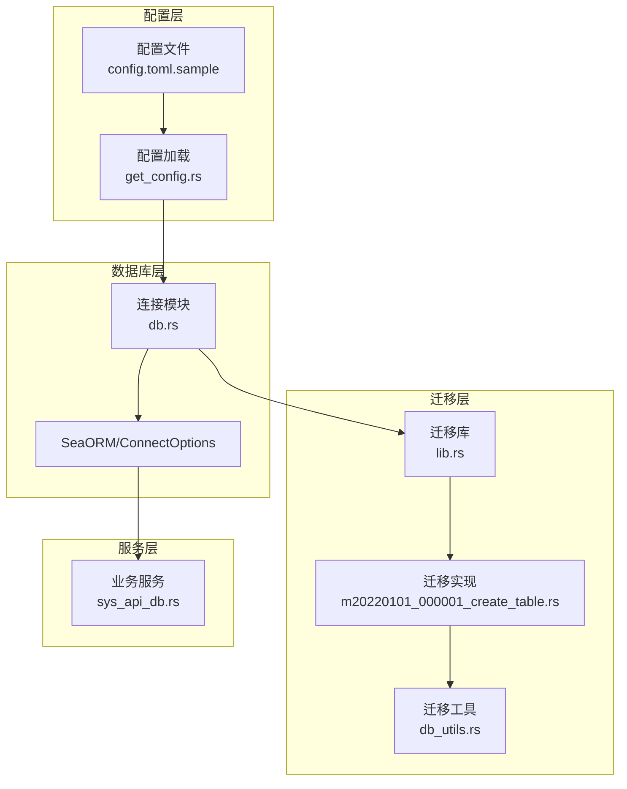
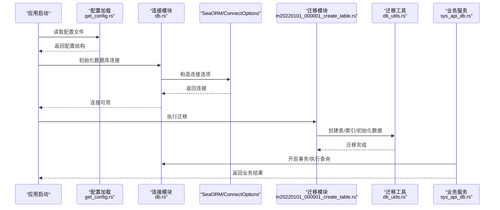
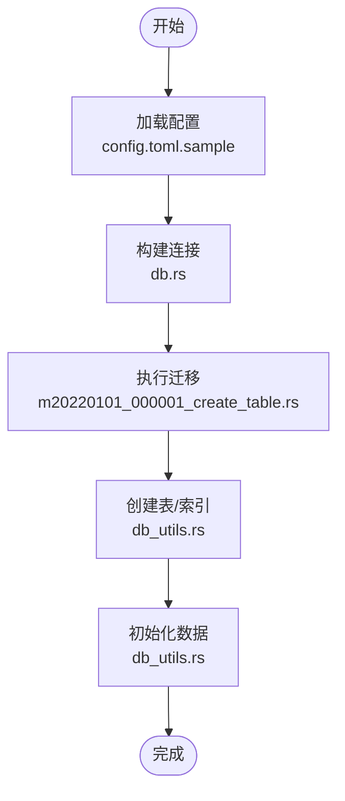
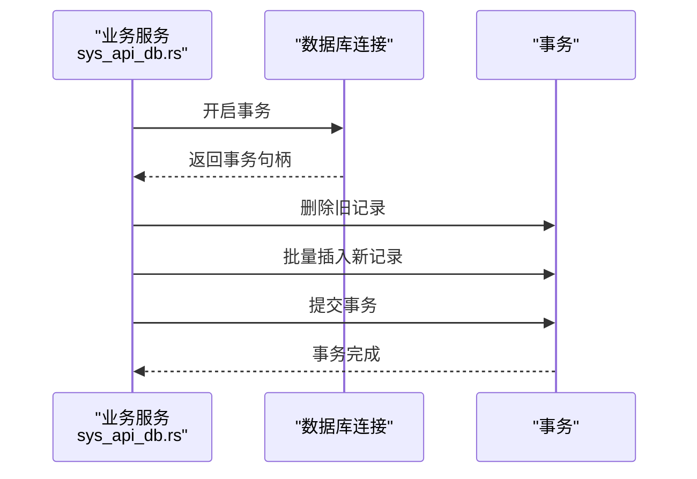
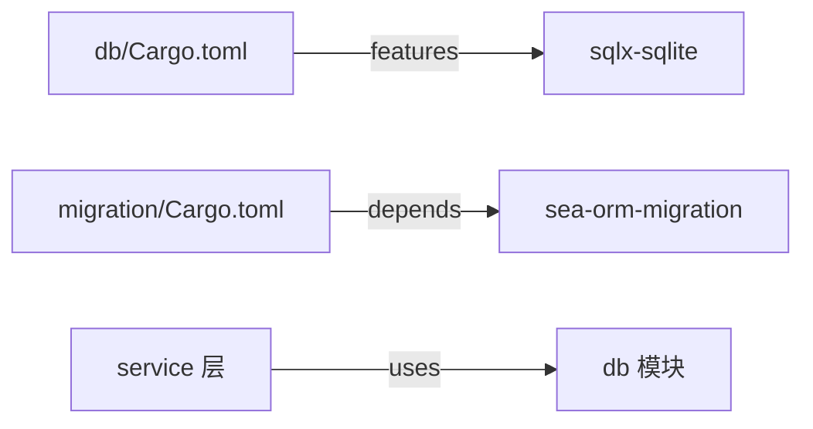

# SQLite 生产配置

<cite>
**本文引用的文件**
- [db.rs](file://db/src/db.rs)
- [config.toml.sample](file://config/config.toml.sample)
- [cfgs.rs](file://configs/src/cfgs.rs)
- [get_config.rs](file://configs/src/get_config.rs)
- [Cargo.toml](file://db/Cargo.toml)
- [m20220101_000001_create_table.rs](file://migration/src/migrations/m20220101_000001_create_table.rs)
- [db_utils.rs](file://migration/src/db_utils.rs)
- [sys_api_db.rs](file://service/src/system/sys_api_db.rs)
- [README.md](file://README.md)
</cite>

## 目录
1. [简介](#简介)
2. [项目结构](#项目结构)
3. [核心组件](#核心组件)
4. [架构总览](#架构总览)
5. [详细组件分析](#详细组件分析)
6. [依赖关系分析](#依赖关系分析)
7. [性能考虑](#性能考虑)
8. [故障排除指南](#故障排除指南)
9. [结论](#结论)
10. [附录](#附录)

## 简介
本指南面向在生产环境中使用 SQLite 的团队，结合仓库现有配置与实现，给出可落地的 SQLite 生产配置建议。内容涵盖：
- 文件路径配置与数据目录规划
- WAL 模式启用与同步模式（PRAGMA synchronous）设置
- 数据库大小限制、页大小优化、缓存大小配置
- 高并发场景下的性能优化策略（WAL 日志、事务处理模式、锁机制）
- 备份策略、数据完整性检查、监控指标与故障排除

说明：当前仓库以 SeaORM + sqlx 作为数据库访问层，默认启用 sqlite 特性，但未显式注入 SQLite PRAGMA 参数。本指南在“生产配置”层面提供通用实践，并在“已知实现映射”部分标注与现有代码的对应关系。

## 项目结构
本项目采用模块化组织，数据库相关的关键位置如下：
- 配置加载：configs 模块负责从配置文件读取数据库连接字符串
- 连接建立：db 模块通过 SeaORM ConnectOptions 建立连接
- 迁移与建表：migration 模块负责数据库结构初始化
- 业务服务：service 层调用数据库连接执行事务

**图表来源**
- [get_config.rs](file://configs/src/get_config.rs#L1-L26)
- [config.toml.sample](file://config/config.toml.sample#L45-L49)
- [db.rs](file://db/src/db.rs#L9-L19)
- [m20220101_000001_create_table.rs](file://migration/src/migrations/m20220101_000001_create_table.rs#L1-L36)
- [db_utils.rs](file://migration/src/db_utils.rs#L1-L120)
- [sys_api_db.rs](file://service/src/system/sys_api_db.rs#L11-L31)

**章节来源**
- [config.toml.sample](file://config/config.toml.sample#L45-L49)
- [get_config.rs](file://configs/src/get_config.rs#L1-L26)
- [db.rs](file://db/src/db.rs#L9-L19)
- [m20220101_000001_create_table.rs](file://migration/src/migrations/m20220101_000001_create_table.rs#L1-L36)
- [db_utils.rs](file://migration/src/db_utils.rs#L1-L120)
- [sys_api_db.rs](file://service/src/system/sys_api_db.rs#L11-L31)

## 核心组件
- 配置结构与数据库连接字符串
  - 配置结构体定义了 database.link 字段，用于承载数据库连接串
  - 默认示例为 SQLite 连接串，指向 data/sqlite 目录下的数据库文件
- 连接建立与池参数
  - 通过 SeaORM ConnectOptions 设置最大/最小连接数、超时、空闲时间等
  - 当前实现未显式设置 SQLite PRAGMA（如 synchronous、wal_mode、cache_size 等）

**章节来源**
- [cfgs.rs](file://configs/src/cfgs.rs#L96-L101)
- [config.toml.sample](file://config/config.toml.sample#L45-L49)
- [db.rs](file://db/src/db.rs#L9-L19)

## 架构总览
下图展示从配置到数据库连接、迁移与业务调用的整体流程。

**图表来源**
- [get_config.rs](file://configs/src/get_config.rs#L1-L26)
- [db.rs](file://db/src/db.rs#L9-L19)
- [m20220101_000001_create_table.rs](file://migration/src/migrations/m20220101_000001_create_table.rs#L16-L27)
- [db_utils.rs](file://migration/src/db_utils.rs#L17-L120)
- [sys_api_db.rs](file://service/src/system/sys_api_db.rs#L11-L31)

## 详细组件分析

### 组件一：数据库连接与池配置
- 连接字符串来源：config.toml.sample 中的 database.link
- 连接池参数：max_connections、min_connections、connect_timeout、idle_timeout
- 日志控制：sqlx_logging=false

建议在生产中补充 SQLite PRAGMA：
- 启用 WAL：PRAGMA journal_mode=WAL
- 设置同步模式：PRAGMA synchronous=NORMAL 或 FULL（根据一致性要求权衡）
- 设置缓存大小：PRAGMA cache_size=-[页数]（负值表示页数，正数为KB）
- 设置页大小：PRAGMA page_size=8192（常见推荐值）
- 设置 mmap 大小：PRAGMA mmap_size=268435456（256MB，按内存情况调整）

注意：当前实现未注入上述 PRAGMA，可在连接后执行相应 SQL 或通过 sqlx 的自定义参数传递（需查阅 sqlx-sqlite 文档）。

**章节来源**
- [config.toml.sample](file://config/config.toml.sample#L45-L49)
- [db.rs](file://db/src/db.rs#L9-L19)

### 组件二：迁移与建表
- 迁移入口：Migrator 实现，注册初始迁移
- 创建表/索引/初始化数据：db_utils 提供工具方法
- 业务表样例：sys_api_db 表用于 API 与数据库关联

**图表来源**
- [config.toml.sample](file://config/config.toml.sample#L45-L49)
- [db.rs](file://db/src/db.rs#L9-L19)
- [m20220101_000001_create_table.rs](file://migration/src/migrations/m20220101_000001_create_table.rs#L16-L27)
- [db_utils.rs](file://migration/src/db_utils.rs#L17-L120)

**章节来源**
- [m20220101_000001_create_table.rs](file://migration/src/migrations/m20220101_000001_create_table.rs#L1-L36)
- [db_utils.rs](file://migration/src/db_utils.rs#L17-L120)

### 组件三：事务与并发处理
- 业务层使用事务包装写入逻辑，确保一致性
- 高并发场景建议：
  - 使用 WAL 模式提升并发读写能力
  - 将长事务拆分为短事务，减少锁持有时间
  - 对只读查询使用 BEGIN IMMEDIATE 或 DEFERRED 事务，避免阻塞

**图表来源**
- [sys_api_db.rs](file://service/src/system/sys_api_db.rs#L11-L31)

**章节来源**
- [sys_api_db.rs](file://service/src/system/sys_api_db.rs#L11-L31)

## 依赖关系分析
- db 模块默认启用 sqlite 功能，依赖 sqlx-sqlite
- 迁移模块依赖 SeaORM 迁移框架
- 业务层通过 SeaORM Entity/Model 访问数据库

**图表来源**
- [Cargo.toml](file://db/Cargo.toml#L21-L25)
- [m20220101_000001_create_table.rs](file://migration/src/migrations/m20220101_000001_create_table.rs#L1-L6)

**章节来源**
- [Cargo.toml](file://db/Cargo.toml#L21-L25)

## 性能考虑
- 文件路径与存储
  - 将数据库文件置于高性能磁盘（SSD），避免网络存储
  - 独立出 WAL 文件与共享内存区域，降低竞争
- WAL 模式
  - 启用 WAL 提升并发读写，减少写放大
  - 配合合适的 synchronous 级别平衡性能与安全性
- 同步模式（PRAGMA synchronous）
  - NORMAL：兼顾性能与可靠性
  - FULL：强一致，但写入开销较大
  - EXTRA/CHECKPOINT：更严格的一致性保证
- 页大小与缓存
  - 推荐页大小 8192 字节，配合 cache_size=-[页数]
  - 根据可用内存设置合理的 mmap_size
- 事务与锁
  - 短事务、批量提交
  - 读写分离或只读副本，减轻主库压力
- 连接池
  - max_connections 依据 CPU 核心数与 I/O 能力设定
  - idle_timeout 适中，避免连接过多导致上下文切换
- 监控与指标
  - WAL 文件大小、checkpoint 频率
  - 事务等待时间、锁冲突次数
  - 连接池命中率、超时统计

## 故障排除指南
- 连接失败
  - 检查 database.link 是否正确指向本地文件路径
  - 确认文件权限与磁盘空间充足
- 迁移失败
  - 查看迁移日志输出，确认表/索引创建是否成功
  - 检查初始化数据 SQL 文件是否存在且格式正确
- 并发问题
  - WAL 文件增长过快：定期 checkpoint 或调整 synchronous
  - 写入阻塞：拆分长事务、减少锁持有时间
- 性能退化
  - 检查页大小与缓存设置是否合理
  - 监控连接池饱和度与超时次数
- 备份与恢复
  - 逻辑备份：使用 .backup 命令或导出 SQL
  - 物理备份：复制数据库文件与 WAL 文件
  - 恢复验证：完整性校验、关键查询回归测试

## 结论
本指南基于仓库现有配置与实现，给出了 SQLite 在生产环境下的配置要点与优化策略。建议在现有基础上补充 SQLite PRAGMA 参数、完善监控与备份流程，并持续评估性能与可靠性指标，以满足业务增长需求。

## 附录

### A. 配置项映射表
- 配置文件：config/config.toml.sample
- 关键字段：database.link
- 类型：字符串（连接串）
- 示例：sqlite://data/sqlite/data.db

**章节来源**
- [config.toml.sample](file://config/config.toml.sample#L45-L49)

### B. 已知实现映射
- 配置加载：get_config.rs
  - 读取配置文件并反序列化为 Configs 结构
- 连接建立：db.rs
  - 使用 SeaORM ConnectOptions 构建连接
- 迁移与建表：migration 模块
  - Migrator 注册初始迁移
  - db_utils 提供创建表/索引/初始化数据的方法
- 业务事务：service 层
  - sys_api_db.rs 使用事务包裹写入逻辑

**章节来源**
- [get_config.rs](file://configs/src/get_config.rs#L1-L26)
- [db.rs](file://db/src/db.rs#L9-L19)
- [m20220101_000001_create_table.rs](file://migration/src/migrations/m20220101_000001_create_table.rs#L1-L36)
- [db_utils.rs](file://migration/src/db_utils.rs#L17-L120)
- [sys_api_db.rs](file://service/src/system/sys_api_db.rs#L11-L31)