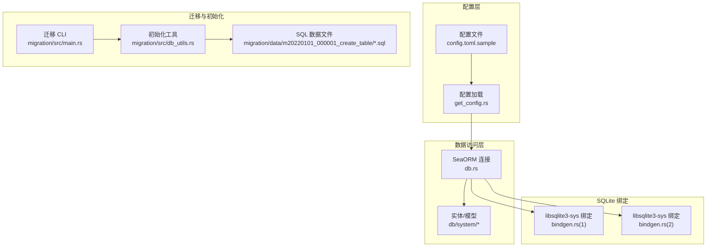
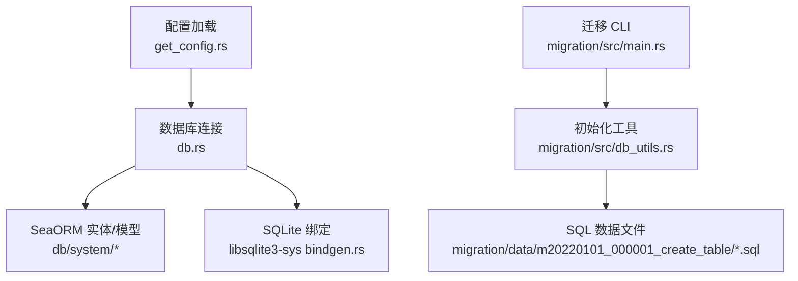
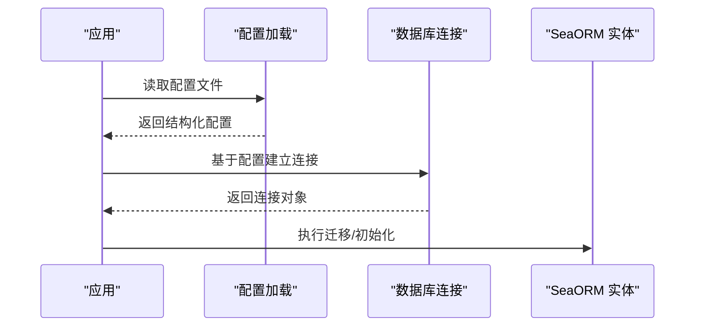
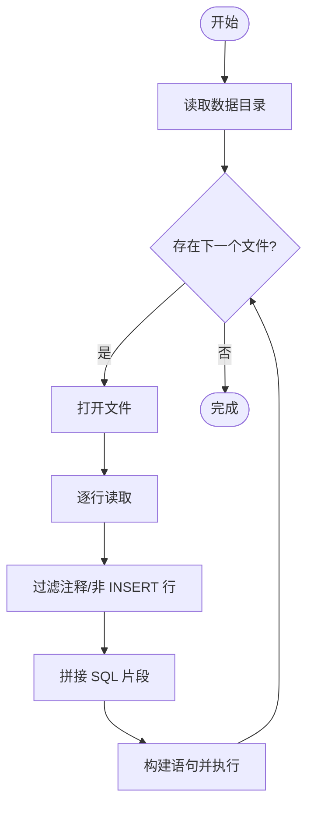
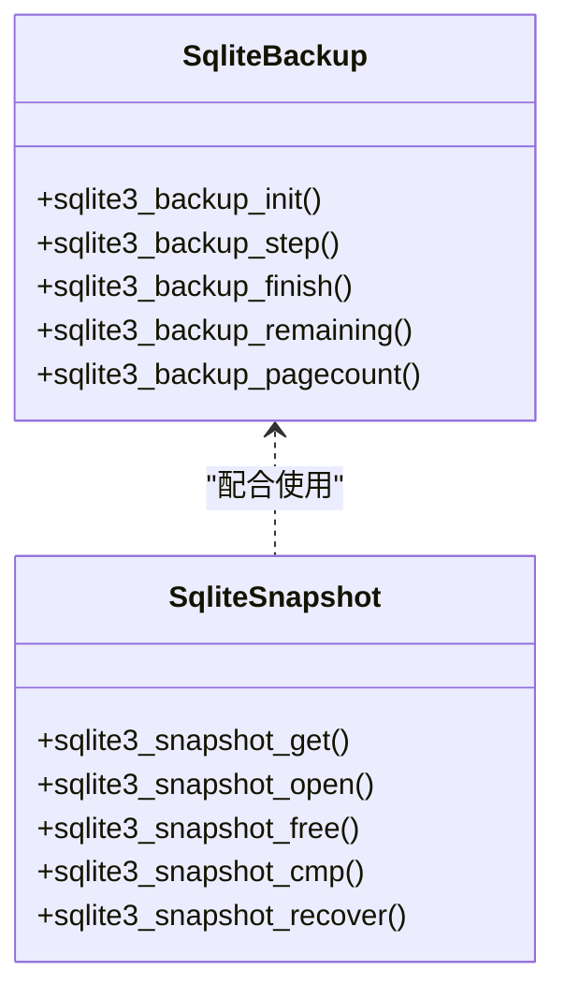
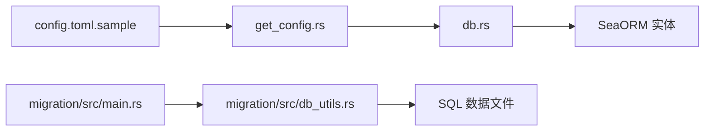

# 数据库备份与恢复

<cite>
**本文引用的文件**
- [Cargo.toml](file://Cargo.toml)
- [config/config.toml.sample](file://config/config.toml.sample)
- [configs/src/cfgs.rs](file://configs/src/cfgs.rs)
- [configs/src/get_config.rs](file://configs/src/get_config.rs)
- [db/src/db.rs](file://db/src/db.rs)
- [db/src/lib.rs](file://db/src/lib.rs)
- [migration/src/db_utils.rs](file://migration/src/db_utils.rs)
- [migration/src/main.rs](file://migration/src/main.rs)
- [migration/data/m20220101_000001_create_table/obj_sys_api_db.sql](file://migration/data/m20220101_000001_create_table/obj_sys_api_db.sql)
- [target/debug/build/libsqlite3-sys-a4cd56ee0770c783/out/bindgen.rs](file://target/debug/build/libsqlite3-sys-a4cd56ee0770c783/out/bindgen.rs)
- [target/debug/build/libsqlite3-sys-f106dd4dc9e5e498/out/bindgen.rs](file://target/debug/build/libsqlite3-sys-f106dd4dc9e5e498/out/bindgen.rs)
</cite>

## 目录
1. [简介](#简介)
2. [项目结构](#项目结构)
3. [核心组件](#核心组件)
4. [架构总览](#架构总览)
5. [详细组件分析](#详细组件分析)
6. [依赖关系分析](#依赖关系分析)
7. [性能考量](#性能考量)
8. [故障排查指南](#故障排查指南)
9. [结论](#结论)
10. [附录](#附录)

## 简介
本文件面向数据库备份与恢复策略，结合当前代码库中对数据库连接、配置加载与迁移工具的实现，给出可落地的 MySQL、PostgreSQL、SQLite 备份与恢复方案（含全量/增量/时间点恢复思路）、存储与安全策略、灾备流程、一致性校验与恢复测试、监控告警与失败处理、以及恢复性能优化建议。由于仓库未内置备份脚本或自动化任务，本文提供基于现有组件的工程化落地方法与最佳实践。

## 项目结构
- 配置层：通过 TOML 配置文件加载数据库连接字符串，运行时由配置模块解析并注入到数据库连接逻辑。
- 数据访问层：以 SeaORM 作为 ORM，统一管理数据库连接与事务。
- 迁移与初始化：提供迁移 CLI 与数据初始化工具，支持按数据库后端生成兼容的 SQL。
- SQLite 绑定：通过 SQLite C 绑定暴露备份、快照等能力，为增量/时间点恢复提供基础。

**图表来源**
- [config/config.toml.sample](file://config/config.toml.sample#L45-L49)
- [configs/src/get_config.rs](file://configs/src/get_config.rs#L1-L26)
- [configs/src/cfgs.rs](file://configs/src/cfgs.rs#L96-L101)
- [db/src/db.rs](file://db/src/db.rs#L1-L20)
- [migration/src/main.rs](file://migration/src/main.rs#L1-L7)
- [migration/src/db_utils.rs](file://migration/src/db_utils.rs#L1-L158)
- [migration/data/m20220101_000001_create_table/obj_sys_api_db.sql](file://migration/data/m20220101_000001_create_table/obj_sys_api_db.sql#L1-L118)
- [target/debug/build/libsqlite3-sys-a4cd56ee0770c783/out/bindgen.rs](file://target/debug/build/libsqlite3-sys-a4cd56ee0770c783/out/bindgen.rs#L2355-L2379)
- [target/debug/build/libsqlite3-sys-f106dd4dc9e5e498/out/bindgen.rs](file://target/debug/build/libsqlite3-sys-f106dd4dc9e5e498/out/bindgen.rs#L2355-L2379)

**章节来源**
- [Cargo.toml](file://Cargo.toml#L1-L90)
- [config/config.toml.sample](file://config/config.toml.sample#L45-L49)
- [configs/src/cfgs.rs](file://configs/src/cfgs.rs#L96-L101)
- [configs/src/get_config.rs](file://configs/src/get_config.rs#L1-L26)
- [db/src/db.rs](file://db/src/db.rs#L1-L20)
- [migration/src/db_utils.rs](file://migration/src/db_utils.rs#L1-L158)
- [migration/src/main.rs](file://migration/src/main.rs#L1-L7)
- [migration/data/m20220101_000001_create_table/obj_sys_api_db.sql](file://migration/data/m20220101_000001_create_table/obj_sys_api_db.sql#L1-L118)
- [target/debug/build/libsqlite3-sys-a4cd56ee0770c783/out/bindgen.rs](file://target/debug/build/libsqlite3-sys-a4cd56ee0770c783/out/bindgen.rs#L2355-L2379)
- [target/debug/build/libsqlite3-sys-f106dd4dc9e5e498/out/bindgen.rs](file://target/debug/build/libsqlite3-sys-f106dd4dc9e5e498/out/bindgen.rs#L2355-L2379)

## 核心组件
- 配置加载与数据库连接
  - 配置文件提供数据库连接字符串，运行时解析为结构化配置，供数据库连接模块使用。
  - 数据库连接模块以 SeaORM 建立连接，并设置连接池与超时参数。
- 迁移与初始化工具
  - 提供迁移 CLI，配合数据初始化工具批量执行 SQL，适配不同数据库后端。
- SQLite 绑定
  - 通过 SQLite C 绑定暴露备份、快照等接口，为增量与时间点恢复提供底层能力。

**章节来源**
- [configs/src/cfgs.rs](file://configs/src/cfgs.rs#L96-L101)
- [configs/src/get_config.rs](file://configs/src/get_config.rs#L1-L26)
- [db/src/db.rs](file://db/src/db.rs#L1-L20)
- [migration/src/db_utils.rs](file://migration/src/db_utils.rs#L1-L158)
- [migration/src/main.rs](file://migration/src/main.rs#L1-L7)
- [target/debug/build/libsqlite3-sys-a4cd56ee0770c783/out/bindgen.rs](file://target/debug/build/libsqlite3-sys-a4cd56ee0770c783/out/bindgen.rs#L2355-L2379)
- [target/debug/build/libsqlite3-sys-f106dd4dc9e5e498/out/bindgen.rs](file://target/debug/build/libsqlite3-sys-f106dd4dc9e5e498/out/bindgen.rs#L2355-L2379)

## 架构总览
下图展示从配置到数据库连接、迁移与初始化、以及 SQLite 绑定的整体关系，用于指导备份与恢复策略的设计与落地。

**图表来源**
- [configs/src/get_config.rs](file://configs/src/get_config.rs#L1-L26)
- [db/src/db.rs](file://db/src/db.rs#L1-L20)
- [migration/src/main.rs](file://migration/src/main.rs#L1-L7)
- [migration/src/db_utils.rs](file://migration/src/db_utils.rs#L1-L158)
- [migration/data/m20220101_000001_create_table/obj_sys_api_db.sql](file://migration/data/m20220101_000001_create_table/obj_sys_api_db.sql#L1-L118)
- [target/debug/build/libsqlite3-sys-a4cd56ee0770c783/out/bindgen.rs](file://target/debug/build/libsqlite3-sys-a4cd56ee0770c783/out/bindgen.rs#L2355-L2379)

## 详细组件分析

### 数据库连接与配置
- 配置项
  - 数据库连接字符串由配置文件提供，支持 MySQL、PostgreSQL、SQLite 等多种后端。
- 连接特性
  - 设置最大/最小连接数、连接超时、空闲超时等参数，确保服务稳定运行。
- 迁移与初始化
  - 迁移 CLI 与初始化工具在启动阶段或运维阶段执行，保证数据库结构与初始数据一致。

**图表来源**
- [config/config.toml.sample](file://config/config.toml.sample#L45-L49)
- [configs/src/get_config.rs](file://configs/src/get_config.rs#L1-L26)
- [db/src/db.rs](file://db/src/db.rs#L1-L20)
- [migration/src/main.rs](file://migration/src/main.rs#L1-L7)
- [migration/src/db_utils.rs](file://migration/src/db_utils.rs#L1-L158)

**章节来源**
- [config/config.toml.sample](file://config/config.toml.sample#L45-L49)
- [configs/src/cfgs.rs](file://configs/src/cfgs.rs#L96-L101)
- [configs/src/get_config.rs](file://configs/src/get_config.rs#L1-L26)
- [db/src/db.rs](file://db/src/db.rs#L1-L20)
- [migration/src/db_utils.rs](file://migration/src/db_utils.rs#L1-L158)
- [migration/src/main.rs](file://migration/src/main.rs#L1-L7)

### 迁移与初始化工具
- 功能概述
  - 迁移 CLI 提供命令行入口；初始化工具按目录扫描 SQL 文件，按数据库后端生成兼容语句并执行。
- 关键点
  - 支持多数据库后端（MySQL、PostgreSQL、SQLite），自动替换标识符或保留原样。
  - 按文件逐条拼接 SQL，遇到分号结束即执行，便于批量初始化。

**图表来源**
- [migration/src/db_utils.rs](file://migration/src/db_utils.rs#L78-L157)

**章节来源**
- [migration/src/db_utils.rs](file://migration/src/db_utils.rs#L1-L158)
- [migration/src/main.rs](file://migration/src/main.rs#L1-L7)
- [migration/data/m20220101_000001_create_table/obj_sys_api_db.sql](file://migration/data/m20220101_000001_create_table/obj_sys_api_db.sql#L1-L118)

### SQLite 绑定与增量/时间点恢复
- 绑定能力
  - 绑定暴露了 SQLite 备份与快照相关函数，可用于增量备份与时间点恢复的基础能力。
- 增量/时间点恢复思路
  - 增量：基于 WAL/快照机制进行增量复制与回放。
  - 时间点：利用快照与日志定位目标时间点并恢复至该状态。
- 注意事项
  - 需要在业务低峰期或只读副本上执行，避免写入冲突。
  - 恢复前需进行一致性校验与数据完整性检查。

**图表来源**
- [target/debug/build/libsqlite3-sys-a4cd56ee0770c783/out/bindgen.rs](file://target/debug/build/libsqlite3-sys-a4cd56ee0770c783/out/bindgen.rs#L2355-L2379)
- [target/debug/build/libsqlite3-sys-f106dd4dc9e5e498/out/bindgen.rs](file://target/debug/build/libsqlite3-sys-f106dd4dc9e5e498/out/bindgen.rs#L2355-L2379)

**章节来源**
- [target/debug/build/libsqlite3-sys-a4cd56ee0770c783/out/bindgen.rs](file://target/debug/build/libsqlite3-sys-a4cd56ee0770c783/out/bindgen.rs#L2355-L2379)
- [target/debug/build/libsqlite3-sys-f106dd4dc9e5e498/out/bindgen.rs](file://target/debug/build/libsqlite3-sys-f106dd4dc9e5e498/out/bindgen.rs#L2355-L2379)

## 依赖关系分析
- 配置依赖
  - 配置模块负责读取 TOML 并反序列化为结构体，供其他模块使用。
- 数据库连接依赖
  - 数据库连接模块依赖配置模块提供的连接字符串，SeaORM 作为 ORM 层。
- 迁移与初始化依赖
  - 迁移 CLI 依赖迁移器；初始化工具依赖 SQL 文件与数据库后端类型。

**图表来源**
- [config/config.toml.sample](file://config/config.toml.sample#L45-L49)
- [configs/src/get_config.rs](file://configs/src/get_config.rs#L1-L26)
- [db/src/db.rs](file://db/src/db.rs#L1-L20)
- [migration/src/main.rs](file://migration/src/main.rs#L1-L7)
- [migration/src/db_utils.rs](file://migration/src/db_utils.rs#L1-L158)

**章节来源**
- [Cargo.toml](file://Cargo.toml#L24-L81)
- [config/config.toml.sample](file://config/config.toml.sample#L45-L49)
- [configs/src/get_config.rs](file://configs/src/get_config.rs#L1-L26)
- [db/src/db.rs](file://db/src/db.rs#L1-L20)
- [migration/src/db_utils.rs](file://migration/src/db_utils.rs#L1-L158)
- [migration/src/main.rs](file://migration/src/main.rs#L1-L7)

## 性能考量
- 连接池与并发
  - 合理设置最大/最小连接数与超时，避免高并发下的连接争用。
- 备份窗口与资源占用
  - 在业务低峰期执行全量备份；增量备份采用 WAL/快照机制，减少锁竞争。
- 压缩与传输
  - 备份文件启用压缩，传输过程中使用带宽控制与断点续传。
- 恢复性能
  - 恢复前预热连接池；批量导入时关闭外键检查与唯一性约束（视数据库而定）以提升速度。

## 故障排查指南
- 配置问题
  - 确认配置文件路径与权限正确；检查连接字符串格式是否匹配所选数据库后端。
- 连接失败
  - 查看连接超时与空闲超时设置；核对数据库实例可达性与认证信息。
- 迁移/初始化失败
  - 检查 SQL 文件编码与注释格式；确认数据库后端兼容性（如反引号替换）。
- 恢复异常
  - 校验备份文件完整性与版本；在只读副本上先行验证；记录并比对关键表计数与哈希。

**章节来源**
- [configs/src/get_config.rs](file://configs/src/get_config.rs#L1-L26)
- [configs/src/cfgs.rs](file://configs/src/cfgs.rs#L96-L101)
- [db/src/db.rs](file://db/src/db.rs#L1-L20)
- [migration/src/db_utils.rs](file://migration/src/db_utils.rs#L1-L158)

## 结论
本项目已具备完善的配置加载、数据库连接与迁移初始化能力，可作为备份与恢复策略的基础设施。结合 SQLite 绑定的备份与快照能力，可设计覆盖全量/增量/时间点恢复的完整方案。建议在生产环境中配套完善的存储与安全策略、灾备流程、一致性校验与恢复测试、监控告警与失败处理机制，以确保数据安全与业务连续性。

## 附录

### 备份策略与自动化方案（基于现有组件）
- MySQL
  - 全量：mysqldump 或 Percona XtraBackup（物理备份）。
  - 增量：binlog 增量备份，结合时间点恢复。
  - 自动化：定时任务调用备份工具，上传至对象存储并校验。
- PostgreSQL
  - 全量：pg_dump 或物理备份工具。
  - 增量：WAL 归档与时间点恢复。
  - 自动化：备份完成后执行一致性校验与元数据记录。
- SQLite
  - 全量：直接复制数据文件（需在只读或关闭数据库时进行）。
  - 增量：WAL/快照机制；结合绑定的备份接口进行增量复制。
  - 自动化：在业务低峰期执行，校验文件完整性与哈希。

### 存储策略、压缩与加密
- 存储：本地磁盘 + 对象存储（冷热分层）。
- 压缩：gzip/zstd，降低存储与传输成本。
- 加密：静态加密（存储侧）与传输加密（TLS），密钥轮换与审计。

### 灾难恢复流程
- RTO/RPO 设定：根据业务需求设定目标。
- 多地备份：至少一个异地副本。
- 回滚演练：定期进行恢复演练，验证数据一致性与应用可用性。

### 数据一致性检查与恢复测试
- 校验：表计数、关键字段哈希、主键唯一性。
- 测试：在隔离环境执行恢复，验证业务功能与接口返回。

### 备份监控告警与失败处理
- 监控：备份任务状态、文件大小、传输耗时、校验结果。
- 告警：失败、延迟、容量预警。
- 失败处理：自动重试、人工介入、回滚与通知。