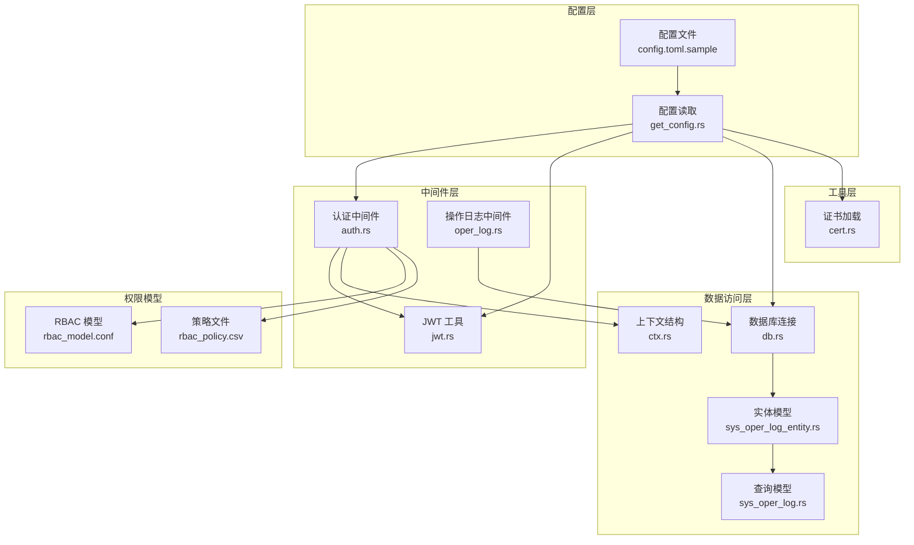
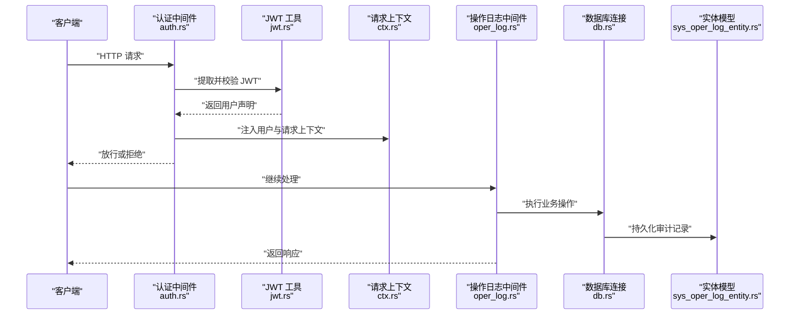
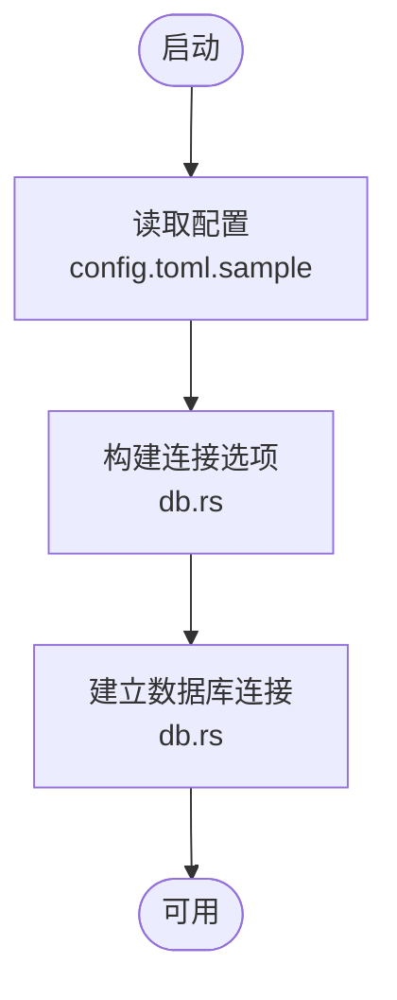
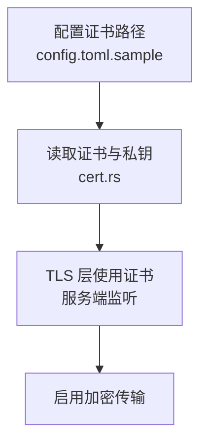
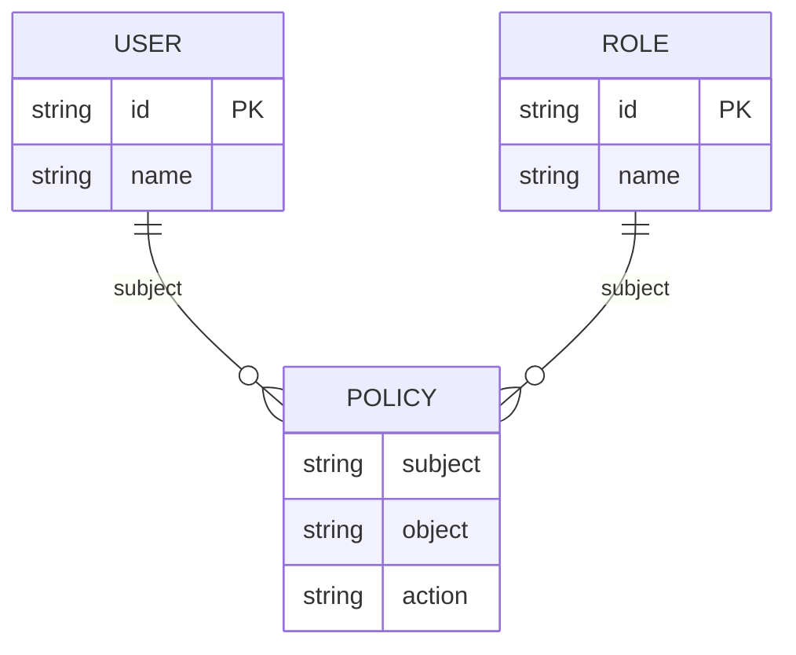
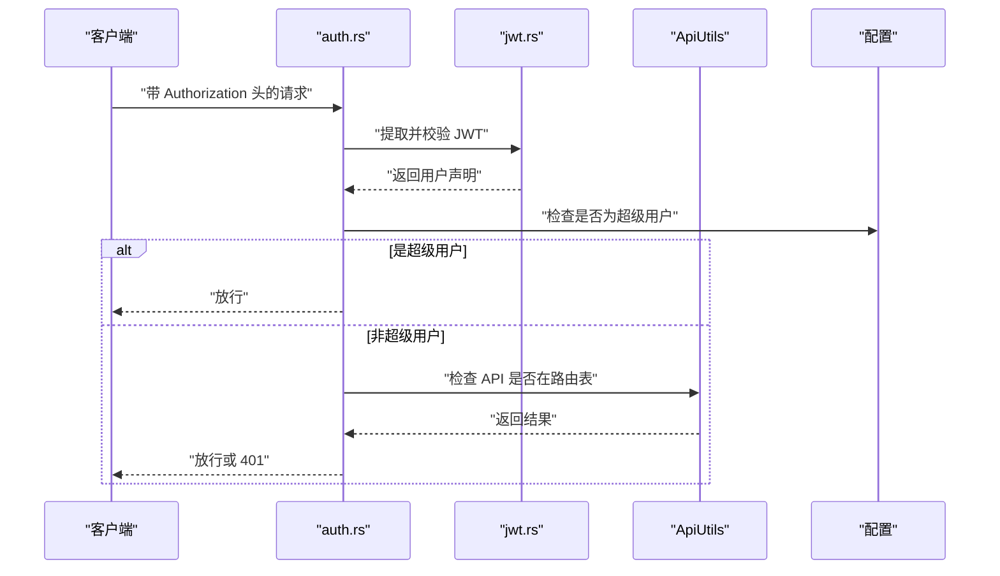
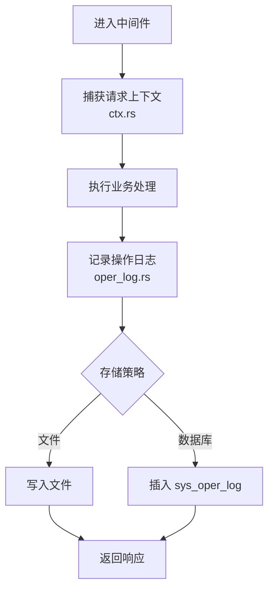
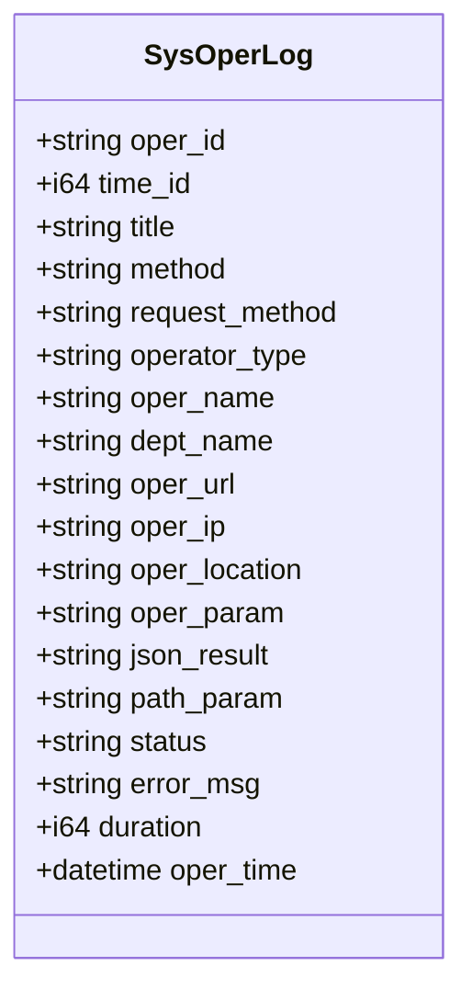
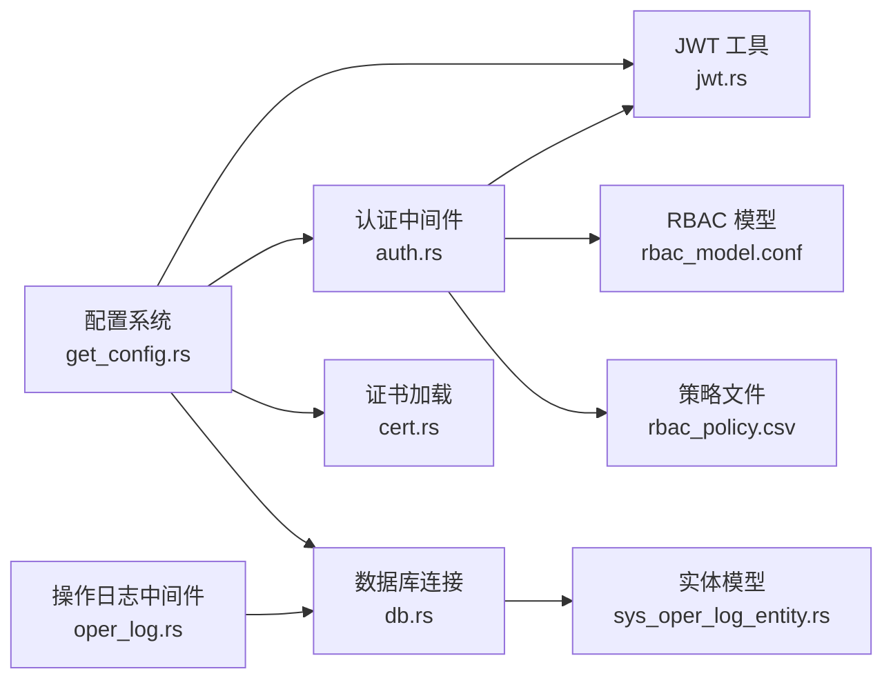

# 数据库安全配置

<cite>
**本文引用的文件**
- [config.toml.sample](file://config/config.toml.sample)
- [get_config.rs](file://configs/src/get_config.rs)
- [db.rs](file://db/src/db.rs)
- [cert.rs](file://utils/src/cert.rs)
- [rbac_model.conf](file://config/casbin_conf/rbac_model.conf)
- [rbac_policy.csv](file://config/casbin_conf/rbac_policy.csv)
- [auth.rs](file://middleware-fn/src/auth.rs)
- [jwt.rs](file://service/src/service_utils/jwt.rs)
- [oper_log.rs](file://middleware-fn/src/oper_log.rs)
- [ctx.rs](file://db/src/common/ctx.rs)
- [sys_oper_log.rs](file://db/src/system/models/sys_oper_log.rs)
- [sys_oper_log_entity.rs](file://db/src/system/entities/sys_oper_log.rs)
- [.gitignore](file://.gitignore)
</cite>

## 目录
1. [简介](#简介)
2. [项目结构](#项目结构)
3. [核心组件](#核心组件)
4. [架构总览](#架构总览)
5. [详细组件分析](#详细组件分析)
6. [依赖关系分析](#依赖关系分析)
7. [性能考虑](#性能考虑)
8. [故障排查指南](#故障排查指南)
9. [结论](#结论)
10. [附录](#附录)

## 简介
本指南围绕数据库安全配置展开，结合代码库中的配置、中间件与实体设计，系统阐述以下主题：
- 用户权限管理与角色模型（基于 Casbin 的 RBAC）
- 角色创建与权限分配流程
- SSL/TLS 连接与证书加载机制
- 审计日志与敏感数据保护策略
- 访问控制与 API 权限校验
- 备份与日志存储安全
- 安全最佳实践建议（防火墙、网络隔离、漏洞扫描、补丁管理、入侵检测）

本指南以仓库现有实现为依据，提供可落地的安全配置步骤与可视化图示。

## 项目结构
该项目采用模块化分层组织，安全相关能力主要分布在以下模块：
- 配置层：集中式配置文件与运行时读取逻辑
- 中间件层：认证、授权与操作审计
- 数据访问层：数据库连接与实体模型
- 工具层：证书加载与随机数工具

**图表来源**
- [get_config.rs](file://configs/src/get_config.rs#L12-L25)
- [config.toml.sample](file://config/config.toml.sample#L25-L49)
- [auth.rs](file://middleware-fn/src/auth.rs#L6-L24)
- [jwt.rs](file://service/src/service_utils/jwt.rs#L20-L38)
- [oper_log.rs](file://middleware-fn/src/oper_log.rs#L21-L42)
- [db.rs](file://db/src/db.rs#L9-L19)
- [sys_oper_log_entity.rs](file://db/src/system/entities/sys_oper_log.rs#L1-L110)
- [sys_oper_log.rs](file://db/src/system/models/sys_oper_log.rs#L1-L18)
- [ctx.rs](file://db/src/common/ctx.rs#L1-L33)
- [cert.rs](file://utils/src/cert.rs#L6-L26)
- [rbac_model.conf](file://config/casbin_conf/rbac_model.conf#L1-L14)
- [rbac_policy.csv](file://config/casbin_conf/rbac_policy.csv#L1-L5)

**章节来源**
- [config.toml.sample](file://config/config.toml.sample#L1-L50)
- [get_config.rs](file://configs/src/get_config.rs#L1-L26)
- [db.rs](file://db/src/db.rs#L1-L20)
- [cert.rs](file://utils/src/cert.rs#L1-L27)
- [rbac_model.conf](file://config/casbin_conf/rbac_model.conf#L1-L14)
- [rbac_policy.csv](file://config/casbin_conf/rbac_policy.csv#L1-L5)
- [auth.rs](file://middleware-fn/src/auth.rs#L1-L25)
- [jwt.rs](file://service/src/service_utils/jwt.rs#L1-L164)
- [oper_log.rs](file://middleware-fn/src/oper_log.rs#L1-L158)
- [ctx.rs](file://db/src/common/ctx.rs#L1-L33)
- [sys_oper_log.rs](file://db/src/system/models/sys_oper_log.rs#L1-L18)
- [sys_oper_log_entity.rs](file://db/src/system/entities/sys_oper_log.rs#L1-L110)

## 核心组件
- 配置系统：集中读取配置文件，提供运行时访问；支持数据库连接串、证书路径、日志开关、JWT 过期时间等。
- 数据库连接：统一连接参数与超时控制，便于集中治理。
- 认证与授权：基于 JWT 的身份提取与校验，结合 API 路由表进行权限判定；超级用户绕过权限校验。
- RBAC 权限模型：通过 Casbin 的模型与策略文件定义角色、策略与匹配器。
- 操作审计：中间件自动记录请求、响应、耗时、状态码与错误信息，并支持落库或文件输出。
- 证书加载：从配置文件指定路径读取证书与私钥，供服务端 TLS 使用。

**章节来源**
- [get_config.rs](file://configs/src/get_config.rs#L12-L25)
- [config.toml.sample](file://config/config.toml.sample#L25-L49)
- [db.rs](file://db/src/db.rs#L9-L19)
- [jwt.rs](file://service/src/service_utils/jwt.rs#L54-L94)
- [auth.rs](file://middleware-fn/src/auth.rs#L6-L24)
- [rbac_model.conf](file://config/casbin_conf/rbac_model.conf#L1-L14)
- [rbac_policy.csv](file://config/casbin_conf/rbac_policy.csv#L1-L5)
- [oper_log.rs](file://middleware-fn/src/oper_log.rs#L21-L103)
- [cert.rs](file://utils/src/cert.rs#L18-L26)

## 架构总览
下图展示从请求进入至数据库访问的关键路径，以及安全相关组件的交互：

**图表来源**
- [auth.rs](file://middleware-fn/src/auth.rs#L6-L24)
- [jwt.rs](file://service/src/service_utils/jwt.rs#L54-L94)
- [ctx.rs](file://db/src/common/ctx.rs#L1-L33)
- [oper_log.rs](file://middleware-fn/src/oper_log.rs#L21-L103)
- [db.rs](file://db/src/db.rs#L9-L19)
- [sys_oper_log_entity.rs](file://db/src/system/entities/sys_oper_log.rs#L106-L143)

## 详细组件分析

### 数据库连接与安全参数
- 连接字符串：通过配置文件集中管理，支持 SQLite、MySQL、PostgreSQL 等。
- 连接参数：最大/最小连接数、连接与空闲超时、SQLx 日志开关等。
- 建议：在生产环境为不同数据库启用 SSL/TLS 连接与证书校验；限制最大连接数以避免资源耗尽；开启连接池健康检查。

**图表来源**
- [config.toml.sample](file://config/config.toml.sample#L45-L49)
- [db.rs](file://db/src/db.rs#L9-L19)

**章节来源**
- [config.toml.sample](file://config/config.toml.sample#L45-L49)
- [db.rs](file://db/src/db.rs#L9-L19)

### SSL/TLS 与证书管理
- 证书路径：配置文件中指定证书与私钥路径。
- 加载机制：运行时从磁盘读取字节流，供 TLS 层使用。
- 建议：仅在生产环境启用 SSL；证书与私钥权限最小化；定期轮换证书；禁用弱密码套件与过时协议版本。

**图表来源**
- [config.toml.sample](file://config/config.toml.sample#L25-L27)
- [cert.rs](file://utils/src/cert.rs#L18-L26)

**章节来源**
- [config.toml.sample](file://config/config.toml.sample#L25-L27)
- [cert.rs](file://utils/src/cert.rs#L1-L27)

### 用户权限管理与角色模型（RBAC）
- 模型定义：请求主体、策略主体、角色关系与匹配器。
- 策略样例：用户对资源的操作权限，以及角色继承关系。
- 建议：为每个 API 明确权限边界；定期审查策略；使用最小权限原则；对敏感 API 启用二次校验。

**图表来源**
- [rbac_model.conf](file://config/casbin_conf/rbac_model.conf#L1-L14)
- [rbac_policy.csv](file://config/casbin_conf/rbac_policy.csv#L1-L5)

**章节来源**
- [rbac_model.conf](file://config/casbin_conf/rbac_model.conf#L1-L14)
- [rbac_policy.csv](file://config/casbin_conf/rbac_policy.csv#L1-L5)

### 认证与 API 权限校验
- JWT 提取与校验：从 Authorization 头部解析 Bearer Token，解码用户声明并校验在线状态。
- 超级用户豁免：配置中列出的用户 ID 可绕过权限校验。
- API 权限判定：根据路由表判断是否需要校验，再进行权限比对。

**图表来源**
- [auth.rs](file://middleware-fn/src/auth.rs#L6-L24)
- [jwt.rs](file://service/src/service_utils/jwt.rs#L54-L94)
- [jwt.rs](file://service/src/service_utils/jwt.rs#L105-L121)
- [config.toml.sample](file://config/config.toml.sample#L38-L44)

**章节来源**
- [auth.rs](file://middleware-fn/src/auth.rs#L1-L25)
- [jwt.rs](file://service/src/service_utils/jwt.rs#L1-L164)
- [config.toml.sample](file://config/config.toml.sample#L38-L44)

### 审计日志与敏感数据保护
- 日志中间件：自动记录请求路径、方法、耗时、状态、错误信息与响应内容。
- 存储策略：支持文件与数据库两种模式，可按 API 维度配置。
- 敏感数据保护：对超长参数与响应进行截断，避免日志膨胀与敏感信息泄露。

**图表来源**
- [ctx.rs](file://db/src/common/ctx.rs#L1-L33)
- [oper_log.rs](file://middleware-fn/src/oper_log.rs#L21-L103)
- [sys_oper_log_entity.rs](file://db/src/system/entities/sys_oper_log.rs#L106-L143)

**章节来源**
- [oper_log.rs](file://middleware-fn/src/oper_log.rs#L1-L158)
- [ctx.rs](file://db/src/common/ctx.rs#L1-L33)
- [sys_oper_log_entity.rs](file://db/src/system/entities/sys_oper_log.rs#L1-L110)

### 数据库实体与审计字段
- 实体字段覆盖：操作标识、标题、方法、请求方法、操作类型、操作人、部门、URL、IP、位置、参数、结果、状态、错误、耗时、时间等。
- 建议：对敏感字段（如参数、结果）进行脱敏或长度限制；对大字段使用合适的数据类型与索引策略。

**图表来源**
- [sys_oper_log_entity.rs](file://db/src/system/entities/sys_oper_log.rs#L15-L36)

**章节来源**
- [sys_oper_log_entity.rs](file://db/src/system/entities/sys_oper_log.rs#L1-L110)
- [sys_oper_log.rs](file://db/src/system/models/sys_oper_log.rs#L1-L18)

## 依赖关系分析
- 配置依赖：所有安全相关组件均依赖配置系统提供的运行时配置。
- 认证链路：认证中间件依赖 JWT 工具与 API 路由表；JWT 工具依赖配置中的密钥与过期时间。
- 审计链路：操作日志中间件依赖数据库连接与实体模型；实体模型依赖数据库连接。
- 权限模型：认证中间件依赖 Casbin 的模型与策略文件。

**图表来源**
- [get_config.rs](file://configs/src/get_config.rs#L12-L25)
- [auth.rs](file://middleware-fn/src/auth.rs#L6-L24)
- [jwt.rs](file://service/src/service_utils/jwt.rs#L20-L38)
- [oper_log.rs](file://middleware-fn/src/oper_log.rs#L106-L143)
- [db.rs](file://db/src/db.rs#L9-L19)
- [cert.rs](file://utils/src/cert.rs#L18-L26)
- [rbac_model.conf](file://config/casbin_conf/rbac_model.conf#L1-L14)
- [rbac_policy.csv](file://config/casbin_conf/rbac_policy.csv#L1-L5)
- [sys_oper_log_entity.rs](file://db/src/system/entities/sys_oper_log.rs#L106-L143)

**章节来源**
- [get_config.rs](file://configs/src/get_config.rs#L1-L26)
- [auth.rs](file://middleware-fn/src/auth.rs#L1-L25)
- [jwt.rs](file://service/src/service_utils/jwt.rs#L1-L164)
- [oper_log.rs](file://middleware-fn/src/oper_log.rs#L1-L158)
- [db.rs](file://db/src/db.rs#L1-L20)
- [cert.rs](file://utils/src/cert.rs#L1-L27)
- [rbac_model.conf](file://config/casbin_conf/rbac_model.conf#L1-L14)
- [rbac_policy.csv](file://config/casbin_conf/rbac_policy.csv#L1-L5)
- [sys_oper_log_entity.rs](file://db/src/system/entities/sys_oper_log.rs#L1-L110)

## 性能考虑
- 连接池：合理设置最大/最小连接数与超时，避免高并发下的连接争用。
- 日志异步：审计日志采用异步写入，降低对主流程的影响。
- 字段截断：对超长参数与响应进行截断，减少存储与序列化开销。
- 缓存与压缩：配置中提供缓存与响应压缩选项，可在保证安全的前提下提升性能。

**章节来源**
- [db.rs](file://db/src/db.rs#L9-L19)
- [oper_log.rs](file://middleware-fn/src/oper_log.rs#L44-L53)
- [config.toml.sample](file://config/config.toml.sample#L11-L14)

## 故障排查指南
- 配置文件缺失：若配置文件不存在或无法读取，应用会直接崩溃提示。请确保配置文件存在且路径正确。
- 证书读取失败：证书或私钥路径错误会导致证书加载失败。请核对配置文件中的证书路径与文件权限。
- JWT 校验异常：无效令牌、过期签名或用户未在线会导致认证失败。请检查密钥一致性与用户在线状态。
- 审计日志异常：日志写入失败会被记录到追踪日志中。请检查日志目录权限与存储空间。
- 数据库连接失败：检查连接字符串、网络连通性与数据库服务状态。

**章节来源**
- [get_config.rs](file://configs/src/get_config.rs#L14-L23)
- [cert.rs](file://utils/src/cert.rs#L24-L26)
- [jwt.rs](file://service/src/service_utils/jwt.rs#L64-L85)
- [oper_log.rs](file://middleware-fn/src/oper_log.rs#L48-L51)
- [db.rs](file://db/src/db.rs#L16-L19)

## 结论
本项目在配置、中间件与实体层面提供了较为完善的数据库安全基础：集中式配置、JWT 认证、Casbin RBAC、操作审计与证书加载。建议在生产环境中进一步强化以下方面：
- 启用数据库 SSL/TLS 并严格管理证书
- 对敏感字段与日志内容进行脱敏与分级存储
- 建立漏洞扫描与补丁管理流程
- 配置防火墙与网络隔离策略
- 部署入侵检测与告警机制

## 附录

### 安全配置清单（基于现有实现）
- 配置文件与证书
  - 在配置文件中设置数据库连接串与证书路径
  - 确保证书与私钥权限最小化
- 认证与授权
  - 正确配置 JWT 密钥与过期时间
  - 为敏感 API 启用权限校验
  - 定期审查 Casbin 策略
- 审计与日志
  - 开启操作日志并选择合适的存储策略
  - 对超长参数与响应进行截断
- 数据库连接
  - 设置合理的连接池参数与超时
  - 在生产环境启用 SSL/TLS

**章节来源**
- [config.toml.sample](file://config/config.toml.sample#L25-L49)
- [cert.rs](file://utils/src/cert.rs#L18-L26)
- [jwt.rs](file://service/src/service_utils/jwt.rs#L20-L38)
- [auth.rs](file://middleware-fn/src/auth.rs#L6-L24)
- [oper_log.rs](file://middleware-fn/src/oper_log.rs#L57-L103)
- [db.rs](file://db/src/db.rs#L9-L19)