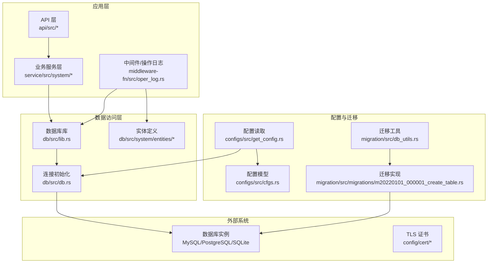
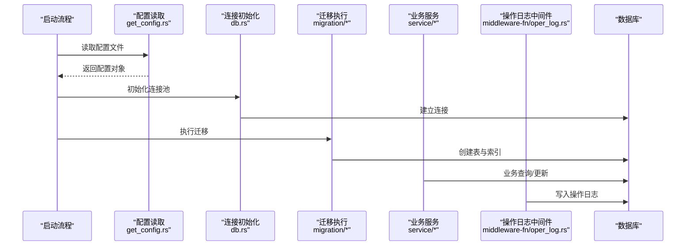
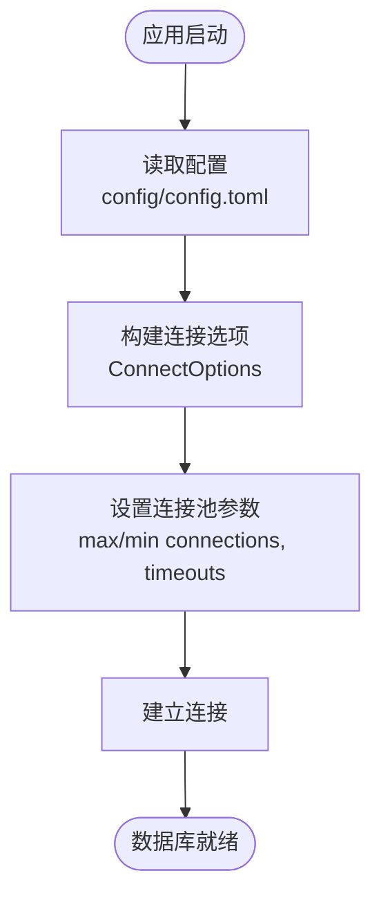
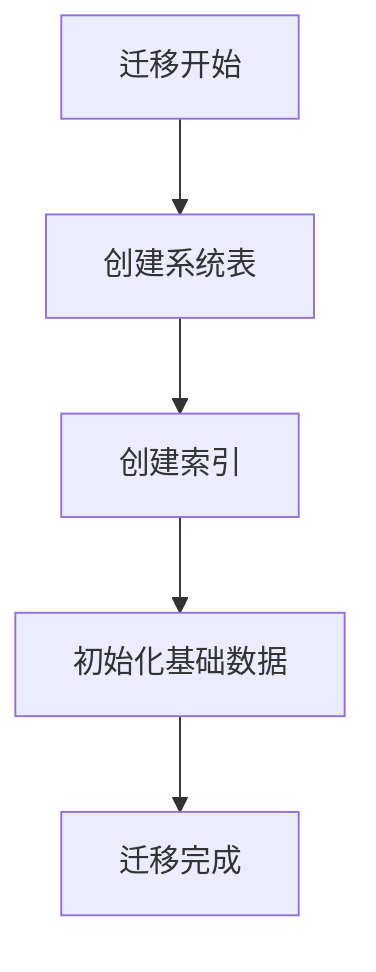
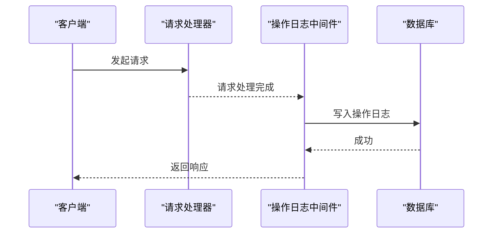
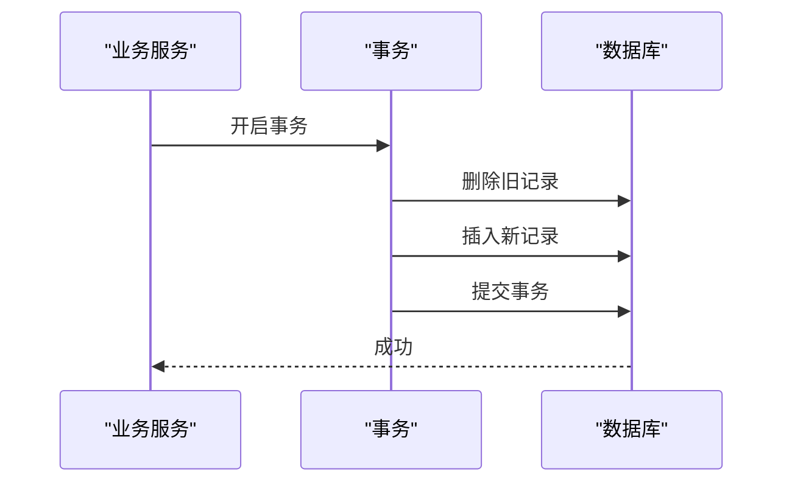
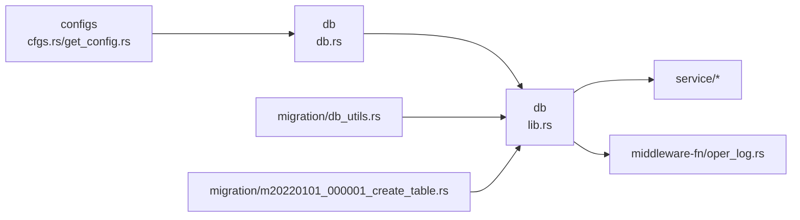

# 生产数据库配置

<cite>
**本文引用的文件**
- [config.toml.sample](file://config/config.toml.sample)
- [Cargo.toml](file://Cargo.toml)
- [db.rs](file://db/src/db.rs)
- [lib.rs](file://db/src/lib.rs)
- [cfgs.rs](file://configs/src/cfgs.rs)
- [get_config.rs](file://configs/src/get_config.rs)
- [db_utils.rs](file://migration/src/db_utils.rs)
- [m20220101_000001_create_table.rs](file://migration/src/migrations/m20220101_000001_create_table.rs)
- [sys_oper_log.rs](file://db/src/system/entities/sys_oper_log.rs)
- [oper_log.rs](file://middleware-fn/src/oper_log.rs)
- [sys_api_db.rs](file://service/src/system/sys_api_db.rs)
</cite>

## 目录
1. [简介](#简介)
2. [项目结构](#项目结构)
3. [核心组件](#核心组件)
4. [架构总览](#架构总览)
5. [详细组件分析](#详细组件分析)
6. [依赖关系分析](#依赖关系分析)
7. [性能考虑](#性能考虑)
8. [故障排查指南](#故障排查指南)
9. [结论](#结论)
10. [附录](#附录)

## 简介
本指南面向 Axum Admin 在生产环境中的数据库配置与运维，覆盖 MySQL、PostgreSQL、SQLite 的连接与优化要点，连接池参数、事务隔离级别、索引优化策略；并提供备份策略、监控指标、性能调优建议，以及安全配置（用户权限、SSL 连接、审计日志）与高可用部署方案（主从复制、集群）。文档基于仓库中实际实现进行说明，并给出可落地的配置建议。

## 项目结构
Axum Admin 使用 SeaORM 作为 ORM，数据库连接通过配置文件动态注入，运行时在进程内初始化连接池。迁移脚本负责建表与索引创建，系统日志与操作日志写入数据库，便于生产监控与审计。

**图表来源**
- [lib.rs](file://db/src/lib.rs#L1-L8)
- [db.rs](file://db/src/db.rs#L1-L20)
- [cfgs.rs](file://configs/src/cfgs.rs#L1-L111)
- [get_config.rs](file://configs/src/get_config.rs#L1-L26)
- [db_utils.rs](file://migration/src/db_utils.rs#L1-L158)
- [m20220101_000001_create_table.rs](file://migration/src/migrations/m20220101_000001_create_table.rs#L1-L133)
- [oper_log.rs](file://middleware-fn/src/oper_log.rs#L105-L134)
- [sys_oper_log.rs](file://db/src/system/entities/sys_oper_log.rs#L76-L109)

**章节来源**
- [Cargo.toml](file://Cargo.toml#L1-L90)
- [config.toml.sample](file://config/config.toml.sample#L1-L50)
- [lib.rs](file://db/src/lib.rs#L1-L8)
- [db.rs](file://db/src/db.rs#L1-L20)
- [cfgs.rs](file://configs/src/cfgs.rs#L1-L111)
- [get_config.rs](file://configs/src/get_config.rs#L1-L26)
- [db_utils.rs](file://migration/src/db_utils.rs#L1-L158)
- [m20220101_000001_create_table.rs](file://migration/src/migrations/m20220101_000001_create_table.rs#L1-L133)

## 核心组件
- 配置系统：通过 toml 文件加载配置，静态单例持有全局配置，其中包含数据库连接字符串。
- 数据库连接：SeaORM ConnectOptions 动态构建连接参数，支持 MySQL、PostgreSQL、SQLite。
- 迁移与索引：迁移脚本统一创建表与索引，确保生产一致性。
- 操作日志：中间件在请求完成后写入操作日志，便于审计与监控。
- 业务事务：服务层使用显式事务，保证关键流程的数据一致性。

**章节来源**
- [config.toml.sample](file://config/config.toml.sample#L45-L50)
- [cfgs.rs](file://configs/src/cfgs.rs#L96-L101)
- [get_config.rs](file://configs/src/get_config.rs#L1-L26)
- [db.rs](file://db/src/db.rs#L1-L20)
- [db_utils.rs](file://migration/src/db_utils.rs#L1-L158)
- [m20220101_000001_create_table.rs](file://migration/src/migrations/m20220101_000001_create_table.rs#L66-L101)
- [oper_log.rs](file://middleware-fn/src/oper_log.rs#L105-L134)
- [sys_api_db.rs](file://service/src/system/sys_api_db.rs#L11-L31)

## 架构总览
下图展示生产环境数据库配置的关键交互：配置加载、连接池初始化、迁移执行、业务请求与日志写入。

**图表来源**
- [get_config.rs](file://configs/src/get_config.rs#L1-L26)
- [db.rs](file://db/src/db.rs#L1-L20)
- [db_utils.rs](file://migration/src/db_utils.rs#L1-L158)
- [oper_log.rs](file://middleware-fn/src/oper_log.rs#L105-L134)

## 详细组件分析

### 数据库连接与连接池
- 连接字符串由配置文件提供，支持 MySQL、PostgreSQL、SQLite 三种后端。
- 连接池参数在运行时设置：最大连接数、最小连接数、连接超时、空闲超时等。
- SeaORM 默认行为与日志开关可通过连接选项控制。

**图表来源**
- [config.toml.sample](file://config/config.toml.sample#L45-L50)
- [db.rs](file://db/src/db.rs#L9-L19)

**章节来源**
- [config.toml.sample](file://config/config.toml.sample#L45-L50)
- [db.rs](file://db/src/db.rs#L1-L20)

### 迁移与索引优化
- 迁移脚本统一创建系统表与索引，确保生产一致性。
- 已创建的常用索引包括：字典类型、菜单组合唯一索引、用户角色关联索引等。
- 建议在生产环境中对高频查询字段补充复合索引，并定期评估索引使用情况。

**图表来源**
- [m20220101_000001_create_table.rs](file://migration/src/migrations/m20220101_000001_create_table.rs#L18-L28)
- [db_utils.rs](file://migration/src/db_utils.rs#L18-L30)

**章节来源**
- [m20220101_000001_create_table.rs](file://migration/src/migrations/m20220101_000001_create_table.rs#L66-L101)
- [db_utils.rs](file://migration/src/db_utils.rs#L32-L66)

### 操作日志与审计
- 中间件在请求完成后将操作信息写入数据库表，包含请求路径、方法、耗时、状态等。
- 审计日志字段丰富，适合用于合规与问题追踪。

**图表来源**
- [oper_log.rs](file://middleware-fn/src/oper_log.rs#L105-L134)
- [sys_oper_log.rs](file://db/src/system/entities/sys_oper_log.rs#L76-L109)

**章节来源**
- [oper_log.rs](file://middleware-fn/src/oper_log.rs#L105-L134)
- [sys_oper_log.rs](file://db/src/system/entities/sys_oper_log.rs#L76-L109)

### 事务与并发控制
- 服务层使用显式事务包裹关键写入流程，确保原子性。
- 对于高并发场景，建议结合数据库层面的锁机制与重试策略，避免热点冲突。

**图表来源**
- [sys_api_db.rs](file://service/src/system/sys_api_db.rs#L11-L31)

**章节来源**
- [sys_api_db.rs](file://service/src/system/sys_api_db.rs#L11-L31)

## 依赖关系分析
- 应用通过 db 模块暴露 DB 连接单例，供各模块共享。
- 迁移模块依赖 SeaORM 进行建表与索引管理。
- 配置模块提供统一的配置读取入口，贯穿启动流程。

**图表来源**
- [lib.rs](file://db/src/lib.rs#L1-L8)
- [db.rs](file://db/src/db.rs#L1-L20)
- [cfgs.rs](file://configs/src/cfgs.rs#L1-L111)
- [get_config.rs](file://configs/src/get_config.rs#L1-L26)
- [db_utils.rs](file://migration/src/db_utils.rs#L1-L158)
- [m20220101_000001_create_table.rs](file://migration/src/migrations/m20220101_000001_create_table.rs#L1-L133)

**章节来源**
- [lib.rs](file://db/src/lib.rs#L1-L8)
- [db.rs](file://db/src/db.rs#L1-L20)
- [cfgs.rs](file://configs/src/cfgs.rs#L1-L111)
- [get_config.rs](file://configs/src/get_config.rs#L1-L26)
- [db_utils.rs](file://migration/src/db_utils.rs#L1-L158)
- [m20220101_000001_create_table.rs](file://migration/src/migrations/m20220101_000001_create_table.rs#L1-L133)

## 性能考虑
- 连接池参数
  - 最大连接数：根据 CPU 核数与 QPS 估算，建议与数据库最大连接限制匹配。
  - 最小连接数：保持一定常驻连接以降低冷启动开销。
  - 连接超时与空闲超时：平衡资源占用与延迟。
- 事务隔离级别
  - 默认隔离级别通常为 READ COMMITTED 或 REPEATABLE READ，按需调整以平衡一致性与吞吐。
- 索引优化
  - 针对高频查询字段建立合适索引，避免全表扫描。
  - 定期分析慢查询与索引使用率，清理冗余索引。
- 监控指标
  - 连接池命中率、平均等待时间、活跃连接数、事务提交速率。
  - 慢查询阈值与数量、索引选择性、缓冲池命中率（MySQL）、WAL 刷盘频率（PostgreSQL）。
- 调优参数
  - MySQL：innodb_buffer_pool_size、innodb_flush_log_at_trx_commit、innodb_thread_concurrency。
  - PostgreSQL：shared_buffers、effective_cache_size、work_mem、checkpoint_completion_target。
  - SQLite：WAL 模式、页大小、自动检查点间隔。

[本节为通用指导，无需特定文件引用]

## 故障排查指南
- 连接失败
  - 检查配置文件中的连接字符串格式与凭据。
  - 核对数据库网络连通性与防火墙策略。
- 连接池耗尽
  - 观察最大连接数是否过低，适当提高 max_connections 并优化业务逻辑减少长事务。
- 慢查询
  - 启用慢查询日志，结合索引策略与查询计划分析。
- 操作日志异常
  - 确认操作日志表存在且具备写入权限，检查中间件是否正确触发。

**章节来源**
- [config.toml.sample](file://config/config.toml.sample#L45-L50)
- [db.rs](file://db/src/db.rs#L9-L19)
- [oper_log.rs](file://middleware-fn/src/oper_log.rs#L105-L134)

## 结论
Axum Admin 的数据库配置以配置驱动与 SeaORM 连接池为核心，配合迁移脚本与操作日志实现生产可用的基础能力。建议在生产部署中结合数据库特性完善连接池、索引与监控策略，并通过主从或集群提升可用性与扩展性。

[本节为总结，无需特定文件引用]

## 附录

### 生产数据库配置清单（示例）
- 连接字符串
  - MySQL: "mysql://用户名:密码@tcp(主机:端口)/数据库?charset=utf8mb4&parseTime=True"
  - PostgreSQL: "postgres://用户名:密码@主机:端口/数据库"
  - SQLite: "sqlite://相对路径/数据库.db"
- 连接池参数（示例）
  - 最大连接数：100
  - 最小连接数：10
  - 连接超时：8 秒
  - 空闲超时：8 秒
- 事务隔离级别
  - 读已提交（READ-COMMITTED）或可重复读（REPEATABLE-READ），视业务需求而定
- 备份策略
  - MySQL：基于 GTID 的主从复制 + 定时全量 + 归档增量
  - PostgreSQL：逻辑复制/物理复制 + 定时全量 + 归档 WAL
  - SQLite：定期文件级备份 + 校验
- 监控指标
  - 连接池：活跃连接、等待队列长度、拒绝次数
  - 查询：慢查询数、平均响应时间、错误率
  - 存储：磁盘空间、IO 等待、缓冲池命中率
- 安全配置
  - 用户权限：最小权限原则，分离只读与写入账户
  - SSL 连接：启用 TLS，校验证书链
  - 审计日志：开启通用查询日志或二进制日志，保留合规周期
- 高可用部署
  - MySQL：主从复制（半同步/组复制）或 InnoDB Cluster
  - PostgreSQL：流复制 + 基于仲裁的故障转移（Patroni/Repmgr）
  - SQLite：文件级高可用（共享存储/仲裁）或迁移到更合适的引擎

[本节为通用指导，无需特定文件引用]