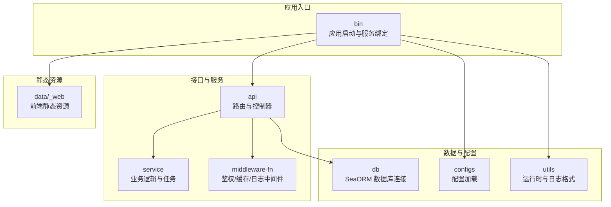
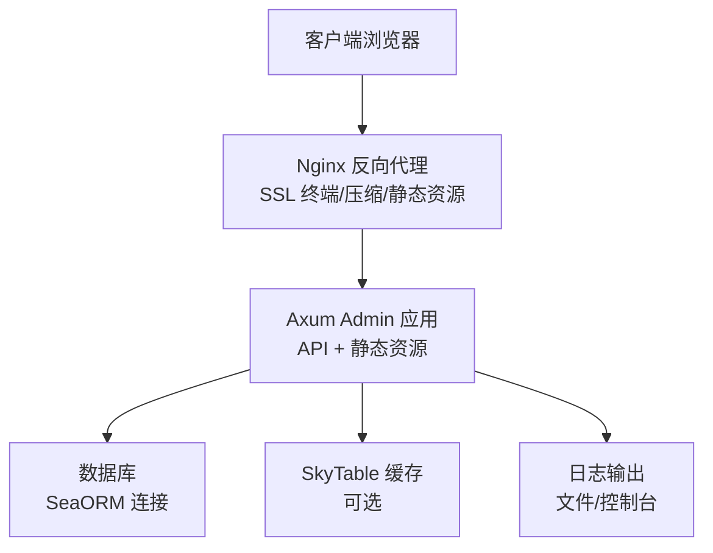
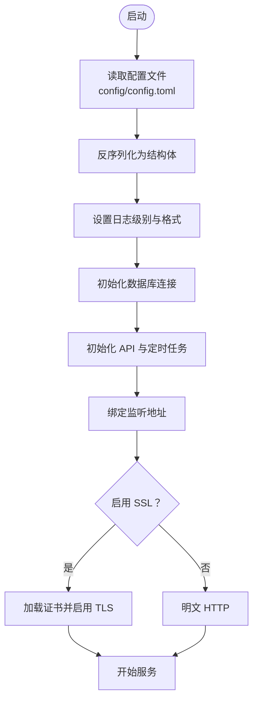
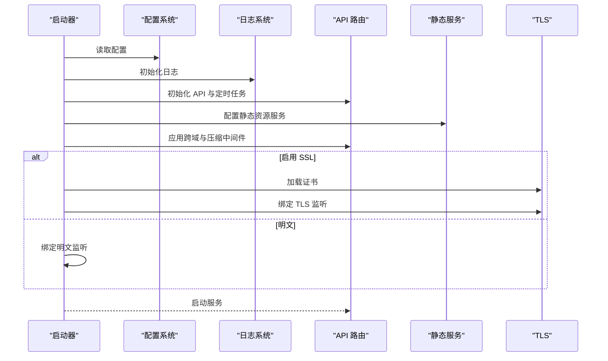
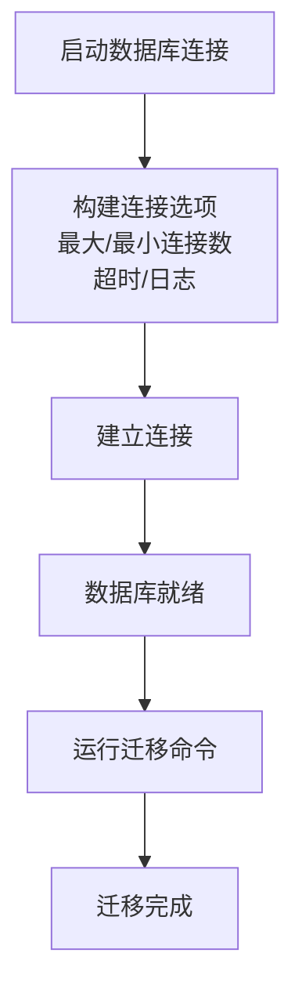
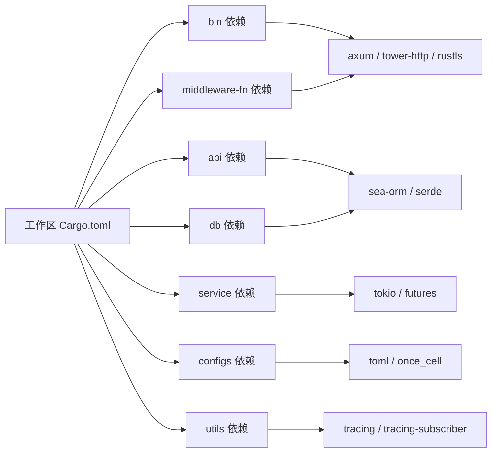

# 生产环境部署

<cite>
**本文引用的文件**   
- [Cargo.toml](file://Cargo.toml)
- [bin/Cargo.toml](file://bin/Cargo.toml)
- [api/Cargo.toml](file://api/Cargo.toml)
- [configs/src/lib.rs](file://configs/src/lib.rs)
- [configs/src/get_config.rs](file://configs/src/get_config.rs)
- [configs/src/cfgs.rs](file://configs/src/cfgs.rs)
- [utils/src/my_env.rs](file://utils/src/my_env.rs)
- [bin/src/main.rs](file://bin/src/main.rs)
- [db/src/db.rs](file://db/src/db.rs)
- [middleware-fn/src/lib.rs](file://middleware-fn/src/lib.rs)
- [api/src/lib.rs](file://api/src/lib.rs)
- [config/config.toml.sample](file://config/config.toml.sample)
- [config/regexes.yaml](file://config/regexes.yaml)
- [.github/workflows/rust.yml](file://.github/workflows/rust.yml)
- [migration/README.md](file://migration/README.md)
</cite>

## 目录
1. [简介](#简介)
2. [项目结构](#项目结构)
3. [核心组件](#核心组件)
4. [架构总览](#架构总览)
5. [详细组件分析](#详细组件分析)
6. [依赖关系分析](#依赖关系分析)
7. [性能考虑](#性能考虑)
8. [故障排查指南](#故障排查指南)
9. [结论](#结论)
10. [附录](#附录)

## 简介
本指南面向 Axum Admin 项目的生产环境部署，覆盖服务器环境准备、应用编译与部署、Nginx 反向代理与 SSL 证书配置、数据库生产环境配置、性能调优参数、日志与监控、负载均衡与高可用、安全加固以及部署后的验证与故障恢复策略。文档基于仓库内现有配置与代码进行梳理，确保可落地、可验证。

## 项目结构
Axum Admin 采用多 crate 的工作区结构，核心模块包括：
- 应用入口与服务启动：bin
- API 路由与业务接口：api
- 服务层与任务调度：service
- 中间件：middleware-fn
- 配置加载：configs
- 数据访问层：db
- 工具与环境：utils
- 迁移工具：migration

图表来源
- [bin/src/main.rs](file://bin/src/main.rs#L1-L129)
- [api/src/lib.rs](file://api/src/lib.rs#L1-L10)
- [configs/src/lib.rs](file://configs/src/lib.rs#L1-L6)
- [db/src/db.rs](file://db/src/db.rs#L1-L20)

章节来源
- [Cargo.toml](file://Cargo.toml#L1-L12)
- [bin/Cargo.toml](file://bin/Cargo.toml#L1-L26)
- [api/Cargo.toml](file://api/Cargo.toml#L1-L22)

## 核心组件
- 配置系统：从 TOML 文件加载运行时配置，支持服务器、Web、证书、系统、数据库、JWT、日志、SkyTable 等配置段。
- 启动流程：初始化日志、跨域、静态文件服务、API 路由、压缩、TLS，并监听指定地址。
- 数据库连接：通过 SeaORM 连接字符串建立连接，配置最大连接数、超时等参数。
- 日志系统：支持控制台与文件双通道输出，按环境变量与配置动态调整日志级别与格式。
- 中间件：鉴权、请求上下文、操作日志、缓存（内存或 SkyTable）。

章节来源
- [configs/src/get_config.rs](file://configs/src/get_config.rs#L1-L26)
- [configs/src/cfgs.rs](file://configs/src/cfgs.rs#L1-L111)
- [bin/src/main.rs](file://bin/src/main.rs#L1-L129)
- [db/src/db.rs](file://db/src/db.rs#L1-L20)
- [utils/src/my_env.rs](file://utils/src/my_env.rs#L1-L72)
- [middleware-fn/src/lib.rs](file://middleware-fn/src/lib.rs#L1-L23)

## 架构总览
下图展示生产环境部署的关键交互：Nginx 作为反向代理与 SSL 终端，Axum Admin 提供 API 与静态资源，数据库与 SkyTable（可选）支撑数据与缓存。

图表来源
- [bin/src/main.rs](file://bin/src/main.rs#L58-L95)
- [config/config.toml.sample](file://config/config.toml.sample#L1-L50)
- [db/src/db.rs](file://db/src/db.rs#L1-L20)

## 详细组件分析

### 配置加载与运行时参数
- 配置文件：默认从 config/config.toml 加载，包含服务器监听地址、SSL 开关、压缩、缓存策略、API 前缀、Web 静态目录、证书路径、Casbin 权限模型与策略、日志目录与级别、系统超级管理员、JWT 密钥与过期时间、数据库连接串、SkyTable 地址与端口。
- 配置结构：通过结构体反序列化，提供强类型访问；日志级别与格式由运行时决定。
- 环境变量：若未设置 RUST_LOG，则使用配置中的 log_level。

图表来源
- [configs/src/get_config.rs](file://configs/src/get_config.rs#L1-L26)
- [configs/src/cfgs.rs](file://configs/src/cfgs.rs#L1-L111)
- [utils/src/my_env.rs](file://utils/src/my_env.rs#L1-L72)
- [bin/src/main.rs](file://bin/src/main.rs#L25-L95)

章节来源
- [config/config.toml.sample](file://config/config.toml.sample#L1-L50)
- [configs/src/get_config.rs](file://configs/src/get_config.rs#L1-L26)
- [configs/src/cfgs.rs](file://configs/src/cfgs.rs#L1-L111)
- [utils/src/my_env.rs](file://utils/src/my_env.rs#L1-L72)

### 应用启动与服务绑定
- 日志：控制台与文件双通道，支持 JSON 或本地时间格式。
- 跨域：允许 GET/POST/PUT/DELETE，任意来源与头部。
- 压缩：除 SSE 外默认启用 gzip 压缩。
- 静态资源：ServeDir 提供前端静态文件，404 回退至 404 处理。
- 监听：根据配置选择明文或 TLS 绑定。
- 优雅关闭：接收信号后触发 graceful shutdown。

图表来源
- [bin/src/main.rs](file://bin/src/main.rs#L25-L95)

章节来源
- [bin/src/main.rs](file://bin/src/main.rs#L1-L129)

### 数据库连接与迁移
- 连接参数：最大连接数、最小连接数、连接与空闲超时、SQLx 日志开关。
- 迁移：提供 CLI 使用说明，支持 up/down/fresh/reset/status 等常用命令。

图表来源
- [db/src/db.rs](file://db/src/db.rs#L1-L20)
- [migration/README.md](file://migration/README.md#L1-L38)

章节来源
- [db/src/db.rs](file://db/src/db.rs#L1-L20)
- [migration/README.md](file://migration/README.md#L1-L38)

### 中间件与缓存
- 中间件导出：鉴权、上下文、操作日志、缓存（内存或 SkyTable）。
- 缓存策略：通过配置选择缓存方式与缓存时间；SkyTable 作为可选外部缓存。

章节来源
- [middleware-fn/src/lib.rs](file://middleware-fn/src/lib.rs#L1-L23)
- [config/config.toml.sample](file://config/config.toml.sample#L1-L50)

### 日志与监控
- 日志输出：控制台与滚动文件输出，支持 JSON 与本地时间格式。
- 日志级别：由配置决定，默认 INFO；可通过环境变量覆盖。
- 监控建议：结合 Nginx 访问日志、应用日志与数据库慢查询日志进行综合分析。

章节来源
- [utils/src/my_env.rs](file://utils/src/my_env.rs#L1-L72)
- [bin/src/main.rs](file://bin/src/main.rs#L38-L51)
- [config/config.toml.sample](file://config/config.toml.sample#L31-L37)

## 依赖关系分析
- 工作区依赖：统一版本管理，启用 tokio 多线程运行时、HTTP/2、CORS、压缩、TLS 等特性。
- 运行时配置：release 配置启用 LTO、优化体积、禁用调试符号，适合生产部署。

图表来源
- [Cargo.toml](file://Cargo.toml#L24-L90)
- [bin/Cargo.toml](file://bin/Cargo.toml#L10-L25)
- [api/Cargo.toml](file://api/Cargo.toml#L8-L21)

章节来源
- [Cargo.toml](file://Cargo.toml#L1-L90)
- [bin/Cargo.toml](file://bin/Cargo.toml#L1-L26)
- [api/Cargo.toml](file://api/Cargo.toml#L1-L22)

## 性能考虑
- 运行时优化：release 配置启用 LTO、优化体积、禁用调试符号，提升运行效率。
- 连接池：数据库连接池参数需结合并发与资源限制调优，避免过度占用。
- 压缩：默认启用 gzip，但排除 SSE 流式响应，兼顾性能与兼容性。
- 缓存：根据业务热点选择内存或 SkyTable 缓存，合理设置缓存时间与失效策略。

章节来源
- [Cargo.toml](file://Cargo.toml#L83-L90)
- [db/src/db.rs](file://db/src/db.rs#L10-L15)
- [bin/src/main.rs](file://bin/src/main.rs#L75-L82)
- [config/config.toml.sample](file://config/config.toml.sample#L11-L14)

## 故障排查指南
- 启动失败：检查配置文件是否存在与可读、证书路径是否正确、监听地址是否被占用。
- 数据库连接：确认连接串格式与可达性，检查连接池参数与超时设置。
- 日志定位：查看滚动日志文件与控制台输出，结合环境变量 RUST_LOG 调整级别。
- 迁移问题：使用迁移工具提供的命令核对状态与回滚策略，确保数据库结构一致。
- 优雅关闭：确认信号处理与 graceful shutdown 时间设置，避免强制中断。

章节来源
- [configs/src/get_config.rs](file://configs/src/get_config.rs#L14-L24)
- [bin/src/main.rs](file://bin/src/main.rs#L102-L128)
- [db/src/db.rs](file://db/src/db.rs#L10-L15)
- [migration/README.md](file://migration/README.md#L1-L38)

## 结论
本指南基于仓库现有配置与代码，给出了生产环境部署的完整路径：从服务器准备、编译打包、Nginx 反代与 SSL、数据库与缓存配置，到性能调优、日志与监控、负载均衡与高可用、安全加固以及部署后的验证与故障恢复。建议在正式上线前完成端到端演练与压测，确保稳定性与可观测性。

## 附录

### A. 服务器环境准备清单
- 操作系统：Linux（推荐 Ubuntu/CentOS）
- 运行时：Rust 运行时（Tokio 多线程）
- 网络：开放应用监听端口与反向代理端口
- 存储：足够的磁盘空间用于日志、静态资源与数据库文件
- 安全：防火墙放行必要端口，限制 SSH 等管理端口访问

### B. 应用编译与部署
- 编译：使用 release 配置进行编译，产物位于目标目录
- 部署：将二进制与 config 目录、data 目录（含静态资源与上传目录）一并部署
- 运行：以系统服务方式运行，或使用容器编排平台

章节来源
- [Cargo.toml](file://Cargo.toml#L83-L90)
- [bin/src/main.rs](file://bin/src/main.rs#L25-L95)

### C. Nginx 反向代理与 SSL 配置要点
- 反向代理：将请求转发至应用监听地址
- SSL 终端：使用 Let’s Encrypt 或自有证书，开启 HTTP/2
- 压缩：可由 Nginx 提供 gzip 压缩，减少后端压力
- 静态资源：由 Nginx 直接提供静态文件，减少后端负载
- 超时与缓冲：合理设置超时与缓冲区大小，避免长连接阻塞

### D. 数据库生产环境配置
- 连接串：根据实际数据库类型与地址配置
- 连接池：结合并发与资源限制调整最大/最小连接数与超时
- 迁移：使用迁移工具在上线前完成数据库结构变更

章节来源
- [config/config.toml.sample](file://config/config.toml.sample#L45-L49)
- [db/src/db.rs](file://db/src/db.rs#L10-L15)
- [migration/README.md](file://migration/README.md#L1-L38)

### E. 性能调优参数建议
- 运行时：启用 LTO、优化体积、禁用调试符号
- 连接池：根据并发与资源上限调整最大连接数与超时
- 压缩：默认 gzip，排除 SSE
- 缓存：根据业务热点选择内存或 SkyTable，设置合理的缓存时间

章节来源
- [Cargo.toml](file://Cargo.toml#L83-L90)
- [db/src/db.rs](file://db/src/db.rs#L10-L15)
- [bin/src/main.rs](file://bin/src/main.rs#L75-L82)
- [config/config.toml.sample](file://config/config.toml.sample#L11-L14)

### F. 日志配置与监控
- 日志：控制台与文件双通道输出，支持 JSON 与本地时间格式
- 监控：结合 Nginx 访问日志、应用日志与数据库慢查询日志进行综合分析

章节来源
- [utils/src/my_env.rs](file://utils/src/my_env.rs#L38-L71)
- [bin/src/main.rs](file://bin/src/main.rs#L38-L51)
- [config/config.toml.sample](file://config/config.toml.sample#L31-L37)

### G. 负载均衡与高可用部署方案
- 负载均衡：使用 Nginx/HAProxy/LVS 等实现多实例分发
- 高可用：多节点部署，共享存储或数据库，健康检查与自动摘除
- 会话与缓存：如需粘性会话，可结合 SkyTable 或共享缓存

### H. 安全加固措施
- 最小权限：应用仅授予数据库与文件系统最小必要权限
- 传输加密：启用 HTTPS/TLS，禁用弱密码套件
- 输入校验：结合 Casbin 权限模型与中间件进行鉴权与审计
- 审计日志：开启操作日志与登录日志，定期归档与分析

章节来源
- [config/config.toml.sample](file://config/config.toml.sample#L28-L30)
- [middleware-fn/src/lib.rs](file://middleware-fn/src/lib.rs#L1-L23)

### I. 部署后的验证与健康检查
- 功能验证：访问首页、登录、基础 API 接口
- 健康检查：对外暴露健康端点，Nginx/负载均衡定期探测
- 性能验证：基准测试与压力测试，观察 CPU、内存、连接池与响应时间
- 故障恢复：演练优雅关闭、重启与回滚流程

### J. CI/CD 与自动化
- 构建：GitHub Actions 示例展示了基本构建流程
- 发布：结合制品管理与自动化部署脚本

章节来源
- [.github/workflows/rust.yml](file://.github/workflows/rust.yml#L1-L26)