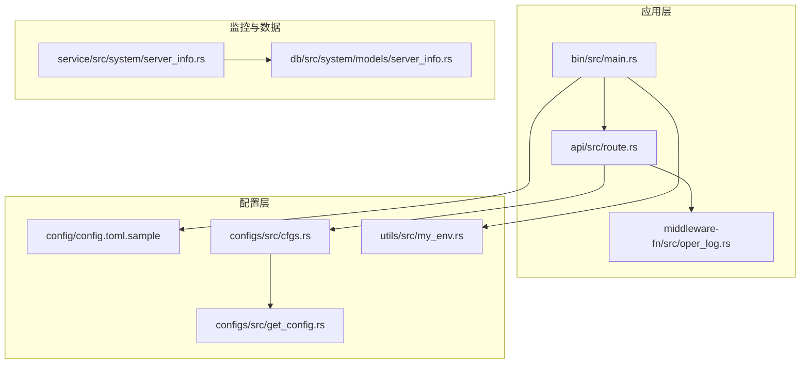
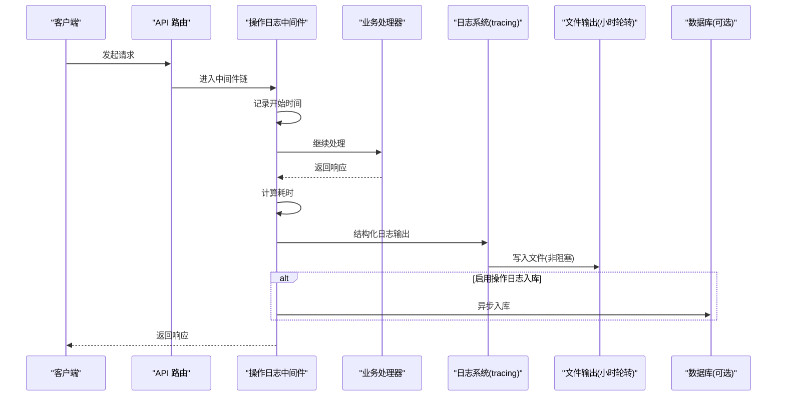
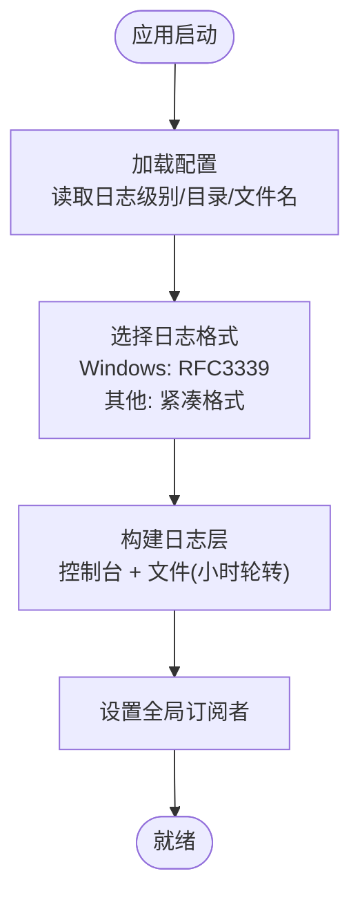
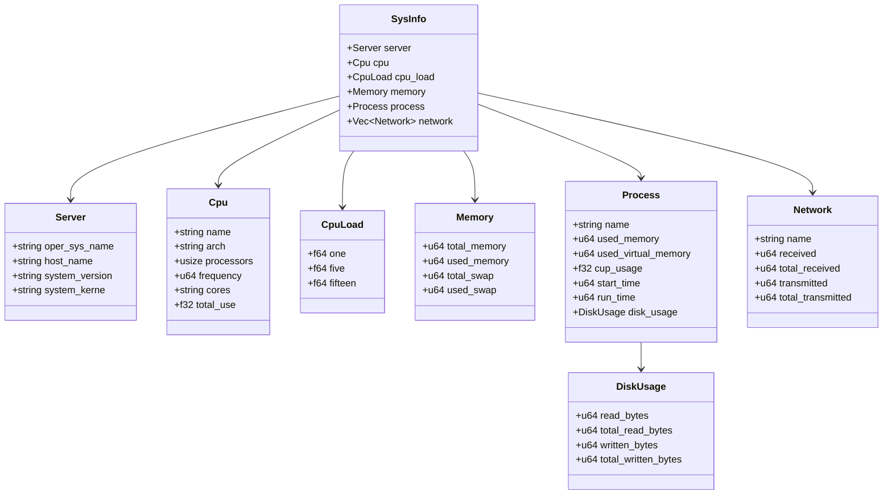
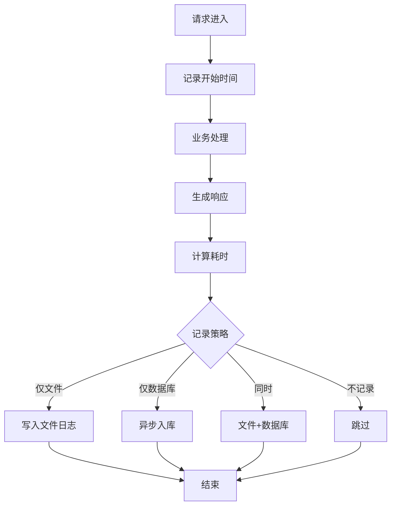
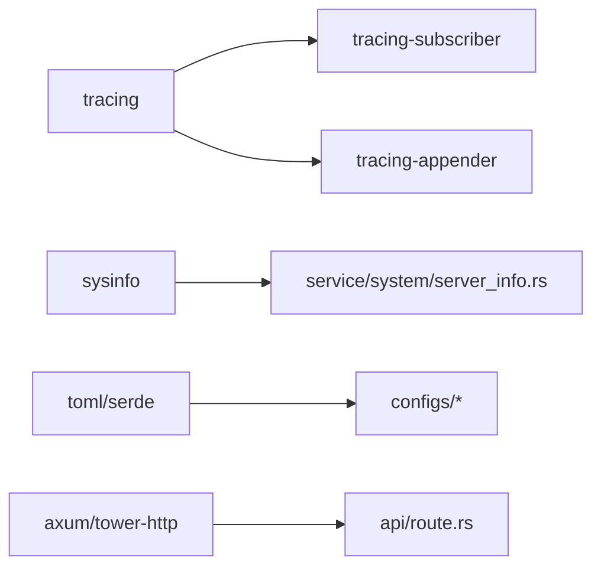

# 监控与日志配置

<cite>
**本文引用的文件**
- [Cargo.toml](file://Cargo.toml)
- [main.rs](file://bin/src/main.rs)
- [my_env.rs](file://utils/src/my_env.rs)
- [config.toml.sample](file://config/config.toml.sample)
- [cfgs.rs](file://configs/src/cfgs.rs)
- [get_config.rs](file://configs/src/get_config.rs)
- [server_info.rs](file://service/src/system/server_info.rs)
- [server_info_models.rs](file://db/src/system/models/server_info.rs)
- [oper_log.rs](file://middleware-fn/src/oper_log.rs)
- [route.rs](file://api/src/route.rs)
- [regexes.yaml](file://config/regexes.yaml)
</cite>

## 目录
1. [简介](#简介)
2. [项目结构](#项目结构)
3. [核心组件](#核心组件)
4. [架构总览](#架构总览)
5. [详细组件分析](#详细组件分析)
6. [依赖关系分析](#依赖关系分析)
7. [性能考量](#性能考量)
8. [故障排查指南](#故障排查指南)
9. [结论](#结论)
10. [附录](#附录)

## 简介
本指南面向生产环境，围绕 Axum Admin 的监控与日志配置提供完整方案，包括：
- 应用日志配置与结构化输出
- 日志轮转策略
- 系统监控指标采集（CPU、内存、磁盘、网络）
- 应用性能监控与错误率监控
- Prometheus 监控集成建议与 Grafana 仪表板配置思路
- 日志分析工具配置与 ELK Stack 集成思路
- 分布式追踪配置建议

## 项目结构
Axum Admin 采用多工作区结构，关键模块如下：
- bin：应用入口与运行时配置
- configs：配置加载与解析
- utils：运行时环境与日志格式化
- service：业务服务，含系统监控指标采集
- db：数据模型，含系统监控数据结构
- middleware-fn：中间件，含操作日志与缓存中间件
- api：路由与中间件装配
- config：配置样例与正则资源

**图表来源**
- [main.rs](file://bin/src/main.rs#L25-L96)
- [route.rs](file://api/src/route.rs#L32-L68)
- [oper_log.rs](file://middleware-fn/src/oper_log.rs#L21-L42)
- [config.toml.sample](file://config/config.toml.sample#L31-L37)
- [cfgs.rs](file://configs/src/cfgs.rs#L83-L94)
- [get_config.rs](file://configs/src/get_config.rs#L12-L25)
- [server_info.rs](file://service/src/system/server_info.rs#L4-L73)
- [server_info_models.rs](file://db/src/system/models/server_info.rs#L1-L11)

**章节来源**
- [Cargo.toml](file://Cargo.toml#L1-L90)
- [main.rs](file://bin/src/main.rs#L25-L96)
- [config.toml.sample](file://config/config.toml.sample#L31-L37)

## 核心组件
- 日志子系统：基于 tracing/tracing-subscriber/tracing-appender，支持结构化 JSON 输出、控制台与文件双通道、按小时轮转
- 配置系统：以 TOML 为配置源，运行时加载并缓存，支持日志级别、日志目录、日志文件名、是否启用操作日志等
- 系统监控：基于 sysinfo 采集 CPU、内存、网络、进程等指标，并以结构化模型输出
- 操作日志中间件：在请求完成后统计耗时、记录请求/响应/错误信息，支持落盘与入库两种持久化策略
- 路由与中间件装配：根据配置决定是否启用操作日志中间件与缓存中间件

**章节来源**
- [my_env.rs](file://utils/src/my_env.rs#L38-L71)
- [cfgs.rs](file://configs/src/cfgs.rs#L83-L94)
- [server_info.rs](file://service/src/system/server_info.rs#L4-L73)
- [oper_log.rs](file://middleware-fn/src/oper_log.rs#L21-L103)
- [route.rs](file://api/src/route.rs#L32-L68)

## 架构总览
下图展示生产环境监控与日志的关键交互流程。

**图表来源**
- [main.rs](file://bin/src/main.rs#L25-L51)
- [oper_log.rs](file://middleware-fn/src/oper_log.rs#L21-L103)
- [route.rs](file://api/src/route.rs#L32-L68)

## 详细组件分析

### 日志配置与结构化输出
- 日志级别：从配置读取，支持 TRACE/DEBUG/INFO/WARN/ERROR，默认 INFO
- 输出格式：跨平台兼容，Windows 使用 RFC3339 时间戳，其他平台使用紧凑格式
- 输出目标：同时输出到标准控制台与文件，文件采用非阻塞 writer
- 文件轮转：按小时轮转，文件名包含日期与序号，避免单文件过大
- 结构化输出：使用 tracing-subscriber 的 JSON/格式化能力，便于日志分析与检索

**图表来源**
- [main.rs](file://bin/src/main.rs#L25-L51)
- [my_env.rs](file://utils/src/my_env.rs#L38-L71)
- [config.toml.sample](file://config/config.toml.sample#L31-L37)

**章节来源**
- [main.rs](file://bin/src/main.rs#L25-L51)
- [my_env.rs](file://utils/src/my_env.rs#L38-L71)
- [config.toml.sample](file://config/config.toml.sample#L31-L37)

### 日志轮转策略
- 轮转周期：按小时轮转，避免单文件无限增长
- 存储位置：由配置项指定目录与文件名前缀
- 非阻塞写入：使用 non-blocking writer，降低 IO 对主线程影响
- 建议：结合系统日志轮转工具（如 logrotate）进行归档与清理

**章节来源**
- [main.rs](file://bin/src/main.rs#L40-L41)

### 系统监控指标采集
- 指标内容：服务器信息、CPU 使用率/频率/核数、负载均值、内存/交换、网络接口收发字节、进程内存/CPU/IO
- 采集方式：基于 sysinfo 获取实时指标，封装为结构化模型
- 输出形式：JSON 序列化，便于 API 返回与外部监控系统消费

**图表来源**
- [server_info_models.rs](file://db/src/system/models/server_info.rs#L1-L11)
- [server_info_models.rs](file://db/src/system/models/server_info.rs#L13-L21)
- [server_info_models.rs](file://db/src/system/models/server_info.rs#L23-L27)
- [server_info_models.rs](file://db/src/system/models/server_info.rs#L29-L35)
- [server_info_models.rs](file://db/src/system/models/server_info.rs#L45-L53)
- [server_info_models.rs](file://db/src/system/models/server_info.rs#L55-L60)
- [server_info_models.rs](file://db/src/system/models/server_info.rs#L63-L69)

**章节来源**
- [server_info.rs](file://service/src/system/server_info.rs#L4-L73)
- [server_info_models.rs](file://db/src/system/models/server_info.rs#L1-L11)

### 应用性能监控与错误率监控
- 性能监控：操作日志中间件统计请求耗时，支持按 API 配置记录策略（仅文件、仅数据库、同时）
- 错误率监控：中间件记录状态码与错误信息，便于后续聚合计算错误率
- 建议：将耗时与错误信息作为独立指标上报至监控系统，便于趋势分析

**图表来源**
- [oper_log.rs](file://middleware-fn/src/oper_log.rs#L21-L103)

**章节来源**
- [oper_log.rs](file://middleware-fn/src/oper_log.rs#L21-L103)

### 中间件与路由装配
- 操作日志中间件：根据配置决定是否启用，按 API 级别配置记录策略
- 缓存中间件：根据配置选择内存或 SkyTable 缓存策略
- 身份认证与上下文：统一注入用户信息与请求上下文

**章节来源**
- [route.rs](file://api/src/route.rs#L32-L68)

### 配置系统
- 配置文件：config/config.toml.sample，包含服务器、Web、证书、系统、数据库、JWT、日志、缓存等配置项
- 运行时加载：configs 模块负责解析 TOML 并缓存，提供静态访问点
- 日志相关：log_level、dir、file、enable_oper_log

**章节来源**
- [config.toml.sample](file://config/config.toml.sample#L31-L37)
- [cfgs.rs](file://configs/src/cfgs.rs#L83-L94)
- [get_config.rs](file://configs/src/get_config.rs#L12-L25)

## 依赖关系分析
- 运行时依赖：tracing/tracing-subscriber/tracing-appender 提供日志基础设施
- 监控依赖：sysinfo 提供系统指标采集
- 配置依赖：toml/serde 提供配置解析
- Web 依赖：axum/tower-http 提供路由与中间件生态

**图表来源**
- [Cargo.toml](file://Cargo.toml#L55-L62)
- [server_info.rs](file://service/src/system/server_info.rs#L1-L2)
- [cfgs.rs](file://configs/src/cfgs.rs#L1-L1)

**章节来源**
- [Cargo.toml](file://Cargo.toml#L55-L62)

## 性能考量
- 日志非阻塞：使用 non-blocking writer，避免 IO 阻塞主事件循环
- 轮转策略：按小时轮转，减少单文件大小，提升读写效率
- 结构化输出：便于日志分析工具高效解析，降低 CPU 开销
- 中间件异步：操作日志入库与文件写入采用异步任务，避免阻塞请求处理
- 压缩策略：按需开启 Gzip 压缩，排除 SSE 类流式响应

**章节来源**
- [main.rs](file://bin/src/main.rs#L40-L51)
- [oper_log.rs](file://middleware-fn/src/oper_log.rs#L44-L52)

## 故障排查指南
- 配置加载失败：检查配置文件是否存在与可读，确认路径与权限
- 日志不输出：确认日志级别、输出目录可写、轮转文件权限
- 操作日志未入库：检查 enable_oper_log 配置与数据库连接
- 系统指标为空：确认 sysinfo 依赖可用与运行权限

**章节来源**
- [get_config.rs](file://configs/src/get_config.rs#L12-L25)
- [config.toml.sample](file://config/config.toml.sample#L31-L37)
- [oper_log.rs](file://middleware-fn/src/oper_log.rs#L56-L103)

## 结论
Axum Admin 已具备完善的日志与监控基础：结构化日志、按小时轮转、系统指标采集与操作日志中间件。结合本文提供的 Prometheus/Grafana/ELK/分布式追踪建议，可在生产环境中实现可观测性闭环。

## 附录

### Prometheus 监控集成建议
- 指标暴露：新增指标端点，导出系统指标（CPU/内存/网络/磁盘）与应用指标（请求耗时/错误率/吞吐）
- 抓取配置：Prometheus 抓取指标端点，设置合适的抓取间隔与超时
- 告警规则：基于指标阈值与趋势设置告警，如 CPU 使用率过高、错误率上升、响应时间超阈

### Grafana 仪表板配置思路
- 数据源：配置 Prometheus 为数据源
- 图表：CPU 使用率、内存使用、网络收发速率、磁盘 IO、请求耗时分布、错误率趋势
- 面板：按服务实例、API 路径、错误类型维度拆分

### 日志分析工具与 ELK 集成
- 收集：通过 Filebeat/Fluent Bit 采集日志文件，过滤与解析结构化字段
- 存储：Elasticsearch 存储日志索引
- 展示：Kibana 构建仪表板，支持日志检索、聚合与告警
- 建议：为日志增加服务名、实例 ID、请求 ID 等标签，便于关联分析

### 分布式追踪配置建议
- 追踪埋点：在请求链路关键节点打点，记录调用链、耗时与错误
- 追踪系统：接入 OpenTelemetry + Jaeger/Tempo + Grafana Tracing
- 关联：将日志与追踪 ID 关联，实现端到端问题定位