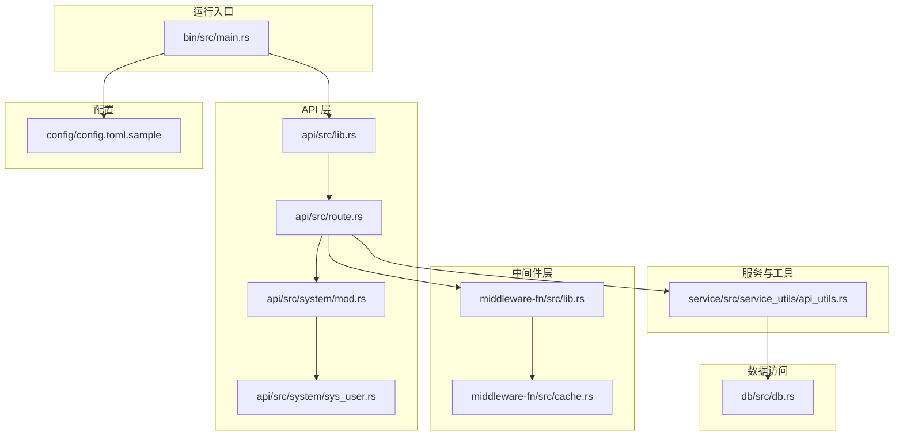
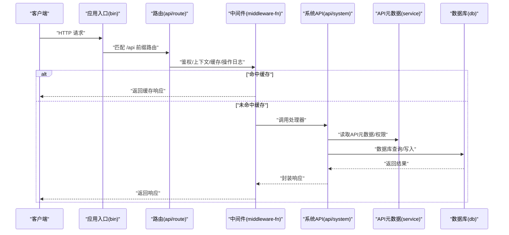
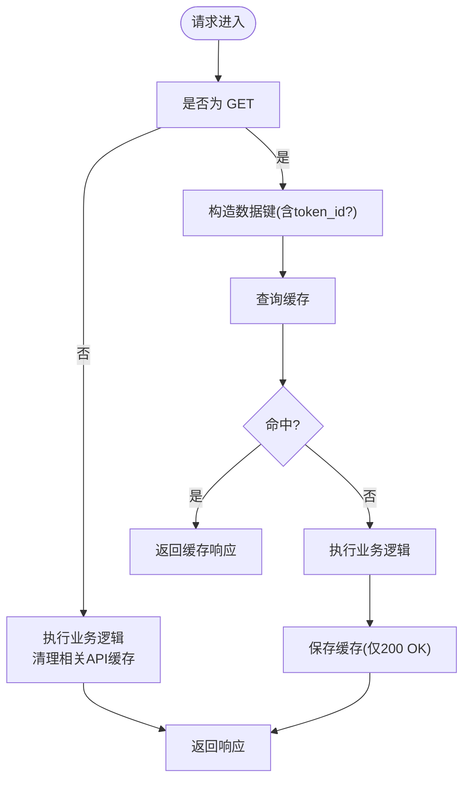
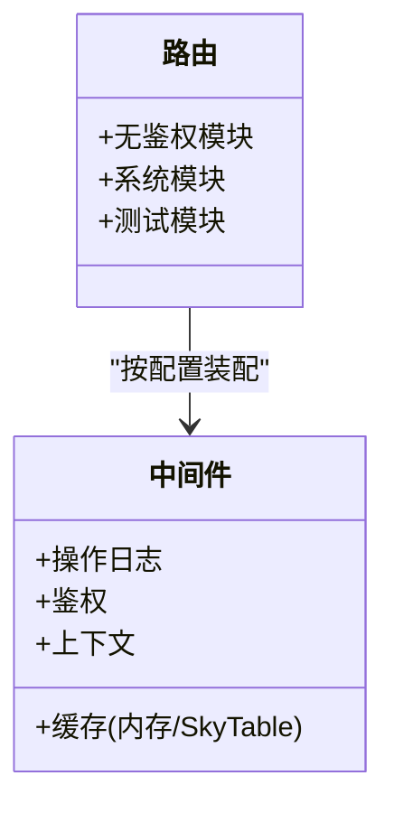
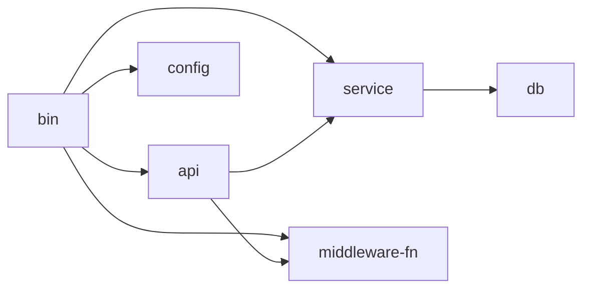

# 部署验证与测试

<cite>
**本文引用的文件**
- [bin/src/main.rs](file://bin/src/main.rs)
- [api/src/lib.rs](file://api/src/lib.rs)
- [api/src/route.rs](file://api/src/route.rs)
- [api/src/system/mod.rs](file://api/src/system/mod.rs)
- [api/src/system/sys_user.rs](file://api/src/system/sys_user.rs)
- [middleware-fn/src/lib.rs](file://middleware-fn/src/lib.rs)
- [middleware-fn/src/cache.rs](file://middleware-fn/src/cache.rs)
- [service/src/service_utils/api_utils.rs](file://service/src/service_utils/api_utils.rs)
- [db/src/db.rs](file://db/src/db.rs)
- [config/config.toml.sample](file://config/config.toml.sample)
- [.github/workflows/rust.yml](file://.github/workflows/rust.yml)
- [Cargo.toml](file://Cargo.toml)
</cite>

## 目录
1. [简介](#简介)
2. [项目结构](#项目结构)
3. [核心组件](#核心组件)
4. [架构总览](#架构总览)
5. [详细组件分析](#详细组件分析)
6. [依赖关系分析](#依赖关系分析)
7. [性能考量](#性能考量)
8. [故障排除指南](#故障排除指南)
9. [结论](#结论)
10. [附录](#附录)

## 简介
本指南面向 Axum Admin 的运维与开发团队，提供一套完整的部署后验证与测试方法，覆盖健康检查、API 功能验证、数据库连接测试、缓存服务验证，并给出性能基准与压力测试建议、负载测试配置要点、常见部署问题诊断、日志分析技巧、故障排除流程以及回滚与灾难恢复策略。

## 项目结构
Axum Admin 采用多 crate 工作区布局，核心运行入口位于 bin，API 路由与系统模块在 api，业务逻辑与工具在 service，中间件在 middleware-fn，数据库连接与实体在 db，配置样例在 config。构建与发布通过 Cargo 工作区统一管理。

**图表来源**
- [bin/src/main.rs](file://bin/src/main.rs#L25-L96)
- [api/src/lib.rs](file://api/src/lib.rs#L1-L10)
- [api/src/route.rs](file://api/src/route.rs#L12-L69)
- [api/src/system/mod.rs](file://api/src/system/mod.rs#L26-L44)
- [api/src/system/sys_user.rs](file://api/src/system/sys_user.rs#L24-L31)
- [middleware-fn/src/lib.rs](file://middleware-fn/src/lib.rs#L1-L23)
- [middleware-fn/src/cache.rs](file://middleware-fn/src/cache.rs#L126-L193)
- [service/src/service_utils/api_utils.rs](file://service/src/service_utils/api_utils.rs#L21-L48)
- [db/src/db.rs](file://db/src/db.rs#L9-L19)
- [config/config.toml.sample](file://config/config.toml.sample#L2-L50)

**章节来源**
- [Cargo.toml](file://Cargo.toml#L1-L12)
- [bin/src/main.rs](file://bin/src/main.rs#L25-L96)
- [api/src/lib.rs](file://api/src/lib.rs#L1-L10)
- [api/src/route.rs](file://api/src/route.rs#L12-L69)
- [api/src/system/mod.rs](file://api/src/system/mod.rs#L26-L44)
- [middleware-fn/src/lib.rs](file://middleware-fn/src/lib.rs#L1-L23)
- [service/src/service_utils/api_utils.rs](file://service/src/service_utils/api_utils.rs#L21-L48)
- [db/src/db.rs](file://db/src/db.rs#L9-L19)
- [config/config.toml.sample](file://config/config.toml.sample#L2-L50)

## 核心组件
- 应用启动与生命周期：负责日志初始化、跨域、静态资源、压缩、TLS、优雅关闭等。
- API 路由与中间件：统一挂载系统模块、测试模块、无鉴权通用模块；按配置启用鉴权、上下文、操作日志、缓存中间件。
- 缓存中间件：内存缓存实现，支持按 API 与数据键缓存响应，支持基于相关 API 的失效策略。
- API 元数据与权限：从数据库加载 API 列表、相关 API 关系、权限校验。
- 数据库连接：SeaORM 连接池配置，超时与并发参数。
- 配置项：服务器地址、SSL、压缩、缓存、API 前缀、Web 目录、证书、Casbin、日志、JWT、数据库连接串等。

**章节来源**
- [bin/src/main.rs](file://bin/src/main.rs#L25-L96)
- [api/src/route.rs](file://api/src/route.rs#L12-L69)
- [middleware-fn/src/cache.rs](file://middleware-fn/src/cache.rs#L126-L193)
- [service/src/service_utils/api_utils.rs](file://service/src/service_utils/api_utils.rs#L21-L48)
- [db/src/db.rs](file://db/src/db.rs#L9-L19)
- [config/config.toml.sample](file://config/config.toml.sample#L2-L50)

## 架构总览
下图展示部署后关键路径：客户端请求经 CORS、压缩、中间件链路（鉴权、上下文、缓存/缓存 SkyTable、操作日志）到达 API 处理器；处理器通过服务工具与数据库交互；日志与指标通过 tracing 输出到文件与标准输出。

**图表来源**
- [bin/src/main.rs](file://bin/src/main.rs#L73-L95)
- [api/src/route.rs](file://api/src/route.rs#L12-L69)
- [middleware-fn/src/lib.rs](file://middleware-fn/src/lib.rs#L16-L22)
- [api/src/system/sys_user.rs](file://api/src/system/sys_user.rs#L98-L104)
- [service/src/service_utils/api_utils.rs](file://service/src/service_utils/api_utils.rs#L32-L48)
- [db/src/db.rs](file://db/src/db.rs#L9-L19)

## 详细组件分析

### 健康检查与可用性验证
- 可用性探测
  - 使用 GET /api/monitor/server 探测服务可用性与基本信息。
  - 若开启内容压缩，注意 SSE 类型的事件流可能不受压缩影响。
- 优雅停机
  - 支持 Ctrl+C 与 Unix 终止信号，Graceful Shutdown 时长可配置，确保容器/编排环境平滑终止。
- 压缩与静态资源
  - 根据配置决定是否启用压缩；静态目录 fallback 于 404 返回“Not found”。

**章节来源**
- [api/src/system/mod.rs](file://api/src/system/mod.rs#L186-L190)
- [bin/src/main.rs](file://bin/src/main.rs#L73-L95)
- [bin/src/main.rs](file://bin/src/main.rs#L102-L128)

### API 功能验证清单
- 通用模块
  - POST /api/comm/login：登录，返回鉴权体。
  - GET /api/comm/get_captcha：获取验证码。
  - POST /api/comm/log_out：退出登录。
- 系统模块（需鉴权）
  - 用户管理：分页列表、按 ID 查询、个人信息、新增/编辑/删除、重置密码、更新密码、变更状态/角色/部门、更新头像等。
  - 字典、岗位、部门、角色、菜单、登录日志、在线用户、定时任务、操作日志、API 数据库、监控、更新日志等。
- 测试模块
  - 提供测试路由，便于集成测试与压测。

**章节来源**
- [api/src/route.rs](file://api/src/route.rs#L24-L30)
- [api/src/system/mod.rs](file://api/src/system/mod.rs#L26-L44)
- [api/src/system/sys_user.rs](file://api/src/system/sys_user.rs#L24-L31)

### 数据库连接测试
- 连接参数
  - 最大连接数、最小连接数、连接超时、空闲超时、SQLx 日志开关等。
- 初始化流程
  - 通过 OnceCell 懒加载连接；首次连接成功会记录日志。
- 建议测试步骤
  - 启动后观察日志中“Database connected”。
  - 执行一次典型查询（如用户列表或登录）以验证读写。
  - 检查数据库连接池状态与慢查询日志。

**章节来源**
- [db/src/db.rs](file://db/src/db.rs#L9-L19)

### 缓存服务验证
- 缓存策略
  - 支持内存缓存与 SkyTable 缓存两种方式，由配置项选择。
  - 缓存键规则：GET 请求按 URI+方法聚合；个人缓存附加 token_id。
  - 失效策略：写操作触发相关 API 缓存清理；定时清理过期缓存。
- 验证方法
  - 对同一 GET 请求重复访问，确认响应来自缓存。
  - 发起写操作（POST/PUT/DELETE），随后访问相关 GET，确认缓存被清理并返回最新数据。
  - 调整 cache_time 与 cache_method 验证行为变化。

**图表来源**
- [middleware-fn/src/cache.rs](file://middleware-fn/src/cache.rs#L126-L193)
- [middleware-fn/src/cache.rs](file://middleware-fn/src/cache.rs#L36-L58)

**章节来源**
- [middleware-fn/src/cache.rs](file://middleware-fn/src/cache.rs#L126-L193)
- [middleware-fn/src/cache.rs](file://middleware-fn/src/cache.rs#L36-L58)

### API 元数据与权限校验
- 元数据加载
  - 启动时从数据库加载菜单与 API 映射，建立 API 到相关 API 的映射关系。
- 权限校验
  - 基于用户角色与 API 方法进行授权判断。
- 验证建议
  - 新增/修改 API 后，触发重新初始化 API 元数据，确保路由与权限生效。

**章节来源**
- [service/src/service_utils/api_utils.rs](file://service/src/service_utils/api_utils.rs#L21-L48)
- [service/src/service_utils/api_utils.rs](file://service/src/service_utils/api_utils.rs#L90-L118)

### 中间件链与控制流
- 中间件顺序
  - 按“操作日志 → 缓存 → 鉴权 → 上下文 → 提取 Claims”的顺序装配。
- 特性开关
  - 是否启用操作日志、缓存方式、缓存时间、API 前缀、Web 目录等均来自配置。

**图表来源**
- [api/src/route.rs](file://api/src/route.rs#L32-L54)
- [middleware-fn/src/lib.rs](file://middleware-fn/src/lib.rs#L16-L22)

**章节来源**
- [api/src/route.rs](file://api/src/route.rs#L32-L54)
- [middleware-fn/src/lib.rs](file://middleware-fn/src/lib.rs#L16-L22)

## 依赖关系分析
- 运行时依赖
  - axum、tower、tower-http、tokio、tracing 等。
- ORM 与数据库
  - SeaORM 连接池参数与日志开关。
- 配置驱动
  - 服务器地址、SSL、压缩、缓存、API 前缀、Web 目录、证书、Casbin、日志、JWT、数据库连接串等。

**图表来源**
- [Cargo.toml](file://Cargo.toml#L1-L12)
- [bin/src/main.rs](file://bin/src/main.rs#L10-L25)

**章节来源**
- [Cargo.toml](file://Cargo.toml#L24-L81)
- [config/config.toml.sample](file://config/config.toml.sample#L2-L50)

## 性能考量
- 基准测试
  - 使用 wrk 或 vegeta 对关键 API（如登录、用户列表）进行短时基准，记录 P50/P95/P99 延迟与吞吐。
- 压力测试
  - 逐步提升并发与 RPS，观察 CPU、内存、数据库连接池占用、缓存命中率与错误率拐点。
- 负载测试配置
  - 并发连接数、请求超时、重试策略、缓存时间、压缩开关、TLS 握手成本。
- 优化方向
  - 合理设置数据库连接池参数；评估缓存命中率与失效策略；启用或关闭压缩以平衡带宽与 CPU。
- 构建优化
  - Release 配置已启用 LTO、按大小优化与 abort panic，适合生产部署。

**章节来源**
- [Cargo.toml](file://Cargo.toml#L83-L89)
- [db/src/db.rs](file://db/src/db.rs#L10-L15)

## 故障排除指南
- 启动与日志
  - 检查日志级别与格式配置，确认日志输出到文件与标准输出；关注“Database connected”、“cache data init”等关键日志。
- 数据库连接失败
  - 校验数据库连接串、网络连通性、凭据；查看连接超时与空闲超时设置。
- 缓存异常
  - 检查缓存时间与缓存方式配置；确认写操作是否正确触发相关 API 缓存清理；排查定时清理任务是否运行。
- API 权限问题
  - 确认 API 元数据是否加载成功；检查角色与 API 方法的授权关系。
- 静态资源与 404
  - 确认 Web 目录与索引文件；检查 fallback 逻辑与 404 返回。
- 优雅停机
  - 观察终止信号处理与 graceful shutdown 行为，避免容器强制终止。

**章节来源**
- [bin/src/main.rs](file://bin/src/main.rs#L28-L51)
- [db/src/db.rs](file://db/src/db.rs#L9-L19)
- [middleware-fn/src/cache.rs](file://middleware-fn/src/cache.rs#L36-L58)
- [service/src/service_utils/api_utils.rs](file://service/src/service_utils/api_utils.rs#L32-L48)
- [config/config.toml.sample](file://config/config.toml.sample#L20-L37)

## 结论
通过上述部署后验证与测试流程，可系统性地确认 Axum Admin 在目标环境中的可用性、稳定性与性能表现。建议在上线前完成健康检查、API 功能验证、数据库与缓存连通性测试，并结合性能基准与压力测试制定容量规划与优化策略。遇到问题时，依据日志与中间件链路快速定位根因，必要时执行回滚与灾难恢复。

## 附录

### 部署后验证清单
- 健康检查：GET /api/monitor/server
- 登录：POST /api/comm/login
- 用户列表：GET /api/system/user/list
- 缓存验证：GET /api/system/user/list（重复请求）、发起写操作后再次访问
- 数据库：执行一次查询，确认连接正常
- 日志：检查文件与控制台日志输出
- 静态资源：访问 /index.html 与上传目录

### 回滚与灾难恢复
- 回滚策略
  - 保留上一版本二进制与配置；快速替换并重启；若失败立即回退。
- 灾难恢复
  - 备份数据库与日志目录；在新实例中恢复配置与证书；验证 API 与缓存连通性；逐步放量流量。

**章节来源**
- [bin/src/main.rs](file://bin/src/main.rs#L102-L128)
- [config/config.toml.sample](file://config/config.toml.sample#L25-L27)