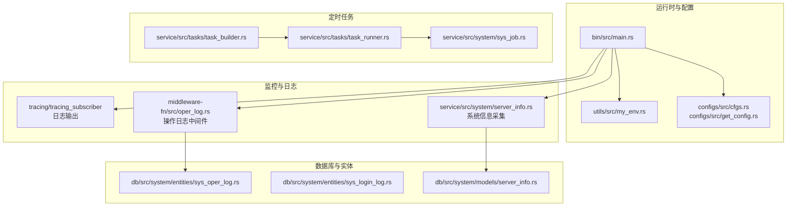
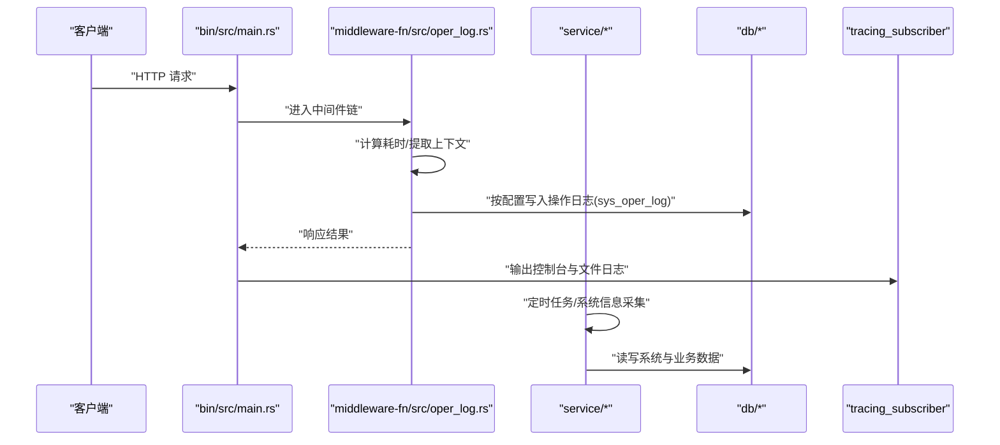
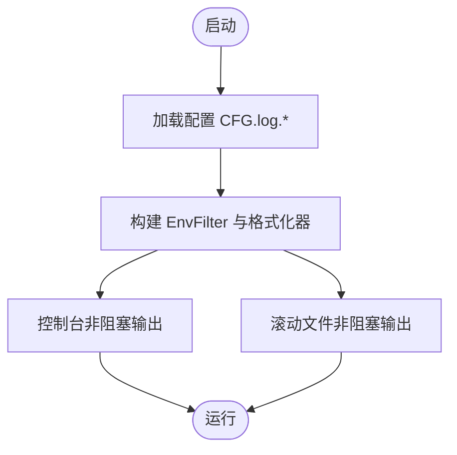
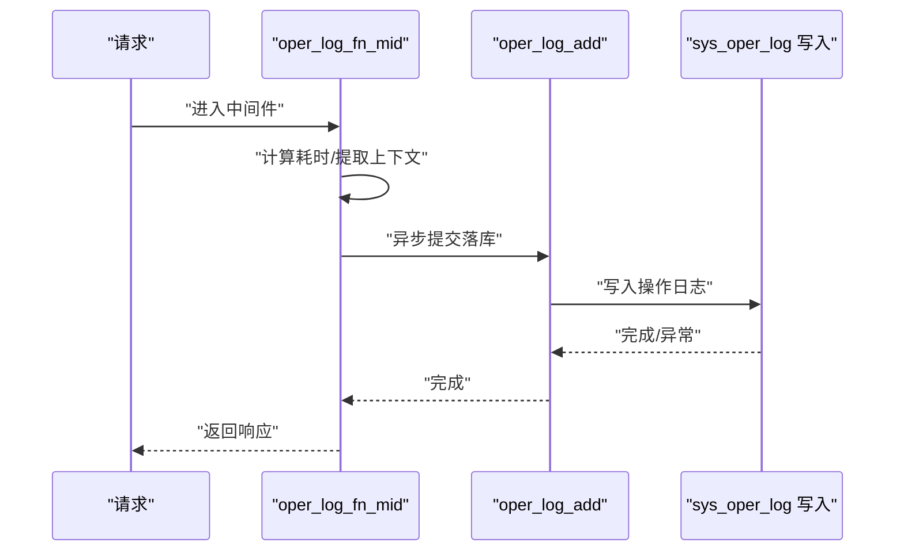
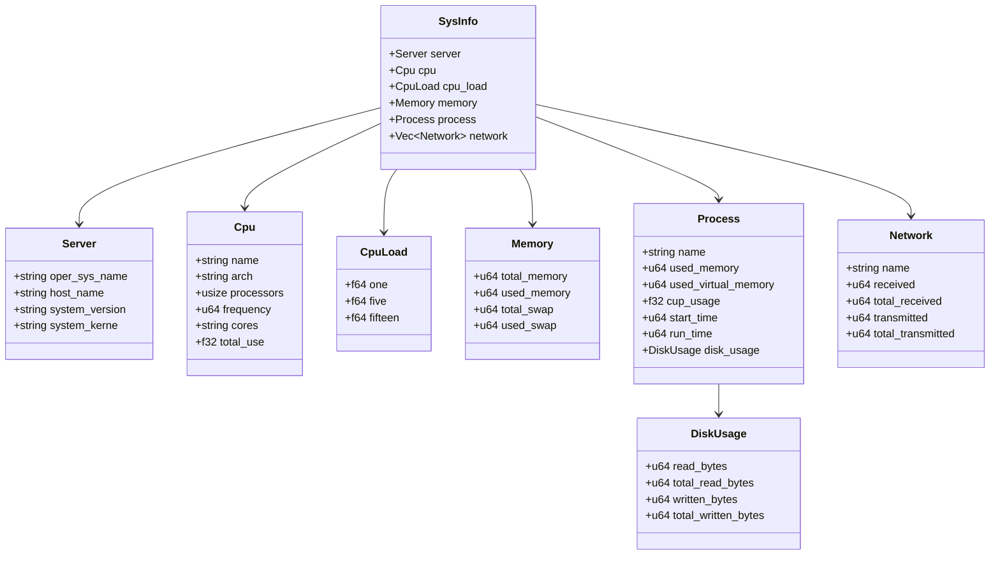
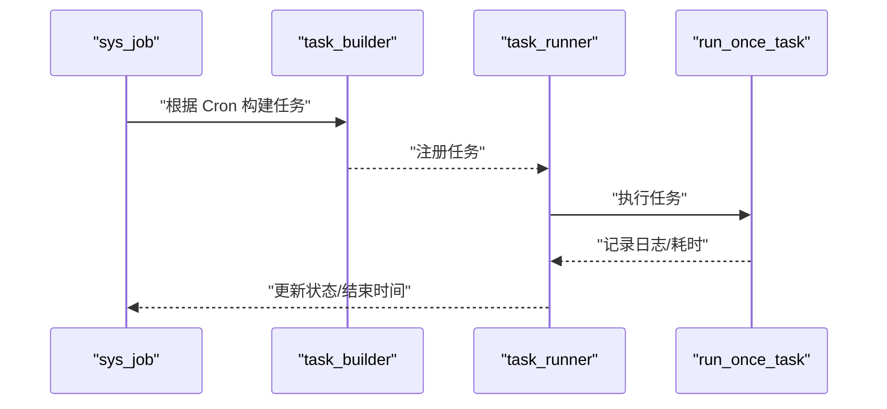
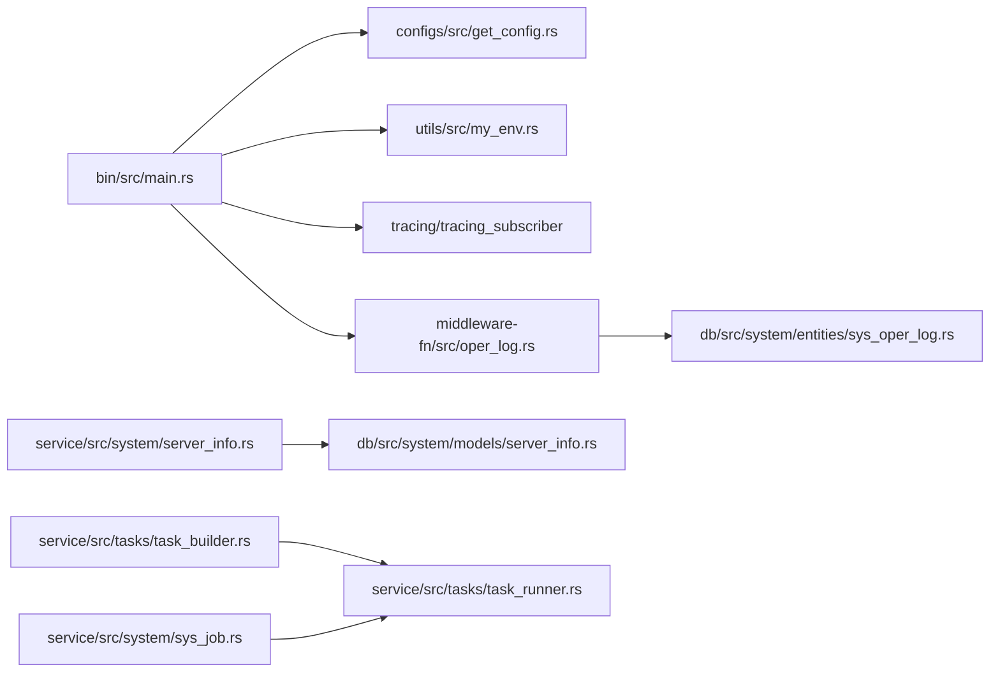

# 监控告警配置

<cite>
**本文引用的文件**
- [Cargo.toml](file://Cargo.toml)
- [config/config.toml.sample](file://config/config.toml.sample)
- [configs/src/lib.rs](file://configs/src/lib.rs)
- [configs/src/cfgs.rs](file://configs/src/cfgs.rs)
- [configs/src/get_config.rs](file://configs/src/get_config.rs)
- [utils/src/my_env.rs](file://utils/src/my_env.rs)
- [bin/src/main.rs](file://bin/src/main.rs)
- [middleware-fn/src/oper_log.rs](file://middleware-fn/src/oper_log.rs)
- [service/src/system/server_info.rs](file://service/src/system/server_info.rs)
- [db/src/system/models/server_info.rs](file://db/src/system/models/server_info.rs)
- [service/src/system/sys_job.rs](file://service/src/system/sys_job.rs)
- [service/src/tasks/task_builder.rs](file://service/src/tasks/task_builder.rs)
- [service/src/tasks/task_runner.rs](file://service/src/tasks/task_runner.rs)
- [db/src/system/entities/sys_oper_log.rs](file://db/src/system/entities/sys_oper_log.rs)
- [db/src/system/entities/sys_login_log.rs](file://db/src/system/entities/sys_login_log.rs)
</cite>

## 目录
1. [简介](#简介)
2. [项目结构](#项目结构)
3. [核心组件](#核心组件)
4. [架构总览](#架构总览)
5. [详细组件分析](#详细组件分析)
6. [依赖关系分析](#依赖关系分析)
7. [性能考量](#性能考量)
8. [故障排查指南](#故障排查指南)
9. [结论](#结论)
10. [附录](#附录)

## 简介
本指南面向 Axum Admin 项目的运维与开发团队，提供一套可落地的监控告警配置方案。内容覆盖应用性能监控（APM）、系统资源监控、业务指标监控、日志收集与分析、错误追踪、性能指标采集与可视化、告警规则与通知渠道、故障自动处理机制，以及监控数据存储、报表生成与容量规划建议。文档以现有代码与配置为基础，结合最佳实践，帮助您快速建立稳定可靠的监控体系。

## 项目结构
Axum Admin 采用多工作区组织，核心模块包括：
- 应用入口与运行环境：bin、utils、configs
- API 层与路由：api
- 服务层：service（含定时任务、系统服务）
- 中间件：middleware-fn（如操作日志中间件）
- 数据访问层：db（SeaORM 实体与模型）
- 配置与示例：config

下图给出与监控相关的关键模块与交互关系：

图表来源
- [bin/src/main.rs](file://bin/src/main.rs#L25-L96)
- [utils/src/my_env.rs](file://utils/src/my_env.rs#L11-L72)
- [configs/src/cfgs.rs](file://configs/src/cfgs.rs#L1-L111)
- [configs/src/get_config.rs](file://configs/src/get_config.rs#L1-L26)
- [middleware-fn/src/oper_log.rs](file://middleware-fn/src/oper_log.rs#L1-L134)
- [service/src/system/server_info.rs](file://service/src/system/server_info.rs#L1-L74)
- [db/src/system/models/server_info.rs](file://db/src/system/models/server_info.rs#L1-L69)
- [db/src/system/entities/sys_oper_log.rs](file://db/src/system/entities/sys_oper_log.rs#L76-L109)
- [db/src/system/entities/sys_login_log.rs](file://db/src/system/entities/sys_login_log.rs#L59-L88)
- [service/src/tasks/task_builder.rs](file://service/src/tasks/task_builder.rs#L1-L63)
- [service/src/tasks/task_runner.rs](file://service/src/tasks/task_runner.rs#L247-L283)
- [service/src/system/sys_job.rs](file://service/src/system/sys_job.rs#L244-L275)

章节来源
- [Cargo.toml](file://Cargo.toml#L1-L90)
- [config/config.toml.sample](file://config/config.toml.sample#L1-L50)
- [configs/src/lib.rs](file://configs/src/lib.rs#L1-L6)

## 核心组件
- 配置中心：统一加载 config/config.toml.sample 并暴露 CFG 静态实例，支持日志级别、缓存策略、API 前缀、SSL、GZIP 等关键参数。
- 日志系统：基于 tracing/tracing_subscriber，同时输出至控制台与滚动文件，支持按配置动态调整日志级别与格式。
- 操作日志中间件：拦截请求，计算耗时，按配置决定是否落库或落文件，并持久化到 sys_oper_log 表。
- 系统信息采集：使用 sysinfo 采集 CPU、内存、网络、进程等指标，供前端“监控”页面展示。
- 定时任务与作业：基于 delay_timer 的 Cron 任务调度，支持启动/停止、日志记录与下次运行时间推算。

章节来源
- [configs/src/cfgs.rs](file://configs/src/cfgs.rs#L1-L111)
- [configs/src/get_config.rs](file://configs/src/get_config.rs#L1-L26)
- [utils/src/my_env.rs](file://utils/src/my_env.rs#L38-L72)
- [bin/src/main.rs](file://bin/src/main.rs#L34-L51)
- [middleware-fn/src/oper_log.rs](file://middleware-fn/src/oper_log.rs#L1-L134)
- [service/src/system/server_info.rs](file://service/src/system/server_info.rs#L1-L74)
- [service/src/tasks/task_builder.rs](file://service/src/tasks/task_builder.rs#L1-L63)
- [service/src/tasks/task_runner.rs](file://service/src/tasks/task_runner.rs#L247-L283)

## 架构总览
下图展示从请求进入、日志与指标采集、到定时任务与系统信息的完整链路：

图表来源
- [bin/src/main.rs](file://bin/src/main.rs#L25-L96)
- [middleware-fn/src/oper_log.rs](file://middleware-fn/src/oper_log.rs#L21-L53)
- [db/src/system/entities/sys_oper_log.rs](file://db/src/system/entities/sys_oper_log.rs#L76-L109)

## 详细组件分析

### 日志系统与采集
- 配置项：日志目录、文件名、级别、是否启用操作日志。
- 初始化：根据配置设置 RUST_LOG，构建 EnvFilter 与格式化器，同时配置控制台与滚动文件输出。
- 输出策略：控制台与文件并行输出，避免阻塞；Windows 下使用 RFC3339 时间戳格式。
- 建议：生产环境建议将日志级别设为 INFO 或 WARN，结合 JSON 格式便于集中采集。

图表来源
- [bin/src/main.rs](file://bin/src/main.rs#L34-L51)
- [utils/src/my_env.rs](file://utils/src/my_env.rs#L38-L72)
- [configs/src/cfgs.rs](file://configs/src/cfgs.rs#L84-L94)

章节来源
- [config/config.toml.sample](file://config/config.toml.sample#L31-L37)
- [configs/src/cfgs.rs](file://configs/src/cfgs.rs#L84-L94)
- [utils/src/my_env.rs](file://utils/src/my_env.rs#L38-L72)
- [bin/src/main.rs](file://bin/src/main.rs#L34-L51)

### 操作日志中间件
- 功能：统计请求耗时、提取用户与请求上下文、按配置决定落库或落文件。
- 落库逻辑：将操作标题、方法、URL、IP、耗时、错误信息等写入 sys_oper_log。
- 落库条件：由配置项 enable_oper_log 控制；具体 API 是否记录由 API 注册表决定。
- 错误处理：落库失败会记录 tracing 信息，不影响主流程。

图表来源
- [middleware-fn/src/oper_log.rs](file://middleware-fn/src/oper_log.rs#L21-L53)
- [middleware-fn/src/oper_log.rs](file://middleware-fn/src/oper_log.rs#L105-L134)
- [db/src/system/entities/sys_oper_log.rs](file://db/src/system/entities/sys_oper_log.rs#L76-L109)

章节来源
- [middleware-fn/src/oper_log.rs](file://middleware-fn/src/oper_log.rs#L1-L134)
- [db/src/system/entities/sys_oper_log.rs](file://db/src/system/entities/sys_oper_log.rs#L76-L109)
- [config/config.toml.sample](file://config/config.toml.sample#L34-L35)

### 系统资源监控
- 指标采集：使用 sysinfo 获取 CPU、内存、网络、进程、负载等信息，封装为 SysInfo 结构。
- 数据模型：定义了 Server、Cpu、Memory、Process、Network、CpuLoad 等模型，便于序列化与传输。
- 可视化：前端“监控”页面可调用系统信息接口展示实时资源占用。

图表来源
- [service/src/system/server_info.rs](file://service/src/system/server_info.rs#L1-L74)
- [db/src/system/models/server_info.rs](file://db/src/system/models/server_info.rs#L1-L69)

章节来源
- [service/src/system/server_info.rs](file://service/src/system/server_info.rs#L1-L74)
- [db/src/system/models/server_info.rs](file://db/src/system/models/server_info.rs#L1-L69)

### 业务指标监控
- 登录日志：sys_login_log 记录登录行为，可用于统计登录成功率、异常登录、地域分布等。
- 操作日志：sys_oper_log 记录 API 调用详情，可用于统计接口 QPS、错误率、耗时分布等。
- 建议：对高频接口增加采样或聚合统计，避免日志表膨胀；可引入外部指标系统（如 Prometheus）进行指标采集与告警。

章节来源
- [db/src/system/entities/sys_login_log.rs](file://db/src/system/entities/sys_login_log.rs#L59-L88)
- [db/src/system/entities/sys_oper_log.rs](file://db/src/system/entities/sys_oper_log.rs#L76-L109)

### 定时任务与故障自动处理
- 任务构建：基于 delay_timer 的 TaskBuilder，支持 Cron 表达式、最大运行次数、共享 Tokio 运行时。
- 任务执行：run_once_task 负责实际执行，task_runner 记录作业日志与结束时间。
- 作业管理：sys_job 提供作业状态切换（启动/停止），并触发任务注册或移除。
- 建议：为关键任务配置健康检查与超时告警；对失败重试策略进行限次与退避。

图表来源
- [service/src/system/sys_job.rs](file://service/src/system/sys_job.rs#L244-L275)
- [service/src/tasks/task_builder.rs](file://service/src/tasks/task_builder.rs#L27-L55)
- [service/src/tasks/task_runner.rs](file://service/src/tasks/task_runner.rs#L247-L283)

章节来源
- [service/src/system/sys_job.rs](file://service/src/system/sys_job.rs#L244-L275)
- [service/src/tasks/task_builder.rs](file://service/src/tasks/task_builder.rs#L1-L63)
- [service/src/tasks/task_runner.rs](file://service/src/tasks/task_runner.rs#L247-L283)

## 依赖关系分析
- 运行时依赖：tokio、tracing、tracing-subscriber、sea-orm、sysinfo、delay_timer 等。
- 配置依赖：configs 工作区提供静态 CFG，被 bin 与中间件使用。
- 日志依赖：bin 通过 my_env 设置日志级别与格式，oper_log 中间件按配置写入数据库。

图表来源
- [Cargo.toml](file://Cargo.toml#L24-L81)
- [bin/src/main.rs](file://bin/src/main.rs#L25-L96)
- [configs/src/get_config.rs](file://configs/src/get_config.rs#L1-L26)
- [utils/src/my_env.rs](file://utils/src/my_env.rs#L11-L72)
- [middleware-fn/src/oper_log.rs](file://middleware-fn/src/oper_log.rs#L1-L134)
- [service/src/system/server_info.rs](file://service/src/system/server_info.rs#L1-L74)
- [db/src/system/models/server_info.rs](file://db/src/system/models/server_info.rs#L1-L69)
- [service/src/tasks/task_builder.rs](file://service/src/tasks/task_builder.rs#L1-L63)
- [service/src/tasks/task_runner.rs](file://service/src/tasks/task_runner.rs#L247-L283)
- [service/src/system/sys_job.rs](file://service/src/system/sys_job.rs#L244-L275)

章节来源
- [Cargo.toml](file://Cargo.toml#L24-L81)

## 性能考量
- 日志级别：生产建议 INFO/WARN，避免过多 DEBUG/TRACE 带来的 I/O 压力。
- GZIP 压缩：默认开启，注意 SSE 场景需排除 text/event-stream 类型。
- 异步落库：操作日志中间件使用 tokio::spawn 异步写入，降低主链路延迟。
- 资源采集：sysinfo 采集为轻量级，但频繁轮询可能带来开销，建议合理间隔。
- 定时任务：共享 Tokio 运行时，避免阻塞；为长任务设置最大运行次数与超时。

章节来源
- [config/config.toml.sample](file://config/config.toml.sample#L9-L10)
- [bin/src/main.rs](file://bin/src/main.rs#L75-L82)
- [middleware-fn/src/oper_log.rs](file://middleware-fn/src/oper_log.rs#L44-L53)
- [service/src/system/server_info.rs](file://service/src/system/server_info.rs#L4-L73)
- [service/src/tasks/task_builder.rs](file://service/src/tasks/task_builder.rs#L18-L26)

## 故障排查指南
- 日志未输出或级别不符
  - 检查 RUST_LOG 是否被正确设置为 CFG.log.log_level。
  - 确认 tracing_subscriber 的 EnvFilter 与格式化器已注册。
- 操作日志未入库
  - 确认 CFG.log.enable_oper_log 已启用。
  - 检查 API 是否在注册表中配置了日志策略。
  - 查看数据库连接与表结构是否正常。
- 系统监控数据为空
  - 确认系统信息采集函数被调用且无 panic。
  - 检查 sysinfo 权限与平台兼容性。
- 定时任务不生效
  - 校验 Cron 字符串合法性。
  - 检查任务是否被注册与运行。
  - 关注任务日志与结束时间记录。

章节来源
- [bin/src/main.rs](file://bin/src/main.rs#L28-L51)
- [config/config.toml.sample](file://config/config.toml.sample#L34-L35)
- [middleware-fn/src/oper_log.rs](file://middleware-fn/src/oper_log.rs#L56-L90)
- [service/src/system/server_info.rs](file://service/src/system/server_info.rs#L4-L73)
- [service/src/system/sys_job.rs](file://service/src/system/sys_job.rs#L265-L275)

## 结论
Axum Admin 已具备完善的日志与系统监控基础：统一配置、可控的日志输出、可选的操作日志落库、系统资源采集与定时任务框架。建议在此基础上接入外部指标与告警系统，完善业务指标采集、可视化与自动化处置，形成闭环的监控告警体系。

## 附录

### 监控告警配置清单（落地建议）
- 日志采集
  - 输出：控制台 + 滚动文件；生产建议 JSON 格式，便于集中采集。
  - 级别：INFO/WARN；异常场景提升至 ERROR。
  - 保留：按天/小时滚动，保留 7-30 天视情况而定。
- 错误追踪
  - 操作日志：记录接口、用户、IP、耗时、错误信息，用于问题复盘。
  - 登录日志：记录登录状态与异常尝试，识别安全风险。
- 性能指标
  - 接口耗时：P50/P95/P99，错误率，QPS。
  - 系统资源：CPU 使用率、内存、磁盘 IO、网络带宽。
- 告警规则
  - 接口错误率 > 阈值（如 1%）持续 N 分钟。
  - 接口 P95 耗时 > 阈值（如 2s）持续 N 分钟。
  - 系统 CPU 使用率 > 阈值（如 80%）持续 N 分钟。
  - 登录失败异常增长。
- 通知渠道
  - 钉钉/企业微信/Webhook/邮件/SMS；区分严重/警告/恢复通知。
- 自动化处置
  - 健康检查失败自动隔离；熔断降级；扩缩容触发。
- 数据存储与报表
  - 日志：集中式日志平台（如 ELK/ Loki）。
  - 指标：Prometheus + Grafana；历史数据归档。
- 容量规划
  - 基于峰值 QPS、P99 耗时、资源使用率与增长趋势制定扩容策略。
  - 定期评估日志与指标保留周期，平衡成本与可追溯性。