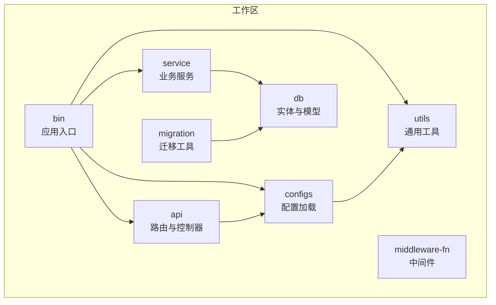
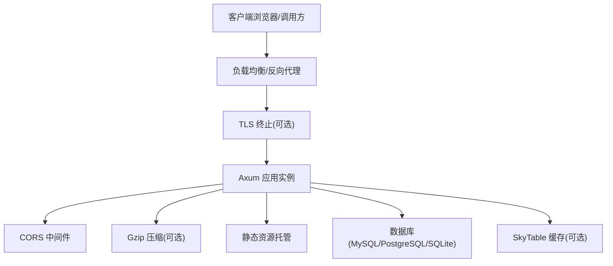
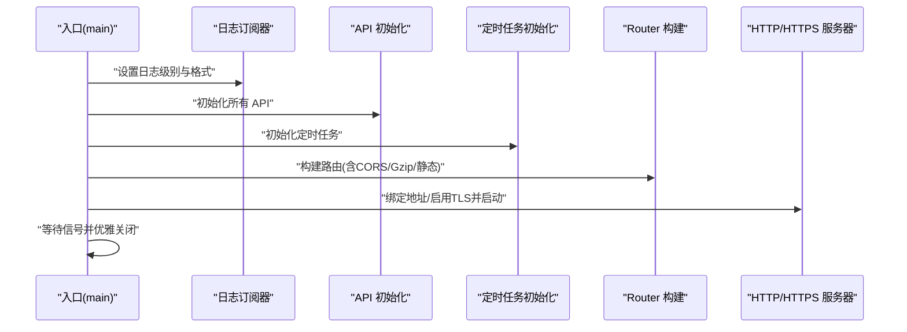
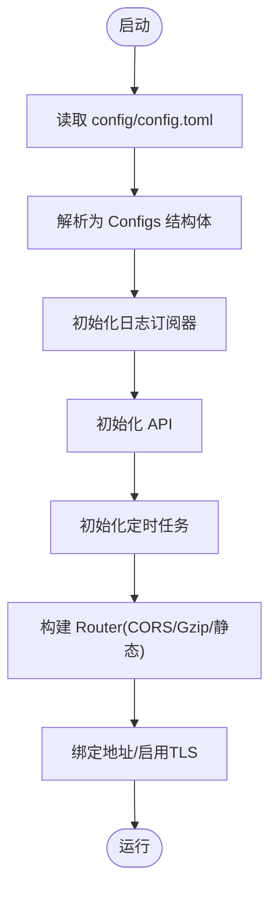
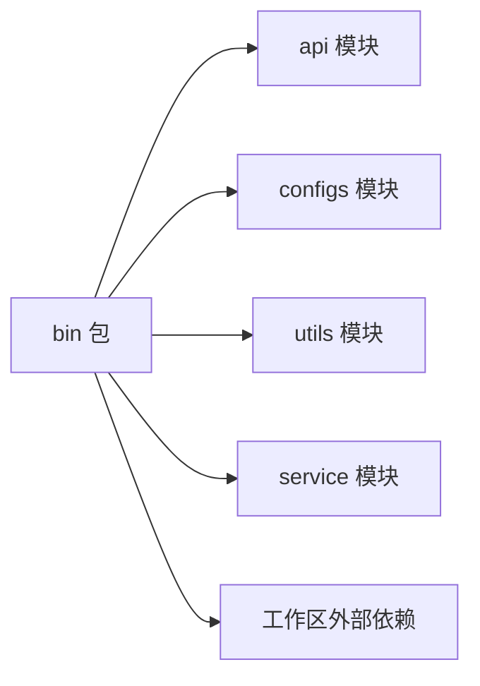
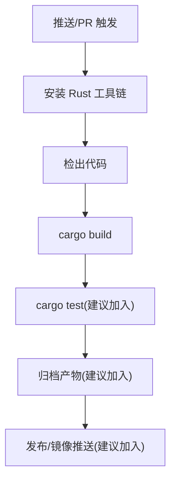

# 部署指南

<cite>
**本文引用的文件**
- [Cargo.toml](file://Cargo.toml)
- [README.md](file://README.md)
- [config/config.toml.sample](file://config/config.toml.sample)
- [bin/Cargo.toml](file://bin/Cargo.toml)
- [bin/src/main.rs](file://bin/src/main.rs)
- [configs/Cargo.toml](file://configs/Cargo.toml)
- [configs/src/lib.rs](file://configs/src/lib.rs)
- [configs/src/get_config.rs](file://configs/src/get_config.rs)
- [utils/src/my_env.rs](file://utils/src/my_env.rs)
- [.github/workflows/rust.yml](file://.github/workflows/rust.yml)
- [.env.sample](file://.env.sample)
- [migration/README.md](file://migration/README.md)
</cite>

## 目录
1. [简介](#简介)
2. [项目结构](#项目结构)
3. [核心组件](#核心组件)
4. [架构总览](#架构总览)
5. [详细组件分析](#详细组件分析)
6. [依赖分析](#依赖分析)
7. [性能考虑](#性能考虑)
8. [运维与监控](#运维与监控)
9. [CI/CD 流水线](#cicd-流水线)
10. [部署方案](#部署方案)
11. [故障排除](#故障排除)
12. [结论](#结论)

## 简介
Axum Admin 是基于 Rust 的现代化后台管理框架，采用 Axum Web 框架、SeaORM ORM、Vue3 前端以及可选的 SkyTable 缓存与 TLS 支持。本指南面向运维工程师，覆盖生产环境部署（传统服务器、容器化、云平台）、环境配置、数据库迁移、性能优化、CI/CD、监控告警、高可用与灾备策略，并提供最佳实践与排障建议。

## 项目结构
- 工作区采用 Cargo Workspace，包含二进制入口、API 路由、服务层、中间件、工具库、配置模块与数据库相关模块。
- 二进制入口负责启动 HTTP/HTTPS 服务、加载配置、注册路由、启用 CORS 与压缩、托管静态资源并优雅关闭。
- 配置模块从本地 TOML 文件加载运行参数，如服务器监听地址、SSL、压缩、缓存方式、日志级别、JWT 过期时间、数据库连接串等。
- 数据库迁移通过 SeaORM CLI 或内置迁移工具完成，支持 SQLite、MySQL、PostgreSQL。

**图表来源**
- [Cargo.toml](file://Cargo.toml#L1-L12)
- [bin/Cargo.toml](file://bin/Cargo.toml#L10-L26)
- [configs/Cargo.toml](file://configs/Cargo.toml#L9-L14)

**章节来源**
- [Cargo.toml](file://Cargo.toml#L1-L12)
- [bin/Cargo.toml](file://bin/Cargo.toml#L1-L26)
- [configs/Cargo.toml](file://configs/Cargo.toml#L1-L14)

## 核心组件
- 应用入口与服务器
  - 使用 axum-server 结合 rustls 提供 HTTPS 支持；默认监听地址与端口由配置决定；支持 gzip 压缩与 CORS。
  - 启动时初始化日志、定时任务与 API 注册，静态资源托管 fallback 到前端页面。
- 配置系统
  - 通过 configs 模块从 config/config.toml 加载配置，使用 Lazy 静态单例缓存，支持日志级别、缓存方式、JWT 过期时间、数据库连接串等。
- 日志与运行时
  - 使用 tracing-subscriber 输出到文件与标准输出，支持 JSON/本地时间格式；Tokio 运行时通过 my_env 提供。
- 数据库与迁移
  - 支持 SQLite/MySQL/PostgreSQL；迁移工具提供 up/down/fresh/reset/status 等命令；README 提供 CLI 安装与使用说明。

**章节来源**
- [bin/src/main.rs](file://bin/src/main.rs#L25-L96)
- [configs/src/get_config.rs](file://configs/src/get_config.rs#L1-L26)
- [configs/src/lib.rs](file://configs/src/lib.rs#L1-L6)
- [utils/src/my_env.rs](file://utils/src/my_env.rs#L1-L72)
- [README.md](file://README.md#L63-L71)
- [migration/README.md](file://migration/README.md#L1-L38)

## 架构总览
下图展示生产部署的关键交互：客户端请求经反向代理/负载均衡到达应用实例，应用根据配置选择 TLS、CORS、压缩与静态资源托管；数据库通过 SeaORM 访问，缓存可选 SkyTable；日志写入文件与标准输出。

**图表来源**
- [bin/src/main.rs](file://bin/src/main.rs#L58-L94)
- [config/config.toml.sample](file://config/config.toml.sample#L2-L50)

## 详细组件分析

### 应用入口与启动流程
- 初始化 Tokio 运行时与日志订阅器，按配置设置日志级别与格式。
- 注册全局 API 与定时任务。
- 构建 Router，挂载 API 前缀与静态资源 fallback。
- 根据配置启用 CORS 与压缩，按需启用 TLS 并绑定地址。
- 优雅关闭：捕获信号，触发 graceful shutdown。

**图表来源**
- [bin/src/main.rs](file://bin/src/main.rs#L25-L96)

**章节来源**
- [bin/src/main.rs](file://bin/src/main.rs#L25-L96)

### 配置加载与运行参数
- 配置文件路径与加载逻辑：从 config/config.toml 读取并解析为结构体，提供全局 CFG 单例访问。
- 关键参数：
  - 服务器：监听地址、是否启用 SSL、API 前缀、响应压缩、缓存方式与时间。
  - Web：静态目录、索引页、上传目录与 URL 前缀。
  - 证书：证书与私钥路径。
  - Casbin：RBAC 模型与策略文件。
  - 日志：日志目录、文件名、是否开启操作日志、日志级别。
  - 系统：超级用户列表、UA 解析正则文件。
  - JWT：过期分钟数、密钥。
  - 数据库：连接串（示例包含 SQLite/MySQL/PostgreSQL）。

**图表来源**
- [configs/src/get_config.rs](file://configs/src/get_config.rs#L13-L25)
- [config/config.toml.sample](file://config/config.toml.sample#L2-L50)

**章节来源**
- [configs/src/get_config.rs](file://configs/src/get_config.rs#L1-L26)
- [config/config.toml.sample](file://config/config.toml.sample#L1-L50)

### 日志与运行时
- 日志：
  - 控制台与滚动文件双通道输出，支持 JSON 与本地时间格式。
  - 日志级别与格式根据平台差异调整。
- 运行时：
  - 通过 my_env 提供全局 Tokio Runtime，避免重复创建。

**章节来源**
- [utils/src/my_env.rs](file://utils/src/my_env.rs#L1-L72)

### 数据库与迁移
- 连接串示例：SQLite/MySQL/PostgreSQL。
- 迁移命令：up、down、fresh、reset、status 等。
- README 提供 SeaORM CLI 安装与迁移步骤。

**章节来源**
- [config/config.toml.sample](file://config/config.toml.sample#L45-L49)
- [README.md](file://README.md#L63-L71)
- [migration/README.md](file://migration/README.md#L1-L38)

## 依赖分析
- 工作区依赖集中在 axum、tokio、tower、tracing、sea-orm 等生态组件，release 配置强调 LTO、单代码单元与按大小优化。
- 二进制包依赖 api、configs、utils、service 模块，以及工作区共享的外部库。

**图表来源**
- [bin/Cargo.toml](file://bin/Cargo.toml#L10-L26)
- [Cargo.toml](file://Cargo.toml#L24-L82)

**章节来源**
- [bin/Cargo.toml](file://bin/Cargo.toml#L1-L26)
- [Cargo.toml](file://Cargo.toml#L24-L90)

## 性能考虑
- 发布配置优化：
  - 单代码生成单元、LTO、按大小优化、中止式 panic，有助于减小二进制体积与提升运行时性能。
- 运行时：
  - 启用 HTTP/2、Gzip 压缩（除 SSE），合理设置日志级别与格式，避免过度 IO。
- 数据库：
  - 使用 SeaORM 连接池与异步运行时；生产环境建议使用 MySQL/PostgreSQL 并配置连接池参数。
- 缓存：
  - 可选 SkyTable 缓存，结合 API 级别缓存策略减少数据库压力。

**章节来源**
- [Cargo.toml](file://Cargo.toml#L83-L90)
- [bin/src/main.rs](file://bin/src/main.rs#L75-L82)
- [config/config.toml.sample](file://config/config.toml.sample#L11-L14)

## 运维与监控
- 日志：
  - 文件滚动输出至 data/log，便于集中采集与分析；可通过日志级别控制开销。
- 健康检查：
  - 建议在网关或探针中增加健康检查端点（例如 /health），返回 200 表示存活。
- 监控指标：
  - 建议集成 Prometheus Exporter 或使用第三方 APM；关注请求量、延迟、错误率、并发连接数、GC/线程指标。
- 告警：
  - 基于阈值触发（如错误率、P95/P99 延迟、CPU/内存/磁盘/IO），并联动运维平台自动拉起实例或回滚。

[本节为通用运维建议，无需特定文件引用]

## CI/CD 流水线
- 当前仓库提供基础 Rust 构建流水线，可在推送或拉取请求时触发稳定工具链构建。
- 建议扩展：
  - 添加测试阶段（cargo test）。
  - 添加构建产物归档与发布（可选）。
  - 将 Docker 构建与镜像推送纳入流水线（见“容器化部署”章节）。

**图表来源**
- [.github/workflows/rust.yml](file://.github/workflows/rust.yml#L1-L26)

**章节来源**
- [.github/workflows/rust.yml](file://.github/workflows/rust.yml#L1-L26)

## 部署方案

### 传统服务器部署
- 系统要求
  - Linux/Windows/macOS（推荐 Linux）；安装 Rust 工具链与数据库客户端。
- 步骤
  - 准备配置文件：复制 config/config.toml.sample 为 config/config.toml，按需修改监听地址、SSL、缓存、日志、JWT、数据库连接串。
  - 准备数据库：根据连接串准备 MySQL/PostgreSQL/SQLite；执行迁移（参考 README 与 migration/README）。
  - 构建与运行：使用 cargo build 生成 release 产物，或直接运行 cargo run；将静态资源 data/_web 放置于 web.dir 指定目录。
  - 启动服务：以 systemd/systemd+socket activation 或 PM2 等进程管理器守护；配置日志轮转。
  - 反向代理：Nginx/Tengine/Apache 作为前置，开启 gzip/HTTP/2，终止 TLS（可选），转发到应用监听地址。
- 注意事项
  - 生产环境务必启用 HTTPS；确保证书与私钥权限正确。
  - 合理设置日志级别与文件滚动，避免磁盘打满。
  - 对外暴露的 API 前缀与静态资源路径需与反向代理一致。

**章节来源**
- [config/config.toml.sample](file://config/config.toml.sample#L2-L50)
- [README.md](file://README.md#L63-L71)
- [migration/README.md](file://migration/README.md#L1-L38)
- [bin/src/main.rs](file://bin/src/main.rs#L85-L94)

### Docker 容器化部署
- 构建镜像
  - 使用多阶段构建，先在构建阶段安装工具链与依赖，再拷贝最小运行时产物到精简基础镜像。
  - 将 config/config.toml、data/_web、data/log、data/sqlite（如使用 SQLite）挂载为卷。
  - 暴露监听端口，映射宿主机端口。
- 运行容器
  - 通过 docker run 或 docker-compose 启动；设置环境变量（如 RUST_LOG）与卷挂载。
  - 建议使用健康检查端点与重启策略。
- 反向代理
  - 在容器外通过 Nginx/Tengine 终止 TLS 并做负载均衡。
- 最佳实践
  - 使用只读根文件系统与最小权限；敏感配置通过环境变量或密钥管理服务注入。
  - 使用 Docker Compose 编排数据库与缓存服务（如 SkyTable）。

[本节为通用容器化建议，无需特定文件引用]

### 云平台部署
- 适用平台：阿里云、腾讯云、AWS、Azure、Google Cloud 等。
- 方案要点
  - 容器编排：Kubernetes/Docker Swarm；使用 Deployment/StatefulSet 管理副本与持久卷。
  - 存储：使用云盘/对象存储承载静态资源与日志；数据库使用云原生 RDS/云数据库。
  - 网络：开启 WAF/CDN，配置灰度与蓝绿发布；使用 Ingress/NLB 实现流量接入。
  - 自动化：结合 CI/CD 流水线与 GitOps；使用 HPA/HPA 自动扩缩容。
- 高可用与灾备
  - 多可用区部署、跨区域备份、只读副本与主从切换演练。
  - 使用云原生负载均衡与健康检查，配合自动故障转移。

[本节为通用云平台建议，无需特定文件引用]

## 故障排除
- 启动失败
  - 检查 config/config.toml 是否存在且可读；确认监听地址与端口未被占用。
  - 若启用 SSL，确认证书与私钥路径正确且权限允许。
- 数据库问题
  - 检查 DATABASE_URL 或 config.toml 中的连接串；执行迁移命令验证表结构。
- 日志定位
  - 查看 data/log 下滚动文件；根据日志级别与 JSON 格式快速定位错误堆栈。
- 性能问题
  - 检查是否启用压缩与 CORS；评估静态资源托管与缓存命中率；排查数据库慢查询。
- 优雅关闭
  - 确认信号处理正常，容器/进程管理器超时时间设置合理，避免强制 kill 导致数据损坏。

**章节来源**
- [configs/src/get_config.rs](file://configs/src/get_config.rs#L14-L24)
- [bin/src/main.rs](file://bin/src/main.rs#L102-L128)
- [README.md](file://README.md#L63-L71)
- [migration/README.md](file://migration/README.md#L1-L38)

## 结论
通过本指南，运维团队可以在多种环境中高效部署与维护 Axum Admin。建议优先采用容器化与云平台方案，结合完善的 CI/CD、监控告警与高可用策略，确保系统在生产环境的稳定性与可扩展性。部署完成后，持续优化日志、缓存与数据库性能，并定期演练灾备与回滚流程。