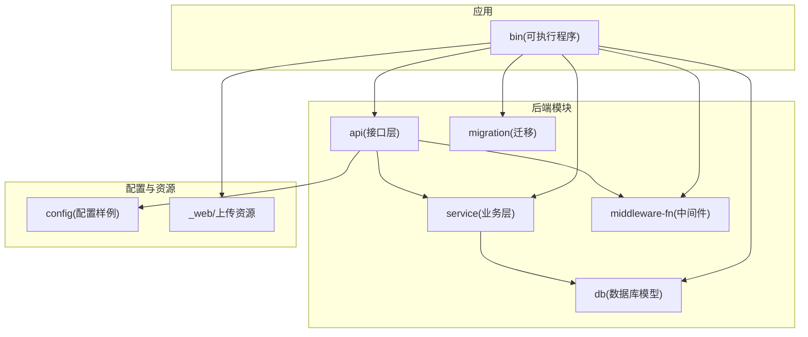
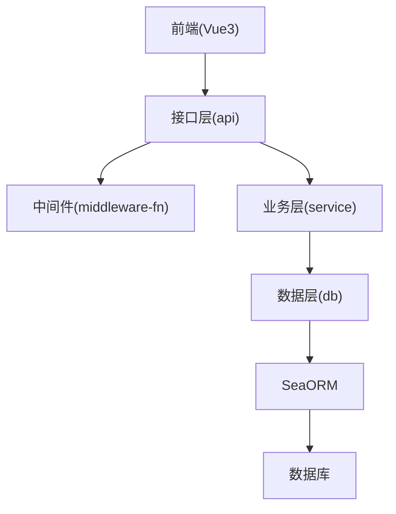
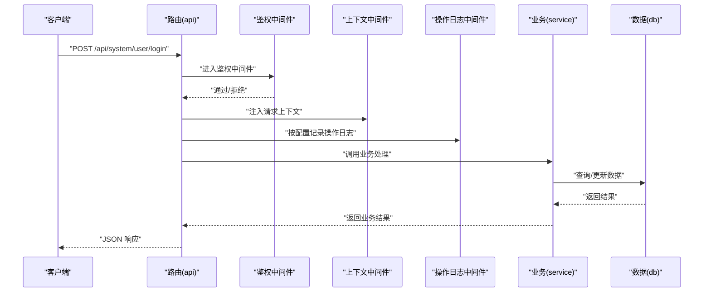
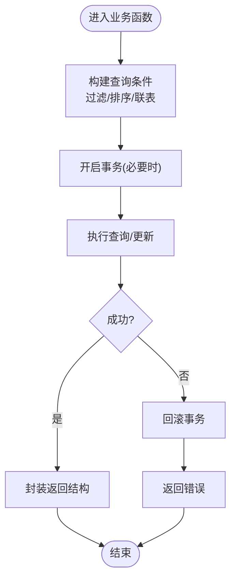
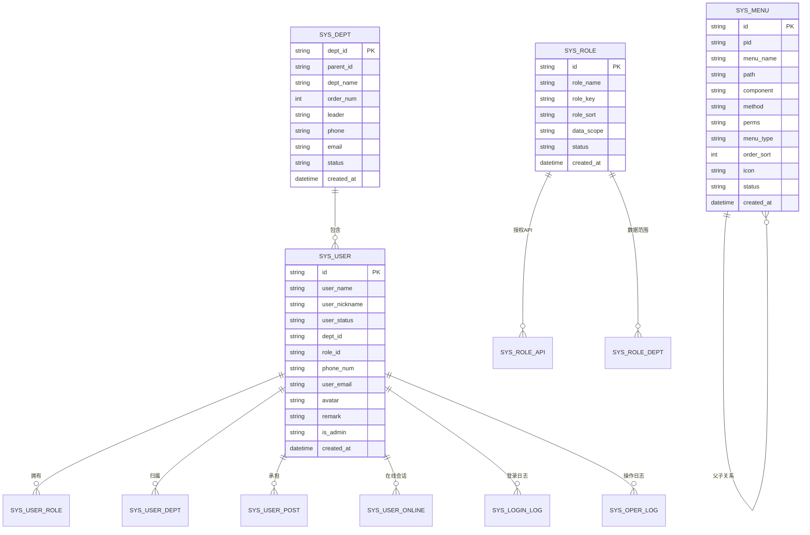
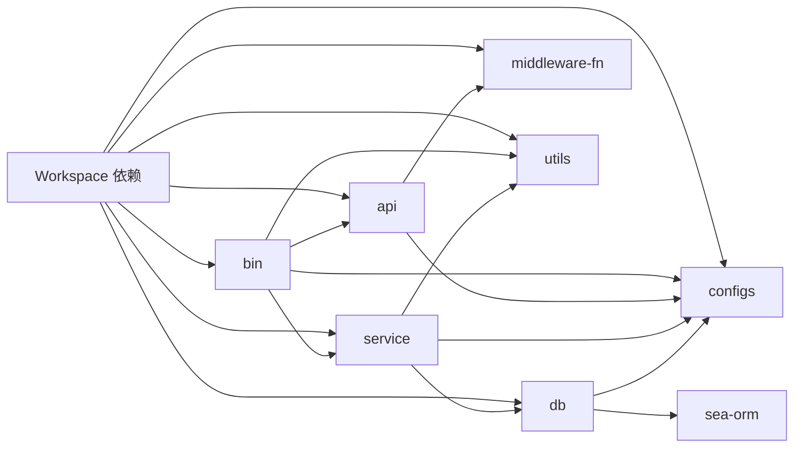

# 项目概述

<cite>
**本文引用的文件**
- [Cargo.toml](file://Cargo.toml)
- [README.md](file://README.md)
- [README_EN.md](file://README_EN.md)
- [api/src/lib.rs](file://api/src/lib.rs)
- [api/src/route.rs](file://api/src/route.rs)
- [service/src/lib.rs](file://service/src/lib.rs)
- [service/src/system/mod.rs](file://service/src/system/mod.rs)
- [service/src/system/sys_user.rs](file://service/src/system/sys_user.rs)
- [api/src/system/sys_user.rs](file://api/src/system/sys_user.rs)
- [api/src/system/sys_menu.rs](file://api/src/system/sys_menu.rs)
- [db/src/system/models/sys_user.rs](file://db/src/system/models/sys_user.rs)
- [db/Cargo.toml](file://db/Cargo.toml)
- [bin/Cargo.toml](file://bin/Cargo.toml)
- [config/config.toml.sample](file://config/config.toml.sample)
- [middleware-fn/src/lib.rs](file://middleware-fn/src/lib.rs)
- [migration/src/migrations/m20220101_000001_create_table.rs](file://migration/src/migrations/m20220101_000001_create_table.rs)
</cite>

## 目录
1. [简介](#简介)
2. [项目结构](#项目结构)
3. [核心组件](#核心组件)
4. [架构总览](#架构总览)
5. [详细组件分析](#详细组件分析)
6. [依赖关系分析](#依赖关系分析)
7. [性能考量](#性能考量)
8. [故障排查指南](#故障排查指南)
9. [结论](#结论)
10. [附录](#附录)

## 简介
Axum Admin 是一个基于 Rust 生态的现代化后台管理框架，采用 Axum 作为 Web 框架、SeaORM 作为 ORM、Vue3 作为前端界面，配合可插拔的中间件与任务调度能力，提供完善的权限体系、系统监控与运维工具。项目以模块化 Workspace 组织，覆盖用户管理、菜单权限、角色与数据权限、字典、定时任务、在线用户、操作与登录日志、系统监控、缓存与 API 关联等能力，适合快速搭建企业级后台管理系统。

- 核心价值与目标
  - 快速交付：通过模块化设计与标准接口，降低重复开发成本。
  - 权限闭环：后端动态路由与按钮级权限控制，结合数据权限策略，满足复杂业务场景。
  - 可观测性：内置操作日志、登录日志、在线用户、系统监控与定时任务日志。
  - 可扩展性：中间件层抽象、缓存策略可插拔、数据库适配多后端。

- 技术选型理由
  - Rust + Axum：高性能、零成本抽象、异步生态成熟，适合高并发后台服务。
  - SeaORM：类型安全的 ORM，支持多数据库后端，迁移工具完善。
  - Vue3 + 前端工程：现代前端开发体验，与后端 API 解耦良好。
  - 中间件与任务：统一的鉴权、上下文、日志与缓存中间件，支持 SkyTable/内存缓存与定时任务。

- 差异化特点
  - 后端动态路由与按钮级权限：前端仅接收后端下发的路由与权限标识，确保权限一致性。
  - 多维度数据权限：支持“全部、本部门、本部门及以下、自定义、本人”等策略组合。
  - API 缓存与失效：按数据库表关联 API，实现精准缓存与失效。
  - 完整迁移与初始化：提供完整的迁移脚本与索引创建，开箱即用。

- 实际使用场景示例
  - 新建用户并分配角色与部门，通过菜单权限控制其可访问的页面与按钮。
  - 配置定时任务，监控任务执行日志，并通过系统监控查看资源占用。
  - 通过字典管理维护常量数据，如状态码、枚举值等，供前端下拉选择使用。

**章节来源**
- [README.md](file://README.md#L9-L79)
- [README_EN.md](file://README_EN.md)

## 项目结构
项目采用多包 Workspace 组织，核心模块如下：
- api：对外暴露的 HTTP 接口层，负责路由注册与中间件装配。
- service：业务逻辑层，封装系统模块的增删改查与复杂流程。
- db：数据库模型与实体定义，提供 SeaORM 访问入口。
- middleware-fn：中间件集合，包括鉴权、上下文、操作日志、缓存等。
- migration：数据库迁移与初始化脚本。
- bin：可执行应用入口，聚合各模块并启动服务。
- config：运行配置样例，含服务器、缓存、日志、JWT、数据库等。
- data：静态资源与上传目录（前端打包产物与上传文件）。

**图示来源**
- [Cargo.toml](file://Cargo.toml#L1-L12)
- [bin/Cargo.toml](file://bin/Cargo.toml#L10-L25)
- [api/src/lib.rs](file://api/src/lib.rs#L1-L10)
- [service/src/lib.rs](file://service/src/lib.rs#L1-L7)
- [db/Cargo.toml](file://db/Cargo.toml#L9-L25)
- [middleware-fn/src/lib.rs](file://middleware-fn/src/lib.rs#L1-L23)

**章节来源**
- [Cargo.toml](file://Cargo.toml#L1-L12)
- [bin/Cargo.toml](file://bin/Cargo.toml#L1-L26)

## 核心组件
- 接口层（api）
  - 负责路由注册、静态资源托管、无需鉴权与需要鉴权的接口分组。
  - 支持上传目录映射、动态中间件装配（鉴权、上下文、操作日志、缓存）。
- 业务层（service）
  - 提供系统模块的完整 CRUD 与复杂流程，如用户、菜单、角色、岗位、部门、字典、定时任务、日志等。
  - 通过事务与联表查询保证数据一致性。
- 数据层（db）
  - SeaORM 实体与模型定义，提供类型安全的查询与更新。
- 中间件（middleware-fn）
  - 鉴权中间件：校验 JWT 并注入用户上下文。
  - 上下文中间件：统一请求上下文与响应包装。
  - 操作日志中间件：按配置记录操作日志。
  - 缓存中间件：支持内存或 SkyTable 缓存策略。
- 迁移（migration）
  - 自动创建表与索引，并初始化基础数据，支持回滚与重建。

**章节来源**
- [api/src/route.rs](file://api/src/route.rs#L1-L69)
- [service/src/system/mod.rs](file://service/src/system/mod.rs#L1-L43)
- [middleware-fn/src/lib.rs](file://middleware-fn/src/lib.rs#L1-L23)
- [migration/src/migrations/m20220101_000001_create_table.rs](file://migration/src/migrations/m20220101_000001_create_table.rs#L1-L133)

## 架构总览
后端采用“接口层 → 业务层 → 数据层”的分层架构，配合中间件实现横切关注点（鉴权、日志、缓存）。前端通过 API 与后端交互，后端动态下发路由与权限标识，确保权限闭环。

**图示来源**
- [api/src/route.rs](file://api/src/route.rs#L12-L22)
- [service/src/system/sys_user.rs](file://service/src/system/sys_user.rs#L26-L144)
- [db/Cargo.toml](file://db/Cargo.toml#L19-L19)

## 详细组件分析

### 接口层（api）与路由装配
- 无需鉴权接口：登录、验证码、退出登录等。
- 系统模块接口：用户、菜单、角色、部门、岗位、字典、定时任务、日志等。
- 中间件装配：根据配置启用操作日志、缓存中间件、鉴权与上下文中间件，并注入 JWT 提取器。

**图示来源**
- [api/src/route.rs](file://api/src/route.rs#L24-L54)
- [middleware-fn/src/lib.rs](file://middleware-fn/src/lib.rs#L16-L23)

**章节来源**
- [api/src/route.rs](file://api/src/route.rs#L1-L69)

### 业务层（service）与数据模型
- 用户模块：提供用户列表、详情、登录、信息获取、重置密码、更新密码、状态变更、角色与部门切换等。
- 菜单模块：提供菜单树、路由下发、相关 API 与数据库关联查询等。
- 数据模型：通过 SeaORM 实体与模型定义，支持联表查询、分页、事务与复杂筛选。

**图示来源**
- [service/src/system/sys_user.rs](file://service/src/system/sys_user.rs#L26-L144)

**章节来源**
- [service/src/system/mod.rs](file://service/src/system/mod.rs#L1-L43)
- [service/src/system/sys_user.rs](file://service/src/system/sys_user.rs#L1-L200)
- [api/src/system/sys_user.rs](file://api/src/system/sys_user.rs#L1-L206)
- [api/src/system/sys_menu.rs](file://api/src/system/sys_menu.rs#L1-L120)
- [db/src/system/models/sys_user.rs](file://db/src/system/models/sys_user.rs#L1-L153)

### 数据层（db）与迁移
- 数据库适配：默认启用 PostgreSQL、MySQL、SQLite 三种后端特性。
- 迁移脚本：自动创建系统表与索引，并初始化基础数据，支持回滚与重建。

**图示来源**
- [migration/src/migrations/m20220101_000001_create_table.rs](file://migration/src/migrations/m20220101_000001_create_table.rs#L31-L63)
- [db/Cargo.toml](file://db/Cargo.toml#L22-L25)

**章节来源**
- [db/Cargo.toml](file://db/Cargo.toml#L1-L25)
- [migration/src/migrations/m20220101_000001_create_table.rs](file://migration/src/migrations/m20220101_000001_create_table.rs#L1-L133)

### 中间件与配置
- 中间件
  - 鉴权：校验 JWT 并注入用户身份。
  - 上下文：统一请求上下文与响应包装。
  - 操作日志：按配置记录到文件或数据库。
  - 缓存：支持内存或 SkyTable 缓存策略。
- 配置
  - 服务器：监听地址、SSL、压缩、缓存时间与方式、API 前缀。
  - Web：静态资源目录、上传目录与 URL 前缀。
  - 日志：日志目录、文件名、开关与级别。
  - JWT：过期时间与密钥。
  - 数据库：连接字符串（默认 SQLite）。

**章节来源**
- [middleware-fn/src/lib.rs](file://middleware-fn/src/lib.rs#L1-L23)
- [config/config.toml.sample](file://config/config.toml.sample#L1-L50)

## 依赖关系分析
- Workspace 顶层统一依赖版本与特性，确保跨模块一致性。
- bin 依赖 api、service、utils、configs，形成应用入口。
- api 依赖 configs、middleware-fn，负责路由与中间件装配。
- service 依赖 db、configs、utils，承载业务逻辑。
- db 依赖 configs、sea-orm，提供类型安全的数据访问。

**图示来源**
- [Cargo.toml](file://Cargo.toml#L24-L81)
- [bin/Cargo.toml](file://bin/Cargo.toml#L10-L25)
- [db/Cargo.toml](file://db/Cargo.toml#L9-L25)

**章节来源**
- [Cargo.toml](file://Cargo.toml#L1-L90)
- [bin/Cargo.toml](file://bin/Cargo.toml#L1-L26)
- [db/Cargo.toml](file://db/Cargo.toml#L1-L25)

## 性能考量
- 异步与并发：基于 Tokio 的异步运行时，Axum 的高效网络栈，适合高并发场景。
- ORM 优化：SeaORM 支持联表查询、分页与事务，减少 N+1 查询风险。
- 缓存策略：支持内存与 SkyTable 缓存，按 API 与数据库表关联实现精准失效。
- 压缩与传输：HTTP 压缩与静态资源托管，降低带宽消耗。
- 发布优化：Release 配置启用 LTO、按大小优化与符号剥离，减小二进制体积。

**章节来源**
- [Cargo.toml](file://Cargo.toml#L83-L90)
- [config/config.toml.sample](file://config/config.toml.sample#L9-L16)

## 故障排查指南
- 数据库连接
  - 检查配置中的数据库连接字符串，确认数据库已启动且可达。
  - 使用迁移工具执行初始化，确保表与索引存在。
- 缓存问题
  - 若启用 SkyTable 缓存，检查 SkyTable 服务连通性与端口配置。
  - 清理相关 API 缓存或等待过期。
- 日志定位
  - 开启操作日志与更详细的日志级别，定位接口异常与权限问题。
- 权限与路由
  - 确认用户角色与数据范围配置，检查菜单与按钮权限标识是否正确下发。
- 静态资源
  - 确认上传目录与 URL 前缀配置，确保文件上传与访问正常。

**章节来源**
- [config/config.toml.sample](file://config/config.toml.sample#L17-L50)
- [migration/src/migrations/m20220101_000001_create_table.rs](file://migration/src/migrations/m20220101_000001_create_table.rs#L104-L133)

## 结论
Axum Admin 以 Rust + Axum + SeaORM + Vue3 为核心技术栈，构建了高可用、可扩展、可观测的后台管理框架。通过模块化设计与中间件抽象，实现了鉴权、日志、缓存与任务调度的统一治理；通过后端动态路由与多维数据权限，保障了权限闭环与业务灵活性。对于初学者，可快速上手并扩展；对于资深开发者，可在保持类型安全与性能优势的前提下，进一步定制与优化。

## 附录
- 功能清单（摘自 README）
  - 用户管理、部门管理、岗位管理、菜单管理、角色管理、字典管理
  - 登录日志、在线用户、定时任务、操作日志
  - 系统监控、数据缓存、权限管理（动态路由与按钮级权限）
  - 数据权限（全部、本部门、本部门及以下、自定义、本人）

**章节来源**
- [README.md](file://README.md#L24-L57)